<script>
window.$docsify = {
  plantuml: {
    skin: 'default',
  },
}
</script>

# SmartAuth 🔑

**Autor:** Jonathan Hauter

## Einführung 
?> Teile von SmartAuth sind _stark inspiriert_ von der [OAuth2 Spezifikation](https://oauth.net/2/). Man kann zu großen Teilen ergänzend auch der [Grundspezifikation](https://datatracker.ietf.org/doc/html/rfc6749) folgen. Besonders abweichende Elemente werden als solche gekennzeichnet.

Viele Smart City Services verwalten sensible, personenbezogene Daten.

Logischerweise sollte nicht jeder Nutzer alle Daten zu allen Personen einsehen und bearbeiten können, sondern nur auf ihre eigenen Zugriff erhalten.
Dazu ist es erforderlich, dass Anwender ihre Identität sicher bestätigen
können. Jeder Nutzer besitzt zu diesem Zweck einen *Account*, welches mindestens durch ein Passwort und einem Benutzernamen geschützt ist.
Damit ein Nutzer nicht für mehrere Services mehrere *Accounts* verwaltet und nicht jeder Microservice selbst eine eigene Authentifizierungslösung bereitstellen muss, existiert für das gesamte Smart City Ökosystem ein allgemeiner Authentifizierungs- und Autorisierungs Service (SmartAuth)
mit dem sowohl interne als auch externe, private Anbieter kommunizieren können um Resourcen über mehrere Microservices hinweg anzufordern.

Gemeldete Bürger erhalten einen Registrierungscode per Email. Ohne Registrierungscode kann kein Bürgeraccount erstellt werden.

---

Angenommen wir wollen Features der SmartCity in einen bereits bestehenden, unabhängigen und privaten Service einbinden, einem Terminkalender.
Der Terminkalender hat eine eigene Accountverwaltung und funktioniert auch ohne die Anbindung mit der SmartCity, kann aber als optionales Feature Termine der Bürgerverwaltung automatisch in einen privaten Kalender eintragen.
Der Kalenderservice muss also, im Namen eines SmartCity Nutzers, Informationen aus dem Bürgerbüro anfordern.
Aus Sicherheits- und Datenschutzgründen soll die App aber nicht mit den SmartCity Anmeldeinformationen des Nutzers in Kontakt kommen oder alle möglichen Daten ansehen und bearbeiten dürfen. 
Stattdessen kann die App bestimmte Rechte bei SmartAuth erfragen. Der Nutzer wird zu SmartAuth weitergeleitet und gibt seine Anmeldeinformation auf einer Anmeldeseite weiter. Dort darf der Nutzter der Anfrage der App zustimmen und sich mit Passwort und Benutzername authentifizieren.

Die App sieht dabei keine Anmeldedaten des Nutzers, sie erhält nach der Zustimmung des Anwenders nur einen kurzlebigen Authentifizierungscode, der dafür genutzt werden kann, bestimmte Resourcen im Namen des Nutzers bei SmartCity Services anzufordern.
Der Nutzer kann Rechte die er an Anwendungen autorisiert hat auch wieder entziehen und einschränken.

Eine Bankapp dagegen könnte jedoch auch von sehr sensitiven Daten profitieren um beispielsweise mit dem Finanzamt zu kommunizieren. Rechte können auf individueller Basis von Administratoren an Anwendungen verteilt werden.
Microservices entscheiden selbst, welche Rechte für Zugriff auf welche APIs/Resourcen notwendig sind.

> Siehe auch: [SSO](https://de.wikipedia.org/wiki/Single_Sign-on)


---
Anwendungen die über SmartAuth auf geschützte Resourcen zugreifen können, müssen sich selbst registrieren und erhalten
einen individuellen Identifikationsausweis der bei einer Autorisierungsanfrage angegeben werden muss.
SmartAuth Administratoren können bestimmen, welche Anwendungen welche Rechte anfordern dürfen.
Optional kann eine registrierte Anwendung auch selbst interne Accounts erstellen und verwalten die bspw für Mitarbeiter genutzt werden können.
Interne Accounts und Bürgeraccounts sind vollständig voneinander getrennt.

---

Microservices die einen integralen Bestandteil zur SmartCity darstellen, müssen keinen Authentifizierungscode anfordern.
Ein einmaliges Einloggen reicht, um alle SmartCity Services nutzen zu können.

--- 


## Überblick

### Grundbegriffe

| Bezeichnung | Beschreibung |
| --- | --- |
| Bürger | Mensch der im Bürgerbüro als Bürger gespeichert wurde |
| Resource | Geschützte Daten oder APIs die nur Besitzer eines Accounts verwenden darf | 
| Nutzer | Benutzer eines oder mehrerer SmartCity Services. Kann ein registrierter Bürger sein | 
| Resourcenbesitzer | Besitzer eines Accounts, gehört Resourcen | 
| Interner Service | Microservice der tief zu dem SmartCity Ökosystem gehört, hohes Vertrauen. Kann Resourcen hosten | 
| Externer/Privater Service | Anweundug die nicht direkt zu der SmartCity gehört, eventuell aber mit internen Services kommunizieren möchte
| Client | Externer Service der mit internen Services kommunizieren möchte, auf Nutzerdaten zugreifen muss und SmartAuth bekannt ist |
| Session | Überbegriff für Zugangsschlüsselkombinationen die zwischen Client und SmartAuth ausgetauscht werden um Zugriff auf geschüzte Resourcen zu ermöglichen |
| Authentisierung | Erbringen von Identitätsnachwis seitens des Nutzers (hier durch Passwort, Benutzername)
| Authentifizierung | Überprüfen des Identitätsnachweis (durch SmartAuth) |
| Autorisierung | Gewähren bestimmter Rechte |         
| Interner Account | Spezieller Accounttyp der von einem Client erstellt und verwaltet wird und nur innerhalb eines Services verwendet werden kann |        

### Use-Cases 

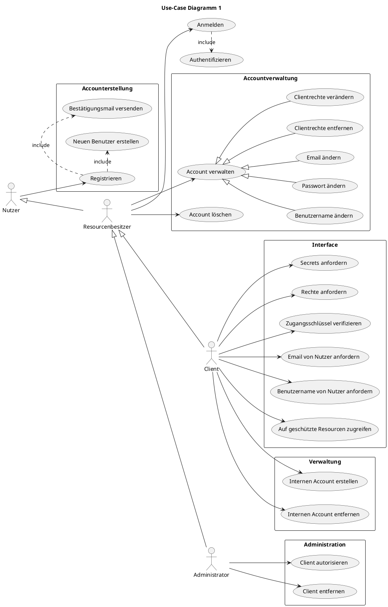
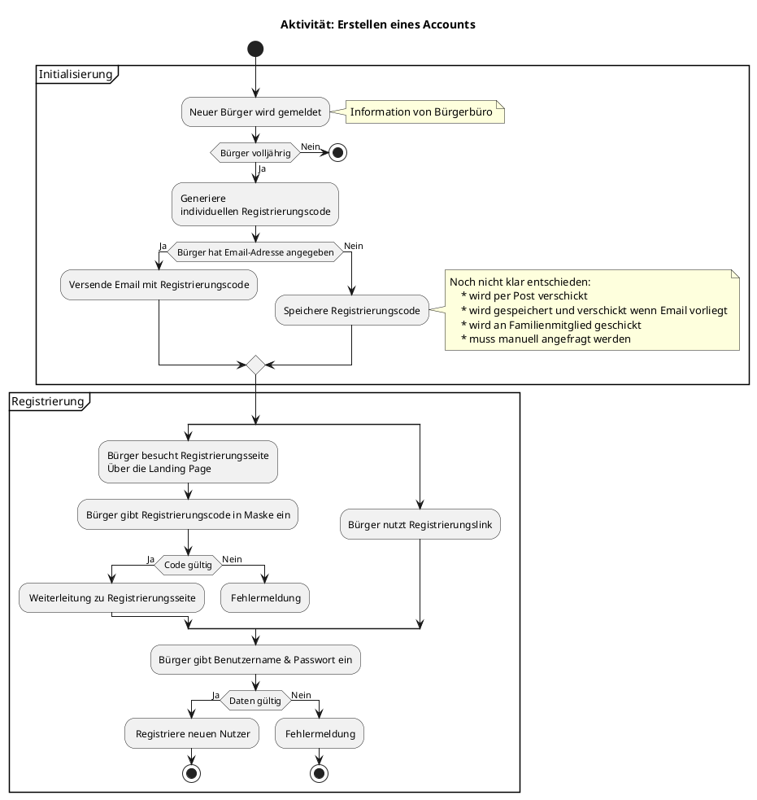
---
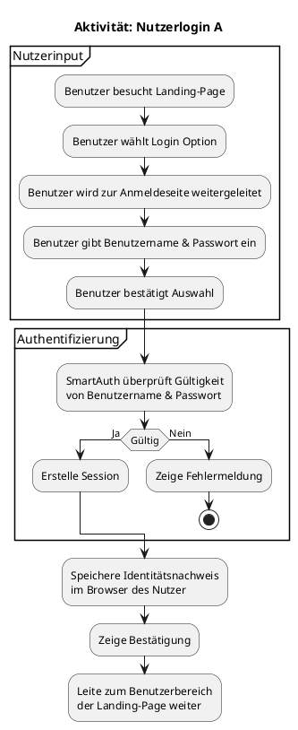

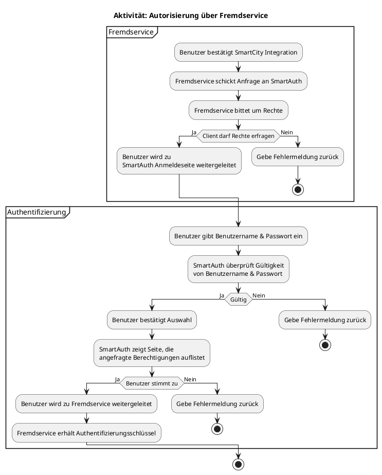


### User-Stories
| **ID** | **Als** | **möchte ich** | **so dass** | **Akzeptanz** | **Prioität** |
| :------ | :----- | :------ | :-------- | :------ | :------ |
|1 | Bürger | ich einen Account erstellen können  | Ich SmartCity Services nutzen kann | Account wird erstellt | Muss
|2 | Nutzer | personenbezogene Services nutzen können | Ich auf meine Daten zugreifen kann | Authentifizierung | Muss
|3 | Nutzer | mich nur einmal einloggen müssen | mein Erlebnis nicht unterbrochen wird |  Speichern globaler Session | Muss
|4 | Nutzer | mein SmartCity Accounts mit anderen Apps verbinden können | ? | Autorisierung | Muss
|5 | Nutzer | verbundene Apps entfernen können | Apps nicht mehr auf meine Daten zugreifen können | Vergebene Schlüssel werden invalidiert | Kann 
|6 | Nutzer | mein Account bearbeiten können | Ich meine Email-Adresse/Benutzername/Passwort verändern kann | Passwort/Benutzername/Email wird geändert | Muss
|7| Nutzer | Mein Passwort zurücksetzen können| Ich meine Email-Adresse/Benutzername verändern kann | Passwort/Benutzername wird geändert | Muss
|8| Client| Meine App bei SmartAuth registieren| Ich Rechte bei SmartAuth anfragen kann | Neuer Client wird aufgenommen | Muss
|9| Client| mein Account bearbeiten können| Ich meine ClientID/Passwort verändern kann | ClientID/Passwort wird verändert | Kann
|10| Client| rechte bei SmartAuth anfragen können | ich personenbezogene Services im Namen eines Nutzers nutzen kann | Muss
|11| Client| interne (Mitarbeiter)Accounts erstellen können | ich Mitarbeiter die keine Bürger sind verwalten kann | Mitarbeiteraccount wird erstellt|  Muss
|12| Client| mit SmartAuth einen Mitarbeiterlogin auf meiner Seite einbauen | sich Mitarbeiter bei meinem Service anmelden können | Mitarbeiter kann sich einloggen | Muss 

### GUI - Mockups


## Technische Komponenten 

- Programmiersprache für alle Softwareelemente: [Rust](https://www.rust-lang.org/)
- Frontend

    -  [Yew](https://github.com/yewstack/yew)

    - *WebGL*

- Backend

    - [Actix-Web](https://actix.rs/)

    - [sqlx](https://github.com/launchbadge/sqlx)

- Datenbank

    - MySQL

## Elemente

### Abläufe

#### Autorisierung über Fremdservice
?> Adaptiert von [rfc6749](https://datatracker.ietf.org/doc/html/rfc6749#section-4.1)

##### IDs und Schlüssel
| Bezeichnung | Beschreibung |
| --- | --- |
Clientschlüssel | Individueller, öffentlicher Schlüssel der einen registrierten Client identifiziert. (Base64 encodiert Clientname +numerische ID) |
Clientsecret | Individueller, geheimer Schlüssel/Passwort der benötigt wird, um einen Client zu authentifizieren. |
Autorisierungsschlüssel | Individueller, gehimer sehr kurzlebiger Schlüssel der dafür verwendet werden kann einen Zugangsschlüssel und Auffrischungsschlüssel |      
Zugangsschlüssel |Individueller, geheimer, kurzlebiger Schlüssel der einem Client Zugriff auf geschüzte Resourcen erlaubt
Auffrischungsschlüssel | Individueller, geheimer, langlebiger Schlüssel mit dem ein Client neue Zugangsschlüssel anfordern kann.

!> Clientsecret bleibt einfachhaltshalber eventuell vollständig unbenutzt. Falls unimplementiert ist "none" immer valide

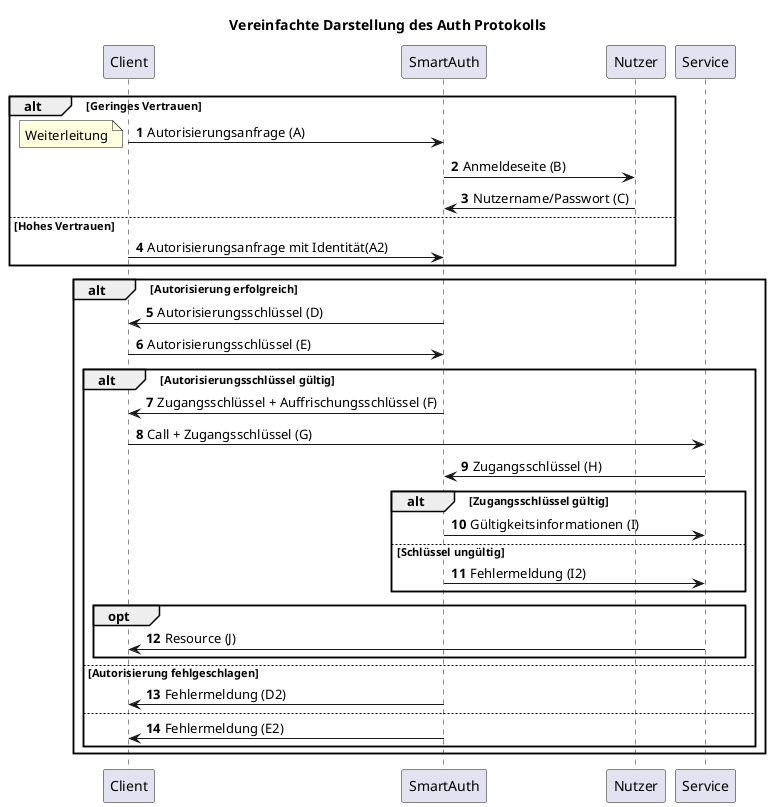


- (A): 
Der Client sendet eine *Autorisierungsanfrage* an den SmartAuth Server. Je nach Vertrauensstufe, kann die Anfrage auch bereits 
die Anmeldedaten des Resourcenbesitzers enthalten (A2). 

- (B): Der Nutzer wird mittels einer 301 Antwort an die Anmeldeseite von SmartAuth weitergeleitet. 

- (C): Der Nutzer gibt seine Anmeldedaten über die Anmeldeseite an SmartAuth weiter und wird dann zurück an die Anwendung des Clients geleitet.

- (D): Falls die Autorisierung erfolgreich ist, gibt SmartAuth einen einmaligen, kurzlebigen Autoriserungsschlüssel (<= 10 min) an den Client weiter. 

- (E): Der Client sendet den Autorisierungsschlüssel an SmartAuth.

- (F): Falls der Autorisierungsschlüssel gültig ist, gibt SmartAuth einen Zugangsschlüssel und Auffrischungsschlüssel weiter.

- (G): Der Client möchte auf eine geschüzte Resource zugreifen und sendet mit der Anfrage den Zugangsschlüssel

- (H): Der Service fragt eine Überprüfung des Zugangsschlüssels an

- (I): Falls der Zugangsschlüssel gültig ist, erhält der Service Informationen über die assozierten Rechte des Zugangsschlüssels

- (I2): Falls der Zugangsschlüssel ungültig ist, wird eine Fehlermeldung zurückgegeben 

?> Beachte: Da sich die internen Microservices eine Domain teilen, muss nicht jeder dieser Services einen Autorisierungs- und Zugangschlüssel anfordern. Mit der Anmeldung auf der Landingpage erhält der Nutzer einen Zuganggschlüssel in Form eines Cookies. 

Es gibt also insgesamt drei Möglichkeiten an eine beschüzte Resource zu kommen:

- Autorisierung über globalen, Zugangsschlüssel (nur für interne Services)

- Autorisierung mit Benutzername, Passwort des Nutzers (nur für externe Clients mit sehr hohem Vertrauen)

- Autorisierung über SmartAuth (für alle registrierten Clients)

---
> Siehe auch: https://datatracker.ietf.org/doc/html/rfc6749#section-1.5

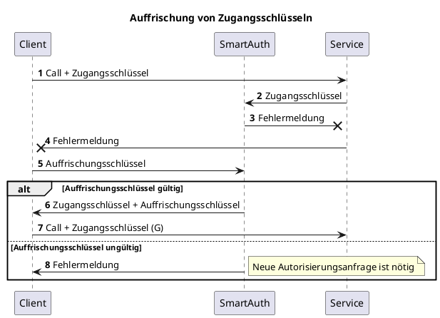
Ohne Auffrischungsschlüssel wäre es sehr einfach für Angreifer Zugangsschlüssel zu stehlen und so Nutzer nachzuahmen.
SmartAuth invalidiert Zuganggschlüssel regelmäßig. Falls ein Zugganschlüssel nicht mehr funktioniert, muss ein Client einen neuen mittels 
eines Auffrischungsschlüssel anfordern (s.o).
Bei einer Anfrage muss:

- Sich der Client mittels Client ID und Client Passwort authentifizieren
- ggf ein neuer Auffrischungsschlüssel seitens des Clients gespeichert werden

---

Für die meisten Services sind nur die Punkte G bis I relevant um nach außen zeigende REST-APIs abzusichern oder zu überprüfen, welcher Nutzer gerade 
den Serivce verwendet.

!> Beispiele und bessere Dokumentation kommen noch! 

Eine Microservice API sollte daher wenn möglich *keine* Bürger-ID als Parameter aktzeptieren. Verlangt einen Zugangsschlüssel und erfragt dann selbst,
welcher Nutzer dazu gehört und welche Rechte der fragenden Anwendung erteilt wurde.

### Daten
!> Nicht 100% final. Es werden jedoch vermutlich höchstens nur Ergänzungen stattfinden.

?> Siehe auch: https://tools.ietf.org/id/draft-richer-oauth-json-request-00.html
und https://datatracker.ietf.org/doc/html/rfc6749#section-4.1.1 (4.1.1 -4.1.4)

#### Autorisierungsanfrage
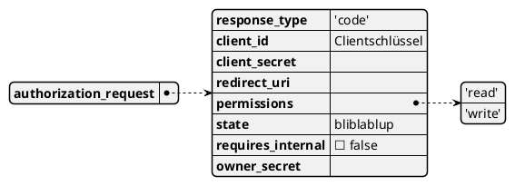

| Bezeichnung | Beschreibung | Typ
| --- | --- | --- |
| response_type | Muss 'code' oder 'client-code' sein| String
| client_id | Die ClientID | String
| client_secret | Das Clientpasswort | String
| redirect_uri | URL zu der der Nutzer weitergeleitet wird, wenn Login beendet wurde (Sowohl bei Fehlschlag als auch bei Erfolg) | String
| permissions | Rechte die angefordert werden sollen. | List  
| state |  Kann alles sein, wird an den Aufrufenden ohne Änderung zurückgeschickt | String
| requires_internal | Falls true: Nur interne Accounts werden aktzeptiert | Boolean 
| owner_secret | Optional: Benutzername + Passwort, nur falls hohes Vertrauen oder interner Account | 

Als Link: 

```
    {smartAuth}/auth?response_type=code
    &client_id=client_id
    &redirect_uri=...
    ...
```
?> Format von "owner_secret" noch nicht festgelegt

---

#### Autorisierungsanfrage Antwort
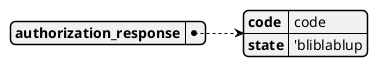

| Bezeichnung | Beschreibung | Typ
| --- | --- | --- |
| code | Der Autorisierungscode | String
| state | Der in der Anfrage mitgelieferte state | String

Als Link: 

```
  {redirect_uri}/?code=...
  &state=... 
    ...
```

#### Zugangssschlüsselanfrage
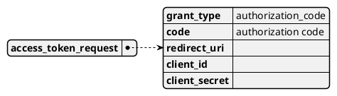
| Bezeichnung | Beschreibung | Typ
| --- | --- | --- |
| grant_type | Muss "authorization_code" sein | String
| code | Der Autorisierungsschlüssel | String
| redirect_uri | Muss die selbe URL sein wie im authorization_request | String
| client_id | Die Client ID | String
| client_secret | Das Client Passwort | String  

!> Client Secret bleibt an dieser Stelle möglicherweise unbenutzt

Als Link: 

```
    {smartAuth}/token?grant_type=authorization_code?code=autorisierungsschlüssel&state=...
```

#### Zugangsschlüsselanfrage Antwort
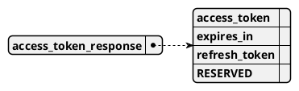

| Bezeichnung | Beschreibung | Typ
| --- | --- | --- |
| access_token | Der Zugangsschlüssel | String
| expires_in | Zeit in Sekunden bis der Zugangsschlüssel ungültig wird| Number 
| refresh_token | Auffrischungsschlüssel | String
| RESERVED |  Wird eventuell in der Zukunft benutzt | String

#### Auffrischung
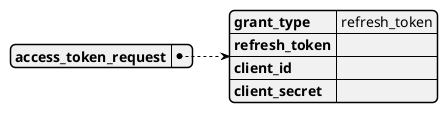
| Bezeichnung | Beschreibung | Typ
| --- | --- | --- |
| grant_type | Muss "refresh_token" sein | String
| refresh_token | Der Auffrischungsschlüssel | String
| client_id | Die Client ID | String
| client_secret | Das Client Passwort | String  

!> Später eventuell über [HTTP authentication](https://developer.mozilla.org/en-US/docs/Web/HTTP/Authentication)

#### Verifyanfrage

| Bezeichnung | Beschreibung | Typ
| --- | --- | --- |
| verify_type | Muss "access_token" sein | String
| access_token | Der Zuggangsschlüssel | String

#### Verifyantwort

| Bezeichnung | Beschreibung | Typ
| --- | --- | --- |
| user_id | Eine individuelle NutzerID | String
| permissions | Die erteilten Rechte | String
| user_name | Nutzername, "REDACTED" falls Rechte zum Einsehen fehlen | String
| user_mail | Nutzer Emial, "REDACTED" falls Rechte zum Einsehen fehlen | String

#### Clientschlüsselanfrage
> Siehe: https://datatracker.ietf.org/doc/html/rfc6749#section-4.4 

| Bezeichnung | Beschreibung | Typ
| --- | --- | --- |
| grant_type | Muss "client_code" sein | String
| redirect_uri | Weiterleitung wie bei allen anderen Anfragen | String
| client_id | Die Client ID | String
| client_secret | Das Client Passwort | String  

####  Clientverifyanfrage
| Bezeichnung | Beschreibung | Typ
| --- | --- | --- |
| verify_type | Muss "client_token" sein | String

#### Clientverifyantwort
!> Noch nicht spezifiziert

### Error
#### Codes 
> Siehe: https://datatracker.ietf.org/doc/html/rfc6749#section-5.2

### Rechte
!> Kann sich stark ändern

Liste von Strings, getrennt mit Leerzeichen
STUB

### REST API
| Endpunkt | Methode | Content-Type | Parameter | Resultat | Anmerkung
| --- | --- | --- | --- | --- | --- | 
/auth{authorization_request} |POST|application/x-www-form-urlencoded|authorization_request| Bei Erfolg: 301, Weiterleitung mit authorization_response, sonst 301 mit error response | - |
/token{access_token_request} |POST|application/x-www-form-urlencoded|access_token_request| Bei Erfolg: 200 OK mit access_token_response, sonst error response | - | 
/verify| POST | application/json | Verifyanfrage | Bei Erfolg: 200 OK mit Verifyantwort
