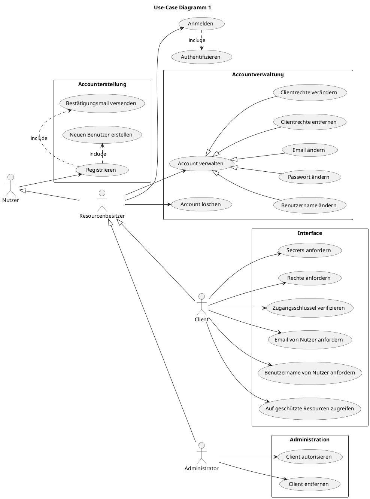
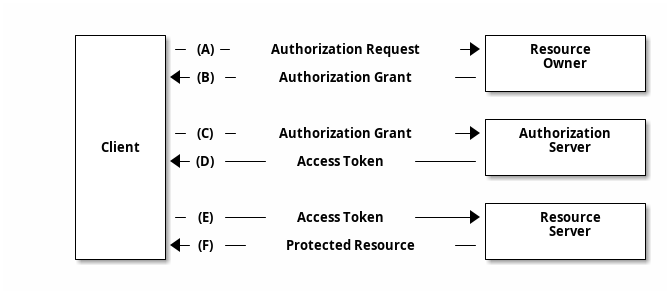
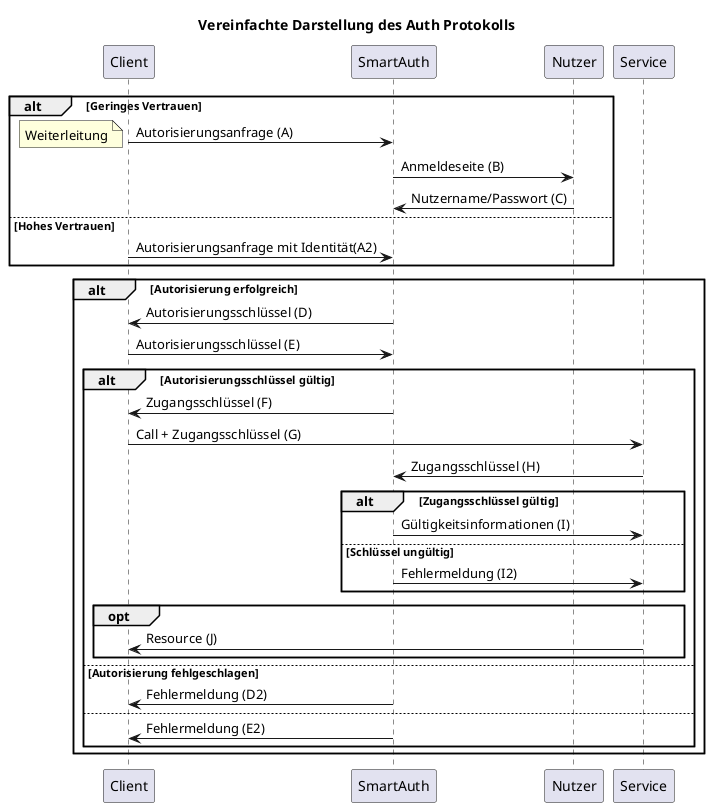
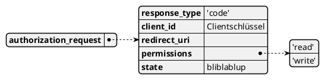
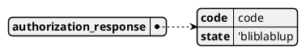
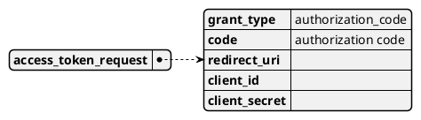
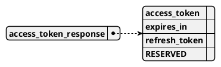
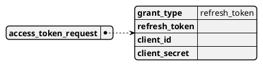

<script>
window.$docsify = {
  plantuml: {
    skin: 'default',
  },
}
</script>

# SmartAuth 🔑

**Autor:** Jonathan Hauter

## Einführung 
Viele Smart City Services verwalten sensible, personenbezogene Daten.

Logischerweise sollte nicht jeder Nutzer alle Daten zu allen Personen einsehen und bearbeiten können, sondern nur auf ihre eigenen Zugriff erhalten.
Dazu ist es erforderlich, dass Anwender ihre Identität sicher bestätigen
können. Jeder Nutzer besitzt zu diesem Zweck ein *Account* welches durch mindestens einem Passwort und einem Benutzernamen geschützt ist.
Damit ein Nutzer nicht für mehrere Services mehrere *Accounts* verwaltet und nicht jeder Microservice selbst eine eigene Authentifizierungslösung bereitstellen muss, existiert für das gesamte Smart City Ökosystem ein allgemeiner Authentifizierungs- und Autorisierungs Service (SmartAuth)
mit dem sowohl interne als auch externe, private Anbieter kommunizieren können um Resourcen über mehrere Microservices hinweg anzufordern.

?> SmartAuth ist _stark inspiriert_ von der [OAuth2 Spezifikation](https://oauth.net/2/) soll jedoch nicht den gesamten Standard implementieren

---

Angenommen wir wollen Features der SmartCity in einen bereits bestehenden, unabhängigen und privaten Service einbinden, einem Terminkalender.
Der Terminkalender hat eine eigene Accountverwaltung und funktioniert auch ohne die Anbindung mit der SmartCity, kann aber als optionales Feature Termine der Bürgerverwaltung automatisch in einen privaten Kalender eintragen.
Der Kalenderservice muss also, im Namen eines SmartCity Nutzers, Informationen aus dem Bürgerbüro anfordern.
Aus Sicherheits- und Datenschutzgründen soll die App aber nicht mit den SmartCity Anmeldeinformationen des Nutzers in Kontakt kommen oder alle möglichen Daten ansehen und bearbeiten dürfen. 
Stattdessen kann die App bestimmte Rechte bei SmartAuth erfragen. Der Nutzer wird zu SmartAuth weitergeleitet und gibt seine Anmeldeinformation auf einer Anmeldeseite weiter. Dort darf der Nutzter der Anfrage der App zustimmen und sich mit Passwort und Benutzername authentifizieren.

Die App sieht dabei keine Anmeldedaten, sie erhält nach der Zustimmung des Anwenders nur einen kurzlebigen Authentifizierungscode, der dafür genutzt werden kann, Resourcen bei SmartCity Services anzufordern.

Der Nutzer kann Rechte die er an Anwendungen autorisiert hat auch wieder entziehen und einschränken.
Microservices entscheiden selbst, welche Rechte für Zugriff auf welche APIs/Resourcen notwendig sind.

---

Anwendungen die über SmartAuth auf geschützte Resourcen zugreifen können, müssen sich selbst registrieren und erhalten
einen individuellen Identifikationsausweis der bei einer Autorisierungsanfrage angegeben werden muss.
Administratoren können bestimmen, welche Anwendungen welche Rechte anfordern dürfen.

---

Microservices die einen integralen Bestandteil zur SmartCity darstellen, müssen keinen Authentifizierungscode anfordern.
Ein einmaliges Einloggen reicht, um alle SmartCity Services nutzen zu können.

## Überblick

### Grundbegriffe

| Bezeichnung | Beschreibung |
| --- | --- |
| Resource | Geschützte Daten oder APIs die nur Besitzer eines Accounts verwenden darf | 
| Nutzer | Benutzer eines oder mehrerer SmartCity Services. Kann ein registrierter Bürger sein | 
| Resourcenbesitzer | Besitzer eines Accounts, gehört Resourcen | 
| Interner Service | Microservice der tief zu dem SmartCity Ökosystem gehört, hohes Vertrauen. Kann Resourcen hosten | 
| Externer/Privater Service | Anweundug die nicht direkt zu der SmartCity gehört, eventuell aber mit internen Services kommunizieren möchte
| Client | Externer Service der mit internen Services kommunizieren möchte, auf Nutzerdaten zugreifen muss und SmartAuth bekannt ist |
| Session | Überbegriff für Zugangsschlüsselkombinationen die zwischen Client und SmartAuth ausgetauscht werden um Zugriff auf geschüzte Resourcen zu ermöglichen |
| Authentisierung | Erbringen von Identitätsnachwis seitens des Nutzers (hier durch Passwort, Benutzername)
| Authentifizierung | Überprüfen des Identitätsnachweis (durch SmartAuth) |
| Autorisierung | Gewähren bestimmter Rechte |                         

### Use-Case 

---



### User-Stories
#### Aus der Perspektive eines Nutzers

- Ich möchte ein Account erstellen können

- Ich möchte mich mit meinem Account anmelden können

- Ich möchte personenbezogene Services nutzen können 

- Ich möchte mich nur einmal einloggen müssen um alle Services nutzen zu können

- Ich möchte mein SmartCity Account mit anderen Apps verbinden können

    - *Ich möchte diese Verbindungen wieder entfernen können*

- Ich möchte mein Account bearbeiten können

    - *Ich möchte meine Email-Adresse/Benutzernamen verändern können*

#### Aus der Perspektive eines Clients

- *Ich möchte meine App bei SmartAuth registrieren*

- Ich möchte Rechte bei SmartAuth anfragen können 

- Ich möchte personenbezogene Services von SmartCity nutzen können


### Technische Komponenten 

- Programmiersprache für alle Softwareelemente: [Rust](https://www.rust-lang.org/)
- Frontend

    -  [Yew](https://github.com/yewstack/yew)

    - *WebGL*

- Backend

    - [Actix-Web](https://actix.rs/)

    - [sqlx](https://github.com/launchbadge/sqlx)

- Datenbank

    - MySQL

### Elemente

### Abläufe

#### Autorisierung über Fremdservice
?> Adoptiert von [rfc6749](https://datatracker.ietf.org/doc/html/rfc6749#section-4.1)


Quelle: https://datatracker.ietf.org/doc/html/rfc6749#section-1.2



- (A): 
Der Client sendet eine Autorisierungsanfrage an den SmartAuth Server. Je nach Vertrauensstufe, kann die Anfrage auch bereits 
die Anmeldedaten des Resourcenbesitzers enthalten (A2).

- (B): SmartAuth präsentiert dem Nutzer eine Anmeldeseite. 

- (C): Der Nutzer gibt seine Anmeldedaten über die Anmeldeseite an SmartAuth weiter

- (D): Falls die Autorisierung erfolgreich ist, gibt SmartAuth einen einmaligen, kurzlebigen Autoriserungsschlüssel (<= 10 min) an den Client weiter. Der Autoriserungsschlüssel selbst reicht nicht, um Resourcen anzufordern.

- (E): Der Client sendet den Autorisierungsschlüssel an SmartAuth

- (F): Falls der Autorisierungsschlüssel gültig ist, gibt SmartAuth einen langlebigen Zugangsschlüssel weiter.

- (G): Der Client möchte auf eine geschüzte Resource zugreifen und sendet mit der Anfrage den Zugangsschlüssel

- (H): Der Service fragt eine Überprüfung des Zugangsschlüssels an

- (I): Falls der Zugangsschlüssel gültig ist, erhält der Service Informationen über die assozierten Rechte des Zugangsschlüssels

- (I2): Falls der Zugangsschlüssel ungültig ist, wird eine Fehlermeldung zurückgegeben 

?> Beachte: Da sich die internen Microservices eine Domain teilen, muss nicht jeder dieser Services einen Autorisierungs- und Zugangschlüssel anfordern. Mit der Anmeldung auf der Landingpage erhält der Nutzer einen Zuganggschlüssel in Form eines Cookies. 

Es gibt also insgesamt drei Möglichkeiten an eine beschüzte Resource zu kommen:

- Autorisierung über globalen, Zugangsschlüssel (nur für interne Services)

- Autorisierung mit Benutzername, Passwort des Nutzers (nur für externe Clients mit sehr hohem Vertrauen)

- Autorisierung über SmartAuth (für alle registrierten Clients)

### Daten
!> Nicht 100% final. Es werden jedoch höchstens nur Ergänzungen stattfinden.

#### IDs und Schlüssel
| Bezeichnung | Beschreibung |
| --- | --- |
Clientschlüssel | Individueller, öffentlicher Schlüssel der einen registrierten Client identifiziert. (Base64 encodiert Clientname +numerische ID) |
Clientsecret | Individueller, geheimer Schlüssel/Passwort der benötigt wird, um einen Client zu authentifizieren. |
Autorisierungsschlüssel | Individueller, gehimer sehr kurzlebiger Schlüssel der dafür verwendet werden kann |      
Zugangsschlüssel |Individueller, geheimer, kurzlebiger Schlüssel der einem Client Zugriff auf geschüzte Resourcen erlaubt
Auffrichungsschlüssel | Individueller, geheimer, langlebiger Schlüssel mit dem ein Client neue Zugangsschlüssel anfordern kann.

!> Clientsecret bleibt einfachhaltshalber eventuell vollständig unbenutzt. Falls unimplementiert ist "none" immer valide


?> Siehe auch: https://tools.ietf.org/id/draft-richer-oauth-json-request-00.html
und https://datatracker.ietf.org/doc/html/rfc6749#section-4.1.1 (4.1.1 -4.1.4)





|    Bezeichnung     |                                                                         Beschreibung                                                                           |   Typ   |
|--------------------|----------------------------------------------------------------------------------------------------------------------------------------------------------------|---------|
| response_type      | Muss 'code'sein                                                                                                                                                | String  |
| client_id          | Die ClientID                                                                                                                                                   | String  |
| redirect_uri       | In JSON Version ggf anders benutzt.  Ansonsten: URL zu der der Nutzer weitergeleitet wird, wenn Login beendet wurde (Sowohl bei Fehlschlag als auch bei Erfolg)| String |
| permissions        |  Rechte die angefordert werden sollen                                                                                                                          | String |
| state              |  Kann alles sein, wird an den Aufrufenden ohne Änderung zurückgeschickt                                                                                        |  -      |

!> Im OAuth2 Spec wird 'permissions' als 'scope' bezeichnet.  

!> Die JSON Version des "authorization_request" ist sehr unsicher und nicht kompatibel mit OAuth Spec, aufgrund von Vereinfachung Teil unserer API.

Als Link: 

```
    https://authorization-server.com/auth?response_type=code
    &client_id=client_id
    &redirect_uri=...
    ...
```
---



| Bezeichnung | Beschreibung | Typ
| --- | --- | --- |
| code | Der Autorisierungscode | String
| state | Der in der Anfrage mitgelieferte state | String


| Bezeichnung | Beschreibung | Typ
| --- | --- | --- |
| grant_type | Muss "authorization_code" sein | String
| code | Der Autorisierungsschlüssel | String
| redirect_uri | Muss die selbe URL sein wie im authorization_request | String
| client_id | Die Client ID | String
| client_secret | Das Client Passwort | String  

!> Client Secret bleibt an dieser Stelle möglicherweise unbenutzt

Als Link: 

```
    {redirect_uri}?grant_typpe=authorization_code?code=autorisierungsschlüssel&state=...
```




| Bezeichnung | Beschreibung | Typ
| --- | --- | --- |
| access_token | Der Zugangsschlüssel | String
| expires_in | Zeit in Sekunden bis der Zugangsschlüssel ungültig wird| Number 
| refresh_token | Auffrischungsschlüssel | String
| RESERVED |  Wird eventuell in der Zukunft benutzt | String


| Bezeichnung | Beschreibung | Typ
| --- | --- | --- |
| grant_type | Muss "refresh_token" sein | String
| refresh_token | Der Auffrischungsschlüssel | String
| client_id | Die Client ID | String
| client_secret | Das Client Passwort | String  

!> Später eventuell über [HTTP authentication](https://developer.mozilla.org/en-US/docs/Web/HTTP/Authentication)
### REST API
| Endpunkt | Methode | Content-Type | Parameter | Resultat | Anmerkung
| --- | --- | --- | --- | --- | --- | 
/auth{authorization_request} |POST|application/x-www-form-urlencoded|authorization_request| Bei Erfolg: 301, Weiterleitung mit authorization_response, sonst 301 mit error response | - |
/token{access_token_request} |POST|application/x-www-form-urlencoded|access_token_request| Bei Erfolg: 200 OK mit access_token_response, sonst error response | - | 
