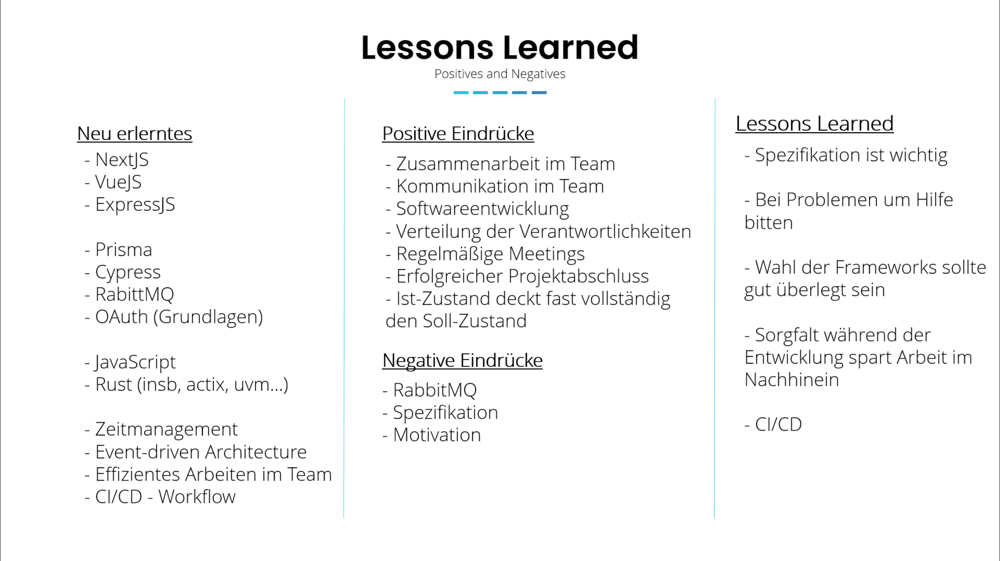

# Lessons Learned

Im Verlaufe der vergangenen Monate haben wir in Bezug zu unserer Projektarbeit viel erlebt. Wir haben viele 
Hürden überwinden müssen und im Zuge dessen einiges gelernt. Um das Gelernte und gesammelte Eindrücke in Worte fassen zu können,
hat jeder aus unserem Team folgende Fragen für sich beantwortet:

- Was hatte ich geplant?
- Was habe ich letzten Endes erreicht?
- Was habe ich neues gelernt? 
- Was lief gut/schlecht?
- Was würde ich beim nächsten Mal anders machen?
- Wie lief die zusammen Arbeit in einem "großen" Team?

Ich (Janik) habe später dann diese Antworten zusammengefasst und den "Lessons Learned"-Teil unserer Präsentation daraus 
hergeleitet. Wie gewünscht, führe ich hier nun die gesammelten Antworten auf. Es ist zu bedenken, dass diese von Anfang an
dazu gedacht waren, zusammengefasst zu werden und daher nicht immer sehr ausführlich sind. 

### Marius - Forum:

**Was hatte ich geplant?**
- Forum, in dem Services benachrichtigungen/Meldungen mit Nutzern der Smart-City teilen können
- Nutzer können Services "abonnieren", sodass bei einer neuen Meldung eines Services eine Mail an den Nutzer verschickt wird
- Kalender mit wichtigen Terminen der Services
- Forum, in dem Nutzer der Smart-City selbst Posts mit unterschiedlichen Kategorien erstellen/bearbeiten/löschen können, Nutzer können sich Posts merken
- Sortieren/Filtern nach Kategorien
- Kontrolle von Posts durch Administratoren

**Was habe ich letzten Endes erreicht?**
- Forum, in dem Services benachrichtigungen/Meldungen mit Nutzern der Smart-City teilen können
- Forum, in dem Nutzer der Smart-City selbst Posts mit unterschiedlichen Kategorien erstellen/bearbeiten/löschen können, Nutzer können sich Posts merken
- Sortieren/Filtern nach Kategorien

**Was habe ich neues gelernt?**
- Einstieg in JavaScript, Express, Prisma, Vue, RabbitMQ
- erstes mal frontend
- erstes mal "scrumartiges" arbeiten mit regelmäßigen Sprints
- erstes mal Workflow mit pullrequests durchgeführt
- erster Einblick in Docker
- selbstständiges Arbeiten innerhalb einer größeren Gruppe
- innerhalb der Gruppe voneinander abhängig programmieren
- in der Gruppe unterschiedliche voneinander unabhängige Programme spezifizieren
- Möglichkeit für Umgang mit Bildern/Dateien
- Fragen stellen
- Balance zwischen sich alleine abquälen und nachfragen schwierig
- direkt nachfragen → man lernt nichts
- gar nicht nachfragen → man verplempert ab einem bestimmten Punkt Zeit ohne großen Lerneffekt
- in großer Gruppe kommunizieren

**Was lief gut?**
- Sprintplannings
- Meetings

**Was lief schlecht?**
- rabbitMq

**Was würde ich beim nächsten Mal anders machen?**
- bei Problemen eher nach Hilfe fragen

**Wie lief die Zusammenarbeit in einem "großen" Team?**
- gut
- man konnte Fragen stellen und sich bei Problemen Hilfe suchen
- Hilfestellungen in den Meetings durch Personen, die schon weiter waren
- Repos der anderen Services als Hilfe
- Kommunikation in den Meetings meist gut, hat sich von Meeting zu Meeting verbessert(anfangs war es in den meetings ruhiger)

### Jonathan - SmartAuth

**Was hatte ich geplant?**
- OAuth2 Server Implementation als Microservice mit Rechteverwaltung, Single Sign On

**Was habe ich letzten Endes erreicht?**
- Deutlich simpleres, rudimentäres Authentifizierungsservice

**Was habe ich neues gelernt?**
- Rust, insb. actix, diesel, lapin
- RabbitMQ
- OAuth Grundlagen
- Authentifizierungsmethoden Grundlagen

**Was lief gut/schlecht?**
- Schlecht:
- Zu lange gebraucht ein "Framework" zu finden, besonders für Frontend in Rust, Wahl fiel auf spannende aber extrem instabiles "FullStack"
Ding was die Arbeit eher schwerer als einfacher gemacht hat (MoonZoon)
- Zu viel vorgenommen und dadurch etwas Zeit verschwendet. Ohne OAuth2 Recherche hätte ich vermutlich deutlich schneller 
- etwas gehabt mit dem Andere hätten arbeiten können
- Generell Frontend in Rust doofe Wahl.
- Probleme mit Deployment, Docker
- Gut:
- Endprodukt funktioniert halbwegs

**Was würde ich beim nächsten Mal anders machen?**
- Kleiner Planen
- Stabilere, bekanntere Bibliotheken nutzen

**Wie lieft die zusammen Arbeit in einem "großen" Team?**
- m.E Insg. ganz gut. Viele Services sind von meinem "abhängig", das war recht stressig. 

### Mario - Finanzamt

**Was hatte ich geplant?**
- (Finanzamt)
- Erstellen und Verwalten von Vorgängen
- Erstellen von PDF-Berichten mit QR-Codes
- Download-Plattform für Formulare und Ähnliches
- Verarbeiten von Spenden
- Allgemeine Verwaltung durch Mitarbeiter
- Funktionen für Arbeitgeber

  **Was habe ich letzten Endes erreicht?**
- Das meiste
- Arbeitgeber Sachen nicht
    - nicht relevant (Kaum Bezug zum Rest)

**Was habe ich neues gelernt?**
- Prisma
- rabbitMQ (allg. Umgang mit Events)
- PDF Erstellung in JavaScript

**Was lief gut/schlecht?**
- Gut
    - Kommunikation im Projektteam
    - Softwareentwicklung
- Schlecht
    - nichts

**Was würde ich beim nächsten Mal anders machen?**
- mehr Zeit in Ideenplanung investieren
- auf mehr Sorgfalt in der Umsetzung achten

**Wie lief die zusammen Arbeit in einem "großen" Team?**
- keine Probleme, da gute Kommunikation im Team

### Jannis - Amt für Integration

**Was hatte ich geplant?**
- (Amt für Integration)
- Registierung von Flüchtlingen
- Erstellung QR Code
- Wohnraum bereitstellen
- Spenden
- Verwaltung (Mitarbeiter)
- mehr Details in der Spezikfiktion

**Was habe ich letzten Endes erreicht?**
- meisten User Stories der Spezifikation, 2 - 3 gestrichen, da keine Relevanz

**Was habe ich neues gelernt?**
- Nextjs
- Prisma
- Cypress

**Was lief gut/schlecht?**
- Gut
    - Kommunikation im Projektteam
    - Softwareentwicklung
- Schlecht
    - nichts

**Was würde ich beim nächsten Mal anders machen?**
- mehr Zeit in Ideenplanung investieren

**Wie lief die zusammen Arbeit in einem "großen" Team?**
- keine Probleme, da gute Kommunikation im Team

### Tom - Fitnessstudio

**Was hatte ich geplant?**
- (Fitnessstudio)
- Anmelden von Mitgliedern
- Kursverwaltung
- Mitgliederverwaltung
- Tierheimkooperation
- mehr Details in der Spezifikation

**Was habe ich letzten Endes erreicht?**
- Keine Kursverwaltung, Tierheim gestrichen

**Was habe ich neues gelernt?**
- Nodejs
- Vue
- Prisma
- RabbitMQ
- Webentwicklung
- JavaScript

**Was lief gut/schlecht?**
- Gut
    - Kommunikation im Projektteam
    - Hilfestellung
- Schlecht
    - Motivation

**Was würde ich beim nächsten Mal anders machen?**
- früher anfangen

**Wie lief die zusammen Arbeit in einem "großen" Team?**
- keine Probleme, da gute Kommunikation im Team

### Max - Kita
**Was hatte ich geplant?**
- Kita-System, das die Platzvergabe erleichtert und in Zusammenarbeit mit den übrigen SmartCity-Services Verwaltungsfunktionen anbietet
- Verwaltungsfunktionen sowohl für SmartCity-Teilnehmer als auch "klassisch" eingepflegte Kita-Kunden

**Was habe ich letzten Endes erreicht?**
- durchsuchbare Kitaliste
- Kita-Detailansicht
- Antragserstellung durch User & durch Amt für Integration
- Bearbeitung von Anträgen durch Mitarbeitende
- Einbindung in SmartCity-Ökosystem wo möglich (Gruppenticket beantragen, SmartAuth, Forumsbeiträge, Amt für Integration)

**Was habe ich neues gelernt?**
- Backend/REST Apis: Expressjs konkret, sowie allgemeines Verständnis von Struktur und Zielen eines Backends (hatte bisher nur Frontend gemacht)
- Javascript: Übung in verschiedenen Anwendungsbereichen
- Frontend: Besseres Verständnis von Vuejs & Frontends allgemein, PrimeVue/PrimeFaces, etwas Verständnis von Reactjs durch Gespräche mit Kommilitonen
- Datenbanken: Arbeit mit Prisma/ORMs
- Event-driven architecture: RabbitMQ Basics, Vor- und Nachteile von EDA
- Zeitmanagement
- Was bei der Zusammenarbeit in einer größeren Gruppe funktioniert und was nicht

**Was lief gut/schlecht?**
- RabbitMQ-Implementierung & Troubleshooting hat mich viel Zeit gekostet
- Spezifikation zu ausladend gestaltet

**Was würde ich beim nächsten Mal anders machen?**
- Bei Spezifikation stärker auf Realisierbarkeit zu achten und entsprechend stärker zu priorisieren
- Genauer definieren, welche Menge von Features ein MVP bildet und welche Features später aufgesetzt werden können
- Aus Erfahrungswerten schließen, welche Features besonders zeitaufwendig werden könnten

**Wie lief die zusammen Arbeit in einem "großen" Team?**
- Lehrreich & praktisch hilfreich, in den Repos anderer schauen zu können, wie sie ähnliche Probleme gelöst haben, sowie Fragen stellen zu können
- Grundsätzlich gute Kommunikation in der Gruppe
- Bekam immer Hilfe bei Problemen
- Typische Kanban Board-Workflows nicht so gut geeignet für dieses Projekt, da man größtenteils allein am eigenen Service arbeitete --> Sprint-Vorgehensweise wurde entsprechend angepasst

### Tristan - Bürgerbüro

**Was hatte ich geplant?**
- das React-Framework kennenlernen
- das Bürgerbüro
    - wo sich die Bürger melden können
    - die Bürger sollten ihre Daten sehen/ändern können
    - die Bürger sollten ihre aktuellen Genehmigungen sehen können
    - die Bürger soltten die Möglichkeit haben neue Genehmigungen zu beantragen
    - die Bürger sollten die Möglichkeit haben eine Partnerschaft zu beantragen und widerrufen
    - Mitarbeiter der Stadt sollten offene Anträge annehmen oder ablehnen können

**Was habe ich letzten Endes erreicht?**
- bis auf die Möglichkeit seinen Ehestatus zu ändern wurde alles implementiert was vorher in den Userstories festgelegt wurde

**Was habe ich neues gelernt?**
- den Aufbau und Umgang mit React
- erste Einblicke in die Funktionsweise von CI/CD (Github Actions)

**Was lief gut/schlecht?**
- gut:
    - die Rollen der Teammitglieder waren klar verteilt
    - Wöchentliche Meetings um den aktuellen Stand der jeweiligen Implementierung zu diskutieren

**Was würde ich beim nächsten Mal anders machen?**
- da jeder Microservice relativ alleinstehend ist, gab es wenig Kommunikation der Teammitglieder untereinander (außerhalb der Meetings)

**Wie lief die zusammen Arbeit in einem "großen" Team?**
- Da wir ja jeder seinen Microservice alleine implementiert hat, gab es außer den Meetings wenig Kontakt zwischen den Teammitgliedern.
- Da die Implementierung bei mir relativ wenig Probleme gemacht hat, gab es auch nur wenig Kommunikation mit Software Architekt und DevOps Engineer. Auch das lief reibungslos.

### Celine - Stadtbus

**Was hatte ich geplant?**
- Smarten Busdienst, der mit Echtzeitdaten die einzelnen Positionen und Verspätungen trackt
- die passenden Route werden angezeigt und man kann Busfahrkarten kaufen
- Bei Personen, die in der SmartCity angemeldet sind sollen Sondertarife/Vergünstigungen automatisch angezeigt werden und es sollen Funktionen freigeschaltet werden, die es einem ermöglichen eine schnelle Route nach Hause zu finden (mit Daten aus dem Bürgerbüro und dem eigenen Standort)
- Benachrichtigungen bei Verspätung/Ausfall

**Was habe ich letzten Endes erreicht?**
- Tracken und Verspätungen anzeigen funktioniert einigermaßen
- Die meisten „smarten“ Funktionen waren doch unrealistischer zu implementieren (z.B. bei SmartCity Mitglieder mit erfundenen Adressen könnte keine Route nachhause berechnet werden, da die Routenberechnung reale Daten verlangt)
- Tickets mit Routen können gekauft werden, normale Tickets noch nicht

**Was habe ich neues gelernt?**
- In einer größeren Gruppe zu arbeiten
- Selbständig ein Full-Stack Projekt zu implementieren (Backend und Web-Frontend)
- Wie man mit externen APIs/WebSockets/Echtzeitdaten umgeht
- Arbeiten mit Rabbitmq/Prisma/Express/React

**Was lief gut/schlecht?**
- Gut: Codeaustausch im Team, da man mit ähnlichen Frameworks gearbeitet hat
- Gut: Einarbeitung in neue Frameworks (gute Dokumentation bei React/Prisma/Express)
- Nicht so gut: Einstieg in RabbitMq, Updates der Echtzeitdaten zu verarbeiten

**Was würde ich beim nächsten mal anders machen?**
- Mehr Zeit für die Ideenfindung und die Planung der Funktionalitäten
- Bei Problemen früher nach Hilfe fragen
- besser mit GitHub arbeiten: rechtzeitige und kleinere Pullrequests

**Wie lieft die zusammen Arbeit in einem "großen" Team?**
- Gute Kommunikation
- Schnelle Hilfe bei Problemen

### Adrian - Software Architekt

**Neu gelernt**
- Vue.js, RabbitMQ, Docker, CI/CD

**Positives**
- Kommunikation und Zusammenarbeit des Teams
- Regelmäßiger und stetiger Fortschritt (keine langen Pausen zwischendurch)

**Negatives**
- Schwierig den Überblick zu behalten, besonders wenn viele Technologien im Spiel sind

**Lessons Learned**
- Technologiewahl einheitlicher gestalten, wenn Übersichtlichkeit und Einfachheit der Wartung wichtig sind

### Paul Merlin - DevOps Engineer

**Was hatte ich geplant?**
- Containerdeployment von allen Microservices, sowie Deployment von Datenbank, RabbitMQ
und Datenbankoberfläche
- Umsetzung einer CI-CD – Pipeline, welche auf das Projekt zugeschnitten ist und eine
vollständige Containerisierung beinhaltet.
- Analyse und Beschaffung einer Linux-VServer Lösung zum Hosten unseres SmartCityprojektes
- Persistierende Daten für Container, DNS-Adressen-Routing, Netzwerkverwaltung und PortForwarding

**Was habe ich letzten Endes erreicht?**
- Eine vollständig umgesetzte Docker Umgebung, mit den oben beschriebenen Spezifikationen
- Vollständige CI-CD-Pipeline mit Tests, Abhängigkeiten und automatischem Redeployment
- Ein Serverlösung, welcher eine hohe uptime – Rate, sowie finanziell wirtschaftlich ist. In
unserem Fall Webtropia Linux V Server
- Volumes (Persisitierende Daten) für benötigte Container (Services), eine DNS Adresse:
supersmartcity.de und eine Weiterleitung zu den einzelnen Microservices inklusive einer
Landingpage, von der man zu den Subseiten weitergeleitet wird.

**Was habe ich Neues gelernt?**
- Containerisierung mit Docker
- Datenbank Deployment im Container
- Volumes innerhalb von Containern
- Verbesserte strukturelle Aufgabenverteilung
- Abschätzungsgabe für den Zeitaufwand bei Abhängigkeit von Teammitgliedern

**Was lief gut/schlecht?**
- Gut
  - Gut lief die Kommunikation untereinander
  - Die zügige Abarbeitung von Aufgaben
  - Die Hilfsbereitschaft von Projektteilnehmern bei Problemen
  - Ebenso das aufeinander Zukommen, wenn menschliche Probleme aufgetreten sind.
  - Verständnis und Anpassung der Ziele, wenn dies nötig war
- Schlecht
  - Manchmal hätten sich Projektteilnehmer früher bei mir melden können
  - Hoher Aufwand zu Beginn durch falsche Hosting-Anbieter-Wahl+

**Was würde ich beim nächsten Mal anders machen?**
- Bei der Wahl des Servers-Hosters, mehr mit Erfahrungen und Bewertungen von anderen
Nutzern in diesem Use-Case abgleichen
- Aufwand für manche Aufgaben besser einschätzen.

**Wie lief die Zusammenarbeit in einem "großen" Team?**
- Es war eine gute Zusammenarbeit durch viel Teamwork und gute Kommunikation möglich
- Durch eine hohe Umsetzungs-Bereitschaft und Motivation war über das Projekt verteilt ein
guter Fortschritt sichtbar

### Janik - Scrum Master

**Was hatte ich geplant?**
- Meetings planen und moderieren
- Backend für die Landingpage implementieren
- Projekt Organisieren und Überwachen
- Anlaufstelle bei Problemen darstellen

**Was habe ich letzten Endes erreicht?**
- Dafür gesorgt, dass die Meetings strukturiert ablaufen und jeder weiß, was er zu tun hat
- Backend mit Events und Routen für die Landingpage implementiert
- Projekt besonders zu Anfang organisiert sowie Abläufe und "Regeln" festgelegt.

**Was habe ich neues gelernt?**
- Frameworks für das Backend waren nichts Neues
- Event-Driven Architecture
- Zusammenarbeit in großem Team
- Man kann es nicht jedem recht machen (Unterschiedliche Meinungen sind normal, es ist wichtig den Mittelweg zu finden)

**Was lief gut/schlecht?**

- Gut:
  - generelle Kommunikation unter den Teammitgliedern 
  - Meetings
  - implementierung des Backends
- Schlecht: 
  - Sondertermine waren teilweise nötig, da wir in manchen Meetings nicht alles klären konnten

**Was würde ich beim nächsten Mal anders machen?**

- Bei Entscheidungen, welche getroffen werden müssen, schneller durchgreifen und die Entscheidung nicht lange herauszögern
- Bei Problemen zwischen Teammitgliedern als Moderator agieren
- Die Rollenverteilung jedem von Anfang an klarmachen

**Wie lief die zusammen Arbeit in einem "großen" Team?**
- Alles in allem sehr gut
- Jeder wusste, was er zu tun hat und hat dies aus entsprechend seiner Fähigkeiten erledigt
- Wenn es Probleme gab, konnte man diese immer Intern lösen

Zusammengefasst wurden diese Antworten dann wie folgt:

