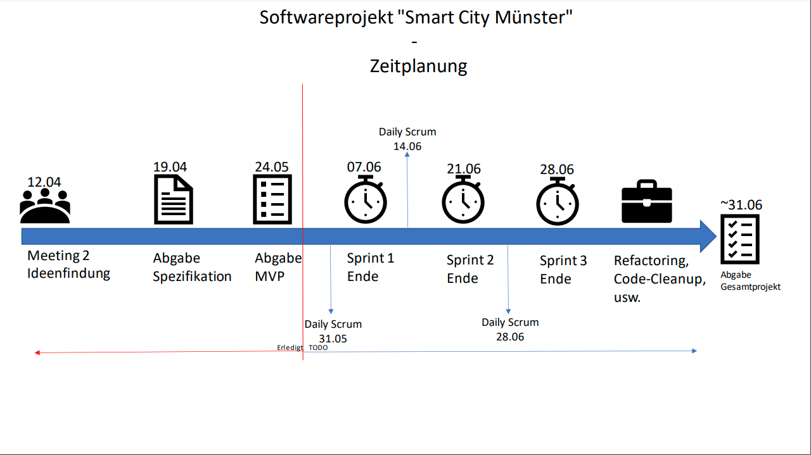
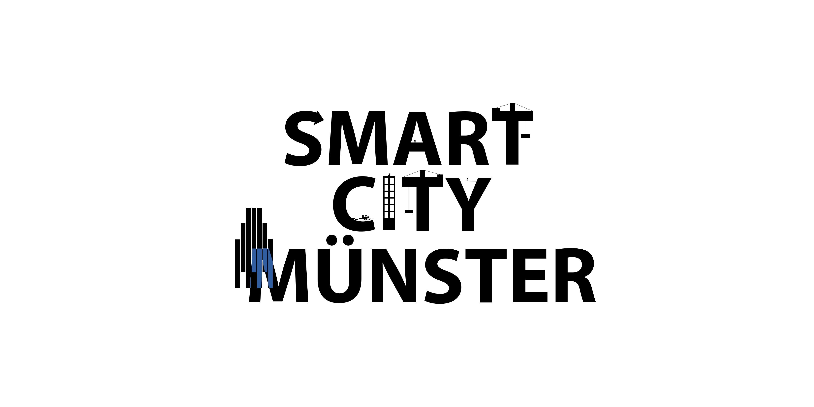

# Protokolle

**Autor:** Scrum Master: Janik Geist

---

**Meeting 1 - Kennenlernen** 05.04.2022

Rollenverteilung (siehe [**Projektorganisation**](_einleitung/projektorganisation)), erste Ideensammlung.

Ansatz (Microservices):

Kommunal
- Landingpage (Adrian & Janik)
- Bürgeramt (Tristan)
  - Dokumentenservice (Upload/Dowload/Neue Dokumente)
- Microservice Newsletter (Jonathan)
- Authentifizierung (Jonathan)
- Finanzamt (Mario) 
- Zulassungsstelle (Tristan)
- Schule (Max)
- Kita (Max)
- Bus(tickets) (Celine)
- Gesundheitsamt / Ärtze (Gesundheitkarte) / Patienteninfos weitergeben (Schnittstellen) (Vivien)
- Tierheim (Vivien)

Privat
- API Schnittstelle für private Unternehmen (Adrian)
- Verein (Celine)
- ggf Hotel (Marius)
- Chiropraktiker
- Physiotherapeuten (Tom)
- Fitnesstudio / Weiterleitung an den Physiotherapeuten? (Tom)
- Einkaufsmöglichkeiten (Mario)
- Online-Shoppingdienst (Marius)
- Apotheken (Rezepte weiterleiten)
- Tierarzt

Nächstes Meeting 12.04.2022
- Jeder geht bei den gewählten Microservices genauer ins Detail, schaut wie sie **Inhaltlich** umsetzbar wären.

---

**Meeting 2 - Ideenfindung** 12.04.2022

Anwesende: Alle

Adrian stellt die technischen Anforderungen und Spezifikationen für die einzelnen 
Microsysteme vor. Alles wichtige dazu findet man unter der [**Projektorganisation**](_einleitung/projektorganisation)

Paul Merlin geht kurz auf die Organisation der Git-Repos ein. 
  - Jeder Microservice ist als Sub-Repo des Main-Repos realisiert.
  - Um Systemunabhängiges Testen und Deployen zu ermöglichen wird Docker genutzt (siehe Discord **#wichtige-links**)

Janik stellt einen groben Zeitplan auf.
  - Welche Deadlines sind zu beachten? - **DI 19.04 Abgabe der Spezifikation**
  - Wie wird der Fortschritt der gesamten Repos beobachtet? - Jedes Repo ist als Kanbancard im Haupt-Repo vertreten,  
    dort kann auf einen Blick erkannt werden, in welchem Status sich jeder Microservice befindet
  - Wie wird der Fortschritt eines einzelnen Repos beobachtet? - Jedes Sub-Repo hat sein eigenes Kanbanboard, auf dem  
    alle Userstories als Sprintziele eingetragen und verfolgt werden.

Die einzelnen Microsysteme werden festgelegt, verteilt und inhaltlich aufgearbeitet.
  
Landing Page: 
  - Bekommt mittels der Events Updates der About Us, Bild, Links und Namen der einzelnen Microservices

Fitnessstudio (Tom):
  - Technik -> Unschlüssig
  - Meldet sich beim Finanzamt für automatische Steuerbearbeitung und Abrechnung
  - Bezieht Adressen der Mitglieder vom Bürgerbüro
  - Bietet vergünstigte Tarife für Mitarbeiter(Fremder Firmen)/Flüchtlinge
  - Bietet engagierten Kunden Arbeit im Tierheim an

Finanzamt (Mario):
  - Technik -> Javascript, node.js o.ä.
  - Bei Bürgeranmeldung steuern verwalten
  - Verwaltung von Fördergeldern (z.b. Flüchtlinge)

Bürgerbüro (Tristan):
  - Technik -> Javascript
  - Bürgeranmeldung löst Event für andere Services aus
  - Statusänderungen werden weitergegeben (Hochzeit o.ä.)
  - Eltern/Kind Beziehung, Ehestatus etc.

Authentifizierung (Jonathan):
  - Technik -> Rust
  - Aktive Session wird in Cookies gespeichert
  - Speichert nur Name und Vorname sowie EMail
  - reagiert auf angemeldeten Bürger mit EMail
    
Jeder Bürger bekommt bei Anmeldung am Amt eine E-Mail und kann sich über einen enthaltenen Link   
bei der Authentifizierung anmelden. Zeitpunkt ist egal.  
Kinder können, müssen aber keine Email-Adresse angeben. Wer keine angibt, kann sich jederzeit anmelden(mit Überprüfung beim Bürgeramt).  

Kita (Max):
  - Technik -> vue.js express
  - Bei Kindes-Anmeldung wird eine EMail mit Kita empfehlungen geschickt
  - reagiert auch auf neue Flüchtlingskinder

Flüchtlingsamt (Jannis):
  - Technik -> express next.js oder react
  - meldet neue Flüchtlinge an 
  - gibt Auskunft über Flüchtlingsstatus
  - Fragt Kitaplätze/Fitnessstudio an

Bus (Celine):
  - Technik -> react express
  - Vergünstigungen für Familien/Flüchtlinge
  - Anfrage an Bürgerbüro für Daten über Personen
  - Kitaausflüge organisieren

Tierheim (Vivien):
- Technik -> Rust für Backend, Frontend unentschieden
- Hundesteuer beim Finanzamt melden
- Sachkundenachweis für gefährliche Hunde beim Bürgerbüro anfragen
- Schwarzes Brett gefundene/einsame Tiere melden
- Fitnessstudio engagierte Menschen finden
 
Newsletter (Marius):
  - Schwarzes Brett (Anmeldung über Events)
  - Schwarzes Brett für Bürger
  - Statistiken
  - Kalender (ebenfalls Events)
  - Werbung der einzelnen Services einbinden 

Bis nächste Woche, eher bis SO 17.04 die Spezifikation fertig stellen.  
Nächste Woche Vorstellung der Spezifikation und Sprintplanning mit Zielen aus den User Stories.

---

**Meeting 3 - Sprintplanning 1** DI 19.04

Meeting startet pünktlich, alle Teammitglieder sind anwesend.

Wir fangen an mit einer, von Hr. Brunsmann angeführten, Präsentation der einzelnen Spezifikationen.
Nachdem jeder Service seine Spezifikation vorgestellt hat, geht Jonathan nochmals genauer auf SmartAuth und den Umgang
mit Events und API dieses Services ein. Auch Tristan stellt nochmals alle Events und API Funktionen des Bürgerbüros vor.

Statt einer ID wird in Zukunft nur ein Schlüssel des SmartAuth verwendet, um die Identität des Bürgers zu schützen. 
Für Testzwecke stellt das Bürgerbüro noch eine API mit BürgerID zur Verfügung.

Adrian prüft noch ob in Zukunft ein JSON-Format-Prüfer genutzt werden soll, um Events auf Korrektheit und Vollständigkeit
zu prüfen. Ergebnis dazu, nächstes Meeting. Außerdem prüft Adrian ob eine Fehler-Event-Queue nötig/sinnvoll ist.

Bei Tests sollen wir uns laut Hr. Brunsmann eher auf integrations Testfälle als auf funktionale Testfälle konzentrieren.

Janik räumt die Woche über die Projektdokumentation auf und löscht unnötige/falsche Einträge und Seiten.

Jeder prüft nochmal bei seinen Klassendiagrammen ob die Aggregationsraute an der richtigen Stelle abgebildet ist.
Die Raute muss am Ganzen der Teil-Ganzes-Beziehung stehen.

Nachdem diese Dinge geklärt sind, erklärt Adrian nochmals das theoretische Verfahren mit RabbitMQ. Weitere Infos dazu 
können in dem [Tutorial](https://www.rabbitmq.com/tutorials/tutorial-two-python.html) nachgelesen werden. 
Außerdem kümmert sich Adrian um eine Visualisierung für die Spezifikation.

Es wird entschieden, dass das Bürgerbüro *erstmal* keine Weiteren Events/API-Routes zur Verfügung stellen muss.

Paul kümmert sich um einen Mailserver, Docker und einen Datenbankserver.

Das MVP sieht vor, dass Interfaces/Events implementiert, aber noch nicht funktional sind.
Um das MVP bis zur Deadline implementieren können, müssen alle Interfaces/Events bis zur 20.KW implementiert sein. Dazu
startet ab Heute dem 19.04 der erste Sprint. Jeder Service wählt einige Userstories aus seiner Spezifikation aus. Wichtig ist,
dass alle einen ähnlichen Umfang haben und jeder auch in der Lage ist, die festgesetzten Ziele zu erreichen.
Folgende Einteilung wurde festgelegt und ist auch in den einzelnen Repos unter "Projekt" auf einem Kanbanboard zu sehen.
Bitte folgt dem Scrumstandart und verschiebt die Karten entsprechend ihres aktuellen Status.

SmartAuth:

    * Userstories 1,2 und 3

Landingpage:

    * Registrierung der einzelnen Services und entsprechende Weiterleitung des Users

Bürgerbüro:

    * Userstories 1,2 und 3

Finanzamt:

    * Userstories 3,4,11,13,7,8

Amt für Integration:

    * Userstories 1,6,12,13,17,18,19,20,21,22

Fitnessstudio:

    * Userstories 2,3,8,9,6,7

Kita:

    * Servicekooperation, Userstory 1, Zweiterabschnitt 1 und 2

Stadtbus:

    * Userstories 1,3,5,7

Forum:

    * Tabelle 1

Tierheim:

    * Userstories 1,2,6,7,8,9,12,13,14,15

---

**Meeting 4 - Daily Scrum** DI 26.04

Anwesend: 2 Online, Rest vor Ort

Wir fangen an mit einem Überblick. Was wurde bisher erledigt? Was lief gut/schlecht? Was soll bis zum nächsten Meeting 
noch erledigt werden?

Jannis - Amt für Integration:
- RabbitMQ Schnittstelle wurde implementiert, es gab jedoch noch Probleme mit der Verbindung zu RabbitMQ selbst.
- Die ersten externen Interfaces (Interfaces die von anderen Services genutzt werden sollen) wurden erstellt
- Einige Frontend-Seiten wurden bereits designed und implementiert
- Bis nächste Woche:
  - Schnittstelle für RabbitMQ auch an RabbitMQ selbst anbinden
  - Private Schnittstellen für User/Mitarbeiter implementieren

Marius - Newsletter:
- Einarbeitung in Vue
- Erste Schritte in Prisma, leider war der Datenbankserver regelmäßig offline, was die Arbeit erschwerte
- Bis nächste Woche:
  - Userstories aus den Sprintzielen implementieren

Max - Kita:
- Einarbeitung in Express und Prisma
- Erstes Datenbankschema erstellt, auch hier Probleme mit der Datenbankserververfügbarkeit
- Bis nächste Woche
  - Private Methoden im Backend erstellen

Tristan - Bürgeramt:
- Einarbeitung in React, dabei ist die Frage aufgekommen, wie mit 2 Servern (Front-/Backend) für einen Services umgegangen werden soll
- Erste Ordnerstrukturen
- Bis nächste Woche:
  - Interfaces zur Meldung des Bürgers, sowie das dazugehörige Event implementieren

Tom - Fitnessstudio:
- Einarbeitung in Front-/Backend Frameworks, dauerte leider länger als erwartet.
- Bis nächste Woche:
  - Verschobene Arbeit aufholen und restliche Sprintziele erarbeiten

Celine - Stadtbus:
- Backend aufgesetzt
- Prismaschema für Datenbank erstellt, auch hier wieder Serverprobleme
- Einarbeitung in React
- Bis nächste Woche
  - Schnittstellen implementierung 
  - RabbitMQ Interfaces erstellen und verbinden

Vivien - Tierheim:
- Einarbeitung in Rust
- Bis nächste Woche:
  - Schnittstellen und Sprintziel implementierung

Jonathan - SmartAuth:
- Einarbeitung in Rust
- Erste Schnittstellen implementierung
- Prismaschema, auch hier wieder Datenbankprobleme
- Bis nächste Woche:
  - Weitere Schnittstellen
  - Dokumentation erweitern, damit andere Services da weiter arbeiten können

Paul - CI/CD und Server
- Githubactions bezüglich CD sind fertig und können genutzt werden
- Rudimentäre Dockerfiles sind fertig, müssen aber in zusammenarbeit mit den Services spezialisiert werden
- Datenbankserver aufgesetzt, dieser macht aber momentan noch Probleme, die noch gelöst werden müssen
- Watchtower zur verwaltung von Containern eingerichtet. Watchtower reagiert auf Commits in den Masterbranch und sorgt für CD
- Erste Versuche mit dem Mailserver, es wird noch überlegt, diesen von einem externen Anbieter hosten zu lassen. (Mehr dazu in den kommenden Tagen)

Adrian zeigt ein paar Codetemplates zur Kommunikation mit RabittMQ und wie man mit Vue ein "gebautes" Frontend direkt vom Backend als 
statischen Ordner einbinden lassen kann.

Bezüglich der Datenbank wird folgendes Festgehalten:
- Da durch regelmäßige Arbeiten am Server keine durchgehende Funktionalität gewährleistet werden kann, sollte jeder Service eine eigene
Datenbank zu Testzwecken einrichten. Dies kann entweder mittels MySQL, oder über einen lokalen Dockercontainer gelöst werden.

Passwörter zu Datenbankservern und ähnlichem sollen in GitHub-Secrets angelegt werden und von da aus mittels CI/CD in Docker als
Umgebungsvariablen festgehalten werden.

In Zukunft sollen JSON-Daten, die direkt aus der Queue gelesen werden, vor der Verwendung mit JSON-Schemas auf Gültigkeit geprüft werden.
Dazu müssen JSON-Schemas für jedes Event angelegt werden, bei Fragen an Adrian wenden.

Da dies gegen Ende des Meetings nochmal aufgekommen ist:
- Adrian ist in seiner Rolle als **Software Architekt** für die generelle
Codestruktur und Qualität zuständig. Er soll darauf achten, dass sich jeder an festgelegte Strukturen und Vorgaben hält.
Natürlich kann jeder neue Ideen und Anregungen einbringen, doch schlussendlich legt Adrian diese Dinge fest und 
weißt auf mögliche Probleme im Code oder in der Spezifikation hin. Inhaltlich und Designtechnisch sind die Services
natürlich vollständig dem entsprechenden Entwickler überlassen.

---

**Meeting 5 - Sprintabschluss/Sprintplanning** DI 03.05 

Anwesend: Alle

Herr Brunsmann beginnt das Meeting und fragt bei jedem nach dem aktuellen Stand. 
Jeder geht auf seinen Stand ein und bennent eventuelle Problembereiche.
Wir legen fest, dass das **MVP am 24.05.2022** fertiggestellt sein muss. Dies wirft uns aus dem Sprintrythmus von 2 Wochen,
daher wird der nächste Sprint auf 3 Wochen verlängert. In den ersten 2 Wochen soll der Focus vor allem auf den externen Schnittstellen und
Events liegen.

Im Discord wurde der Wunsch geäußert, dass wir nochmal genauer auf RabbitMQ und JSON-Schema eingehen, daher zeigt Adrian
jetzt nochmal was dazu. Die Beispiele und weitere Tutorials sind im Main-Repo zu finden. Der Zugang zu RabbitMQ ist noch
nicht für jeden eingerichtet, dies soll sich bis heute Abend ändern.

Tristan hat für das Bürgerbüro bereits einige Events mit RabbitMQ verschickt und zeigt einige Beispiele aus seinem Code.
Durch das Aufteilen von Connection und Senden, in eine spezielle Wrapperklasse, sind Passwörter und Benutzernamen nur an
einer Stelle im Projekt zu setzen.

Auch zu Prisma gab es noch ein paar Fragen, die heute geklärt werden sollen. Daher zeigt Max einige Beispiele aus seinem
Kitaprojekt und geht auf den generellen Umgang mit Prisma ein.

Bzgl. Docker und generellem CD gibt es Momentan noch Probleme, welche auf unzureichende Serverspezifikationen zurückzuführen sind.
Wir arbeiten noch an einer Lösung. Wenn es schlecht läuft, müssen wir den Provider wechseln. Weiteres dazu, nächste Woche.

Da der Mailserver extreme Probleme auf dem Hauptserver gemacht hat, haben wir uns letzte Woche nach dem Meeting dazu entschieden, 
den Mailservice von einem externen Anbieter hosten zu lassen. Leider existiert hier kein Framework das durch Rust benutzt werden kann,
daher übernimmt Jonathan jetzt die Bereitstellung des Mailservers. Sollte dieser bis zum nächsten Meeting am 10.05 nicht lauffähig sein, 
kümmern sich Janik und Adrian um einen Microservice der eine API für EMail-Verkehr bereitstellt.

Für das Datum soll zukünftig ein einheitliches Format festgelegt werden, dies soll mit JSON-Schemas in AJV konform sein.

Im nachfolgenden Sprintplanning legen wir folgende Ziele für den kommenden Sprint fest: 
(Die Zielsetzung mittels Userstories hat sich im letzten Sprint als problematisch erwiesen, daher nutzen wir für den folgenden Sprint API- und Eventschnittstellen )

Tom - Fitnessstudio:
- Problembereiche aufarbeiten 
- Grundstruktur, mit Mentoring durch Adrian, aufbauen

Max - Kita:
- Eventschnittstellen
- JSON-Schema
- Testfälle einarbeitung

Celine - Stadtbus:
- Eventschnittstellen
- Testfälle
- Prisma (Fehlerbehebung)

Marius - Newsletter:
- Eventschnittstellen
- Testfälle
- Evtl. Private schnittstellen

Tristan - Bürgerbüro:
- Testfälle
- Private Schnittstellen, da die meisten öffentlichen schon implementiert
- Eventschnittstellen (empfangen)

Jannis - Amt für Integration:
- Zweiten Pullrequest überarbeiten
- Logik fürs Backend (privat), da auch hier die meisten öffentlichen schon implementiert sind

Jonathan - SmartAuth:
- Eine Anmeldung für den User 
- Auth und Token 
- EMail-Server bereitstellen

Vivien - Tierheim:
- Eventschnittstellen
- Testfälle

Mario - Finanzamt:
- Eventschnittstellen senden/empfangen
- Interne Schnittstellen
- Testen

Paul - CI/CD:
- Serverprobleme fixen

Janik/Adrian - Landingpage:
- Weiteres Event zum Löschen von Services
- Front- und Backend verbinden
- Testfälle

---

**Meeting 6 - Daily Scrum** DI 10.05

Anwesend: Zwei Online, Rest Präsenz

Jeder geht kurz auf seinen Fortschritt, seit letzter Woche, ein und nennt mögliche Probleme oder Hindernisse, die Ihr/Ihm 
bei der Entwicklung begegnet sind. Ergebnis dieser kurzen Zusammenfassung ist, dass im Gegensatz zu letzter Woche vieles
besser und auch schneller fortschreitet. 

Unter der Woche kam es zu einem Anbieterwechsel für den Server, da wir in der 
Vergangenheit große Probleme mit der limitierten Performanz des alten Servers hatten. Mit dem neuen Anbieter sind diese 
Probleme hoffentlich Geschichte. Paul hat bereits alles portiert und neue Links/Zugangsdaten über Discord verteilt.

Da der Server aufgrund des Anbieterwechels in der vergangenen Woche nur selten zur Verfügung stand, konnten Dinge wie Datenbankschemas
oder Anbindung an RabbitMQ garnicht oder nur schlecht getestet werden, dies sollte in Zukunft besser laufen.

Außerdem sollen bis zum nächsten Meeting die meisten Dockerfiles für die einzelnen Services erstellt werden, sodass der CD-Teil von
CI/CD funktionsfähig ist.

Alles in allem sind wir auf einem guten Weg in Richtung MVP und sind zuversichtlich, dass wir die Deadline einhalten können.

---

**Meeting 8 - Abgabe MVP & Sprintplanning** DI 24.05

Anwesend: Alle

Vorab: Das Meeting letzte Woche hat stattgefunden, jedoch war ein Protokoll nicht nötig, bzw. wäre in einem Einzeiler 
zusammenzufassen.

Wir fangen an und führen zuerst unseren Sprintabschluss durch.

Nach dem Sprintabschluss treffen wir einige Absprachen bezüglich verschiedener Themen, Ergebnisse dieser Absprachen sind 
weiter unten aufgelistet.

Pull-Requests:
* Ab sofort soll wirklich **jedes Feature** mit einem Pull-Request in den Mainbranch gemerged werden. Dafür am besten direkt zu 
  Anfang der Entwicklung einen Request mit dem [WIP]-Tag erstellen und dann bei Fertigstellung das Tag entfernen.

Zeitplanung:

* Ich hatte bereits im Discord einen Zeitplan hochgeladen der die ungefähre Restzeit abbildet, die wir noch für das
  Projekt haben. Wir legen fest, dass wir versuchen diese Zeiteinteilung einzuhalten und behalten Sprints im 2 Wochenrhythmus
  bei. Außerdem beschließen wir, unseren Fokus während der Entwicklung auf interne Schnittstellen zu legen, welche 
  im späteren Verlauf wichtig für die Kommunikation zwischen den Services ist. So kann diese Kommunikation in den späteren
  Sprints effektiv und funktional implementiert werden. Auf dem Zeitplan ist momentan noch eine "Refactoring-Phase" angegeben, 
  diese führen wir nur durch, wenn noch genügend Zeit über bleibt. 

Verzögerungen:
* Da Verzögerungen ab jetzt noch schwerwiegender auf Fortschritt unseres Projekts wirken, legen wir ein paar Grundregeln 
  zum Umgang mit diesen fest. So sollen Verzögerungen frühzeitig angesprochen werden, damit wir entsprechend reagieren
  können. Sollten Verzögerungen auftreten, legen wir auch hier den Fokus eher auf Kommunikation zwischen den Services
  und stellen in dem Fall erstmal "interne" Eigenschaften zurück. So hoffen wir, auch mit Verzögerungen ein fertiges Produkt 
  abgeben zu können.

Scrummeetings:
* In den vergangenen Meetings hatten wir oft nicht viel zu klären, da das Ziel klar war und jeder seinen Teil getan hat.
  Da wir nicht damit rechnen, dass das ab jetzt immer noch der Fall ist, belassen wir es bei den wöchentlichen Meetings um
  so auf eventuelle Probleme zeitnah reagieren zu können.

Nach dem all diese Dinge geklärt sind, fangen wir mit dem Sprintplanning des kommenden Sprints an, folgende Ziele wurden festgelegt.

Janik & Adrian:
* About Us-Event überarbeiten, sodass auch Links mitgeschickt werden
* Frontend mit Backend verbinden

Jonathan:
* Registrieren 
* Einloggen
* Fixes

Mario:
* Userstory 12
* Userstory 14
* Userstory 11
* Userstory 08
* Userstory 03

Tom:
* Userstory 02
* Userstory 03
* Userstory 06
* Userstory 07

Tristan:
* Datenbankprobleme beheben
* Melden (Userstory 01)

Celine:
* Userstory 11
* Userstory 07
* Userstory 16
* Userstory 15
* (Karte wenn noch Zeit)

Max:
* Events implementieren (senden)
* Userstory 25
* Userstory 26
* Userstory 31
* Events empfangen
* (Userstory 01)

Marius:
* Userstory 01
* Userstory 05

Jannis:
* Userstory 01
* Userstory 02
* Userstory 03
* Userstory 04
* Userstory 05
* Userstory 06
* Userstory 07
* Userstory 08
* Userstory 09
* Userstory 13
  * Meist Frontend

Vivien:
* Userstory 07
* Userstory 01
* Userstory 09
* Userstory 10

Paul: 
* Weiterhin CI/CD (never ending)

---

**Meeting 9 Daily Scrum** DI 31.05.

Anwesend: 2 Online, Rest vor Rrt

Wir fangen an mit dem Fortschritt der einzelnen Services. Jeder geht kurz auf Probleme oder Schwierigkeiten
während der Entwicklung ein. Grob zusammengefasst, geht es bei den meisten gut voran und wir sind zuversichtlich,
dass wir für die nächste Präsentation des MVPs einiges vorzeigen können.

Bezüglich der Präsentation am **DI 07.06** legen wir fest, dass wir uns am **Montag 06.06 um 10:00 nochmal online treffen**,
um einen vernünftigen Ablauf der Präsentation festzulegen.

Um auch mit weniger funktionalen Aspekten der Projektentwicklung weiterzukommen, legen wir uns auf ein vorläufiges Logodesign 
fest, welches ab jetzt unser Projekt grafisch repräsentieren soll. Mit Upload dieses Protokolls, ist das Logo unter dem Namen
logo_4.png im Hauptverzeichnis zu finden. Außerdem lade ich noch ein weiteres Symbollogo hoch, welches unter dem Namen
logo_icon.png ebenfalls im Hauptverzeichnis zu finden ist.

---

**Meeting 10 Präsentationsplanung** DI 06.06

Anwesend: Fast alle (Janik zu spät, Merlin verhindert)

Heute wollen wir den Ablauf der MVP-Präsentation besprechen. Die Präsentation soll einen
sinnvollen Verlauf haben, der bereits implementierte Events und Funktionen in passender Reihenfolge
darstellt. Dazu legen wir folgendes Fest:

**(Fast alle Funktionen werden auf dem Live-Server präsentiert, nur vereinzelt wird etwas lokal ausgeführt sein)**

1. Wir starten bei der Landingpage und zeigen wie sich das Bürgerbüro registriert und leiten von der Landingpage 
direkt zum Bürgerbüro weiter.

2. Das Bürgerbüro verschickt ein "Bürger-melden-Event", welche dann von SmartAuth verarbeitet werden soll.

3. SmartAuth nimmt das "Bürger-melden-Event" entgegen und zeigt die Verarbeitung eventuell mit Registrierung.

4. Das Tierheim nimmt dann diese Registrierung und zeigt das Einloggen und prüfen auf Mitarbeiter/User.

5. Danach verschickt das Amt für Integration ein Spenden-Event und ein Kita-Event, welche dann von den jeweiligen Services 
entgegengenommen werden.

6. Das Finanzamt nimmt das Spenden-Event an und verschickt zusätzlich ein Event an das Forum.

7. Daraufhin zeigt die Kita wie mit dem Event vom Amt für Integration umgegangen wird und verschickt ein Event an den Stadtbus.
Außerdem wird auch von der Kita ein Event an das Forum verschickt.

8. Der Stadtbus zeigt dann die Verarbeitung des empfangenen Events und verschickt ebenfalls ein Event an das Forum.

9. Anschließend fasst das Forum alle empfangenen Events zusammen.

10. Zum Abschluss zeigt das Fitnessstudio seinen Fortschritt und verschickt eventuell ein eigenes Event.

---

**Meeting 11 Sprintabschluss & Planning** DI 07.06.

Anwesend: Alle (Einer Online)

Wir fangen an, Herrn Brunsmann das MVP vorzustellen.
Danach besprechen wir wann wir das Endprodukt präsentieren möchten, zur Auswahl stehen der 
21.07, 28.07 oder der 05.08. Wir einigen uns darauf, dass wir Herrn Brunsmann am 20.07 über den 
geplanten Vorstellungstermin informieren. Aktuell gehen wir vom 05.08 aus.

Der aktuelle Stand ist zufriedenstellend, die meisten Services sind nun deployed und die Kommunikation
funktioniert. Wir sind zuversichtlich, dass wir die meisten Ziele bis zur Abgabe erreichen werden.

Nachdem wir den aktuellen Stand besprochen haben, vereinbaren wir Sprintziele für den kommenden Sprint.

Smart-Auth:
Mitarbeiter login
Serviceregistrierung
Userlogin in zusammenarbeit mit dem Bürgerbüro

Amt für Integration:
Wohnraumbereitstellung
Userstories - 18, 12, 6, 15, 20

Bürgerbüro:
Genehmigungen beantragen annehmen/ablehnen
Event vom Amt für Integration empfangen und automatisch verarbeiten

Stadtbus:
Anfragen der Kita bearbeiten (Tickets)
Userstories - 1, 18, 14, 4

Kita: 
Userstories - 11 (Anträge sichtbar machen), 2, 4, 5, 34, 33, 7, 8, 28 (Besuche beim Tierheim anmelden)

Forum:
Nutzer-Implementierung realisieren
Kalender (falls zu schwer, diesen als Liste darstellen)
Userstories - 7, 20, 10, 14, 15, 17

Tierheim:
Userstories - 1, 7, 10, 22, 24

Finanzamt:
Bürgerbüro Events bearbeiten
Donations
Förderung beantragen 
Vorgänge erstellen
Userstories: 
3, 4, 5, 13, 15 (PDF-Export von Vorgängen)

Fitnessstudio:
Mitglieder anmeldung
Mitarbeiter verwaltung
Userstories 1-4, 11-15

Paul kümmert sich um CI in zusammenarbeit mit dem Amt für Integration und dem Bürgerbüro, so
können wir beispielhaft die CI-Pipeline mit JEST und CYPRESS zeigen.

---

**Meeting 12 Daily Scrum** DI 14.06.

Wir fangen direkt an mit dem aktuellen Fortschritt der einzelnen Services.

Forum:
Diese Woche leider verhindert aufgrund von anderen Abgaben

Kita:
Kitas können nun gefiltert und sortiert werden.
Der Rest soll bis Dienstag aufgeholt werden.

Stadtbus:
Erste Schritte für die Karte unternommen, hier müssen noch Animationen überarbeitet werden.
Eingabe für Haltestellen steht, die Berechnung einer passenden Route folgt noch.

Bürgerbüro:
Eventlistener ist fast fertig.
Arbeit an Genehmigungen hat begonnen.

Amt für Integration:
Wohnraum kann nun für Flüchtlinge bereitgestellt werden.
Familien können nun auch registriert werden.
Mitarbeiter können diese Registrierungen annehmen und Wohnraum zuweisen.

Finanzamt:
Landingpage-Events werden verschickt (Hier ist noch ein Fehler bei der Landingpage aufgetaucht, der noch behoben werden muss)
Bürgerbezüge müssen noch verfeinert werden 

CI/CD:
Tests für CI laufen für das Amt für Integration.
Superlinter ist ab jetzt für alle Services aktiviert, verhindert aber keine Commits bei Fehlern!

SmartAuth:
Container macht aktuell noch Probleme 
Mails werden mittlerweile an den Bürger verschickt, hier steht dann der Code, welcher zur Registrierung genutzt werden kann.
SmartAuth funktioniert so weit für Bürger und kann von den anderen Services benutzt werden, leider ist es momentan noch auf einem 
anderen Server zu erreichen, dies soll sich in der kommenden Woche ändern.

Fitnessstudio:
Frontend arbeiten laufen.
Mitgliederverwaltung in Arbeit.

Da SmartAuth in dieser Woche große Schritte gemacht hat, können die anderen Services sich nun darum kümmern diese Funktionalität
in Ihren Seiten einzubauen. Deshalb legen wir diese Woche den Fokus auf diesen Teil, sodass wir hier endlich einen guten Schritt 
weiter kommen.