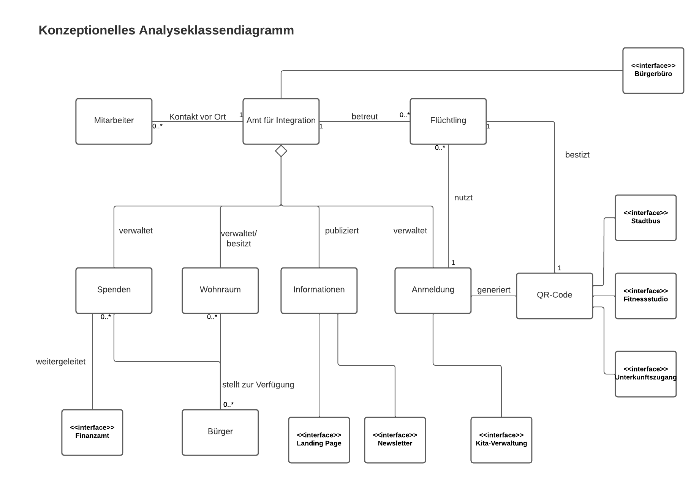

# Amt für Integration

**Autor:** Jannis Thiel

## Überblick
Wegen Krieg und Verfolgung flüchten viele Menschen aus ihrer Heimat und kommen zu uns.
Wir versuchen die Geflüchteten ab ihrer Ankunft bestmöglich zu unterstützen und ihren 
Integrationsprozess zu begleiten. Dabei sollen bürokratischen Hürden überwunden werden,
um schnelle, flexible Hilfe gewährleisten. 
 
Die Gefüchteten können sich und ihre Familie bei der Ankunft digital mit ihren Dokumenten anmelden. 
Bei diesem Event werden ihnen eine geeigente Unterkunft/Wohnung zugewiesen, sowie ein QR-Code mit 
dem sie Zugang zur Unterkunft haben. Dieser wird ihnen direkt als Download zur Verfügung gestellt. 
Des Weiteren können sich die Flüchtlinge mit dem QR-Code Ausweisen. Dadurch können andere Einrichtungen ihren Status abfragen.
Mit dem QR-Code können Geflüchtete kostenlos mit öffentlichen Verkehrsmittel fahren, sowie an Freitzeitaktivitäten 
teilnehmen, wie beispielsweise im Fitnessstudio. 
Als weiterer digitaler Service bieten wir die Beantragung der Unterbringung von Kindern in der Kita an. 
Neben den dititalen Lösungen besteht auch die Möglichkeit der Kontaktaufnahme vor Ort.
Dazu sind alle Informationen auf der Website aufgeführt. 
Bürger können einen Beitrag leisten, indem sie Wohnraum zur Verfügung stellen oder spenden. 
Wichtige Informationen für Bürger werden regelmäßig im Newsletter veröffentlicht.

 <!-- Analyseklassendiagramm -->