# Bürgerbüro

**Autor:** Tristan Kechlo

?> http://vps2290194.fastwebserver.de:9710/

## Überblick

<!--- Textuelle Beschreibung der Anwendungsdomäne --->
Das Bürgerbüro dient als erste Anlaufstelle wenn ein Bürger sich in der Stadt melden will.  
Dies kann der Bürger in der SmartCity auch online durchführen.
Nach Abschluss des Meldevorgangs erhält der Bürger ein Email mit einem Registrierungscode.
Mit diesem Code kann der Bürger sich dann einen Account in der SmartCity anlegen. 
Der Account wird für die Nutzung anderer Microservices der SmartCity benötigt.  
  
Desweiteren kann bei dem Bürgerbüro eine Namens-/Adressänderung beantragt werden.
Diese Änderungen werden den anderen Microservices über Events mitgeteilt. Auch andere Statusänderungen, 
wie Eheschließung, Scheidung oder Todesmeldungen, werden an die anderen Microservices veteilt.  
Zusätzlich können die Bürger über das Bürgerbüro verschiedene Genehmigungen, wie z.B. eine Baugenehmigung, beantragen. 
  
<!--Konzeptionelles Analyseklassendiagramm (logische Darstellung der Konzepte der Anwendungsdomäne)-->
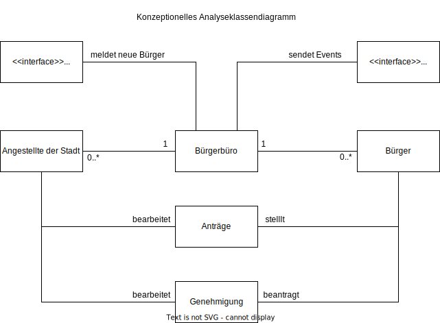

## Funktionale Anforderungen
<!--
  * Definition der Akteure
  * Use-Case Diagramme
  * Strukturierung der Diagramme in funktionale Gruppen
  * Akteure sowie andere Begriffe der implementierten Fachdomäne definieren 
  * Begriffe konsistent in der Spezifikation verwenden  
  * Begriffe im Glossar darstellen
-->
### Akteure
**Bürger:** eine Person die sich in dieser Stadt melden will  
**User:** ein Bürger der sich in der SmartCity registriert hat  
**Angestellter:** ein Mitarbeiter der Stadt  

### Use-Case Diagramme
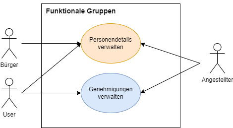
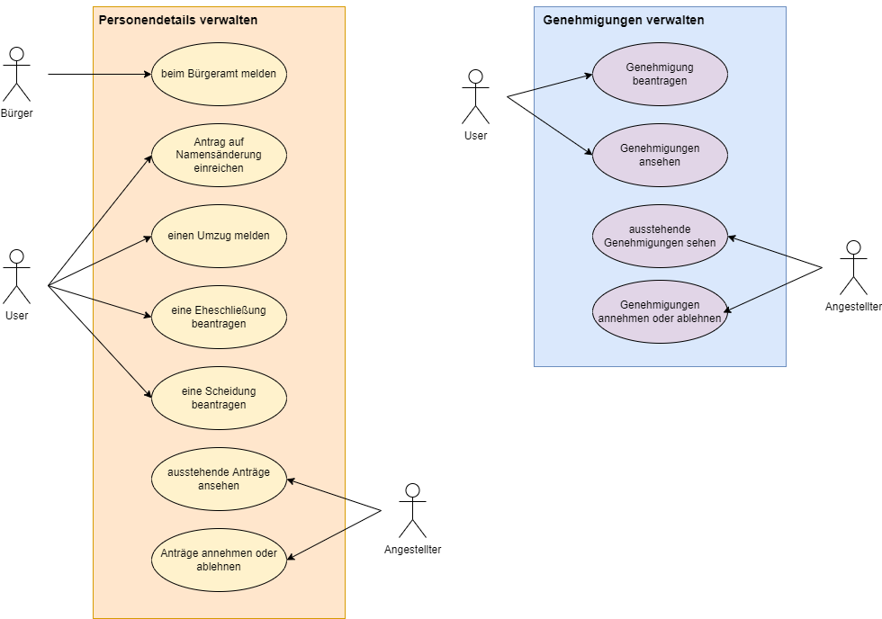

## Anforderungen im Detail
<!--
- User Stories mit Akzeptanzkritierien 
- Optional: Name (oder ID) und Priorität ("Must", "Should", "Could", "Won't")
- Strukturierung der User Stories in funktionale Gruppen
- Sicherheit: Misuse-Stories formulieren
-->
**User-Stories: Personendetails verwalten**

| **ID** | **Als** | **möchte ich** | **so dass** | **Akzeptanz** | **Prioität** |
| :------ | :----- | :------ | :-------- | :------ | :------ |
| 1 | Bürger | möchte ich mich im Bürgeramt melden können | ich in dieser Stadt gemeldet bin | Bürger wird gemeldet | Muss |
| 2 | User | eine Namensänderung beantragen | mein Name im Melderegister korrekt ist | Antrag wird eingereicht | Muss |
| 3 | User | einen Umzug melden | meine Adresse im Melderegister korrekt ist | Daten werden geändert | Muss |
| 4 | User | eine Eheschließung beantragen | mit meinem Partner verheiratet bin | Heirat wird beantragt | Kann |
| 5 | User | eine Scheidung beantragen | nicht mehr mit meinem Partner verheiratet bin | Scheidung wird beantragt | Kann |
| 6 | Angestellter | ausstehende Anträge sehen | ich diese annehmen/ablehnen kann | Anträge werden angezeigt | Muss |
| 7 | Angestellter | einen ausstehenden Antrag annehmen/ablehnen | dieser bearbeitet wurde | Antrag wird angenommen/abgelehnt | Muss |

**User-Stories: Genehmigungen einreichen**

| **ID** | **Als** | **möchte ich** | **so dass** | **Akzeptanz** | **Prioität** |
| :------ | :----- | :------ | :-------- | :------ | :------ |
| 8 | User | Genehmigungen beantragen | diese eingereicht wird | Genehmigung wird eingereicht | Muss |
| 9 | User | meine Genehmigungen sehen | ich weiß welche Genehmigungen angenommen wurden | Genehmigungen werden angezeigt | Muss |
| 10 | Angestellter | ausstehende Genehmigungen sehen | ich diese annehmen/ablehnen kann | Genehmigungen werden angezeigt | Muss |
| 11 | Angestellter | eine ausstehende Genehmigung annehmen/ablehnen | diese bearbeitet wurde | Genehmigung wird angenommen/abgelehnt | Muss |

## Graphische Benutzerschnittstelle
<!--
- GUI-Mockups passend zu User Stories
- Screens mit Überschrift kennzeichnen, die im Inhaltsverzeichnis zu sehen ist
- Unter den Screens darstellen (bzw. verlinken), welche User Stories mit dem Screen abgehandelt werden
- Modellierung der Navigation zwischen den Screens der GUI-Mockups als Zustandsdiagramm
- Mockups für unterschiedliche Akteure
-->
?> Klicke auf die Bilder um sie in voller Größe zu sehen

  
Hauptseite des Bürgerbüros

  
Neuen Bürger im Melderegister eintragen

  
Übersicht über eigene Anträge

  
Übersicht über eigene Genehmigungen

  
  
  
  
  
Antrag auf Namensänderung

  
Umzug melden

  
Eheschließung beantragen

  
Scheidung beantragen

  
  
  
  
  
Angestellter: offene Anträge

  
Angestellter: Antragsdetails

  
Angestellter: offene Gemehmigungen

  
Angestellter: Genehmigungsdetails

  
  
  
  

## Datenmodell
<!--
- Begriffe im Glossar darstellen
- Modellierung des physikalischen Datenmodells 
  - RDBMS: ER-Diagramm bzw. Dokumentenorientiert: JSON-Schema
-->
### ER-Modell
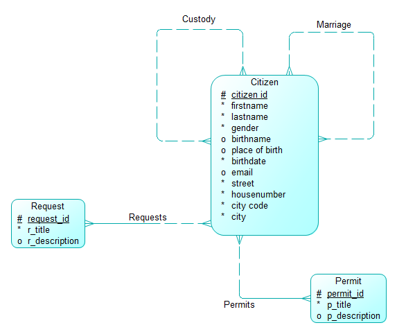
### Physisches Datenmodell
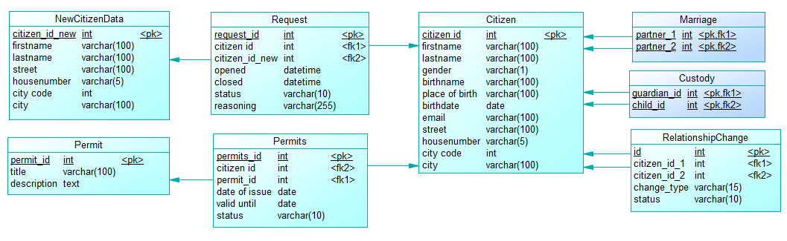

#### Begriffserklärung
**Requests**: Anträge die einmalig bearbeitet werden und dann abgeschlossen sind. Zum Beispiel ein Antrag auf Namensänderung  
**Permit**: Dauerhafte/Zeitbegrenzte Genehmigung zugeordnet zu einem Bürger. Beipiele: Baugenehmigung, Sachkundenachweis für Hundehalter, ...

## Abläufe
<!--
- Aktivitätsdiagramm für den Ablauf sämtlicher Use Cases
- Aktivitätsdiagramme für relevante Use Cases
- Aktivitätsdiagramm mit Swimlanes sind in der Regel hilfreich 
  für die Darstellung der Interaktion von Akteuren der Use Cases / User Stories
- Abläufe der Kommunikation von Rechnerknoten (z.B. Client/Server)
  in einem Sequenz- oder Aktivitätsdiagramm darstellen
- Modellieren Sie des weiteren die Diagramme, die für das (eigene) Verständnis des
  Softwaresystems hilfreich sind. 
-->
### Bürger
Ablauf für Bürger die sich in der Stadt melden, und anschließend für die SmartCity registrieren  

### Anträge
Ablauf für das Stellen und bearbeiten von Anträgen  

### Genehmigungen
Ablauf für das Beantragen und bearbeiten von Genehmigungen  

## Schnittstellen
<!--
- Schnittstellenbeschreibung (API), z.B. mit OpenAPI 
- Auflistung der nach außen sichtbaren Schnittstelle des Microservices. Über welche Schnittstelle kann z.B. der Client den Server erreichen?
- In Event-gesteuerten Systemen ebenfalls die Definition der Ereignisse und deren Attribute
- Aufteilen in Commands, Events, Queries
* Abhängigkeiten: Liste mit Kommunikationsabhängigkeiten zu anderen Microservices
-->

<!-- code images created with https://carbon.now.sh -->
### API
?> Klicke auf die Bilder um sie in voller Größe zu sehen

**URL der API:** http://vps2290194.fastwebserver.de:9710/api

#### Öffentliche API

| **Methode** | **Pfad** | **Parameter** |  **Resultat** |
| :------ | :----- | :------ | :----- |
| GET | `<api-url>/citizen/<id>/` | ID: eindeutige Bürger-ID | Informationen zu einem einzelnen Bürger |
| GET | `<api-url>/citizen/<id>/hasDogPermit/` | ID: eindeutige Bürger-ID | Gibt an ob der Büger einen Sachkundenachweis für Hundehalter hat<a href="https://smartcityprojectgroup.github.io/SmartCity/buergerbuero/media/api_has_dog_permit.png" title="Klick mich!" target="_blank" rel="noopener">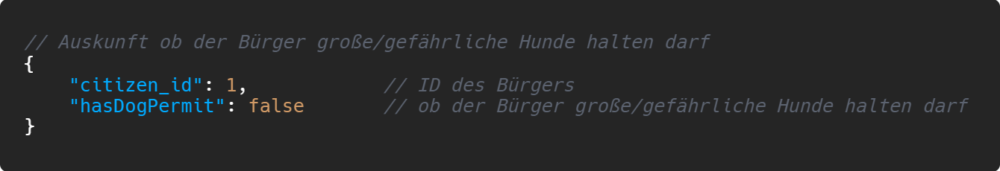</a> |
| GET | `<api-url>/citizen/<id>/children/` | ID: eindeutige Bürger-ID | gibt die IDs der Kinder zurück<a href="https://smartcityprojectgroup.github.io/SmartCity/buergerbuero/media/api_children.png" title="Klick mich!" target="_blank" rel="noopener">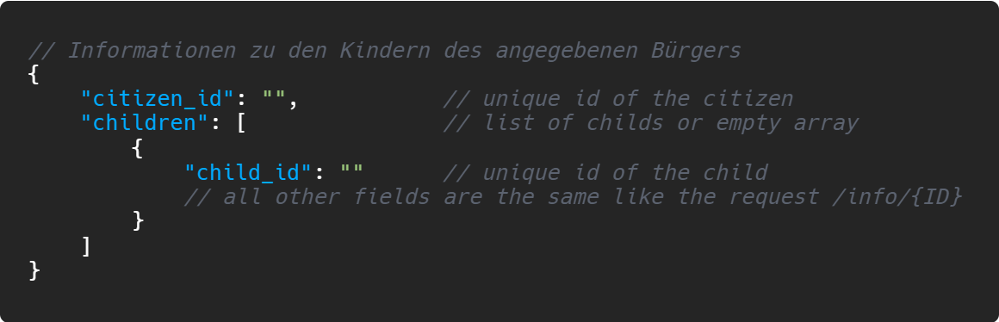 |

#### Private API

| **Methode** | **Pfad** | **Parameter** |  **Resultat** |
| :------ | :----- | :------ | :----- |
| | **API zum Bürger** | | |
| POST | `<api-url>/citizen/` | Json im Request-Body | der neu erstellte Bürger |
| GET | `<api-url>/citizen/<id>/permits/` | ID des Bürgers | Alle aktuellen Genehmigungen eines Bürgers |
| | **API zu Genehmigungen** | | |
| POST | `<api-url>/permits/` | Json im Request-Body | die neu erstellte Genehmigung |
| GET | `<api-url>/permits/<id>/` | ID der Genehmigung | die angefragte Genehmigung |
| PUT | `<api-url>/permits/<id>/` | ID der Genehmigung | die überarbeitete Genehmigung |
| DELETE | `<api-url>/permits/<id>/` | ID der Genehmigung | Boolean, ob die Genehmigung gelöscht wurde |
| GET | `<api-url>/permits/` | - | alle Genehmigungen |
| POST | `<api-url>/permits/requestPermits/` | Json im Request-Body | die neu beantragte Genehmigung |
| GET | `<api-url>/permits/open/` | - | alle offenen Genehmigungen |
| POST | `<api-url>/permits/approve/<id>/` | - | Boolean, ob die Genehmigung überarbeitet wurde |
| POST | `<api-url>/permits/reject/<id>/` | - | Boolean, ob die Genehmigung überarbeitet wurde |
| | **API zu Anträgen** | | |
| POST | `<api-url>/requests/` | Json im Request-Body | der neu erstellte Antrag |
| GET | `<api-url>/requests/<id>/` | ID des Antrags | der angefragte Antrag |
| GET | `<api-url>/requests/` | - | alle offenen Anträge |
| DELETE | `<api-url>/requests/<id>/` | ID des Antrags | Boolean, ob der Antrag gelöscht wurde |
| POST | `<api-url>/requests/approve/<id>/` | ID des Antrags | Boolean, ob der Antrag überarbeitet wurde |
| POST | `<api-url>/requests/reject/<id>/` | ID des Antrags | Boolean, ob der Antrag überarbeitet wurde |

### Events
?> Klicke auf die Bilder um sie in voller Größe zu sehen

| **Name** | **Beschreibung** | **Payload** |
| :------ | :----- | :----- |  
| About us | wird ausgelöst wenn sich die About-Us-Seite des Bürgerbüros ändern soll | <a href="https://smartcityprojectgroup.github.io/SmartCity/buergerbuero/media/event_about_us.png" title="Klick mich!" target="_blank" rel="noopener">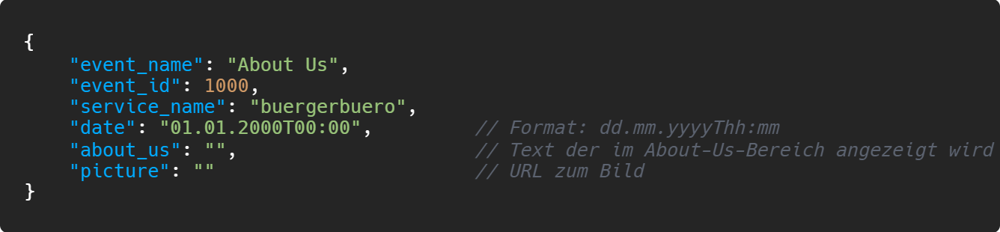</a> |
| Neuer Bürger gemeldet | wird ausgelöst sobald sich ein Bürger bei der Stadt meldet |  |
| Datenänderung | wird ausgelöst, wenn ein Bürger seine Daten (Name/Adresse/...) ändern lässt | <a href="https://smartcityprojectgroup.github.io/SmartCity/buergerbuero/media/event_data_change.png" title="Klick mich!" target="_blank" rel="noopener">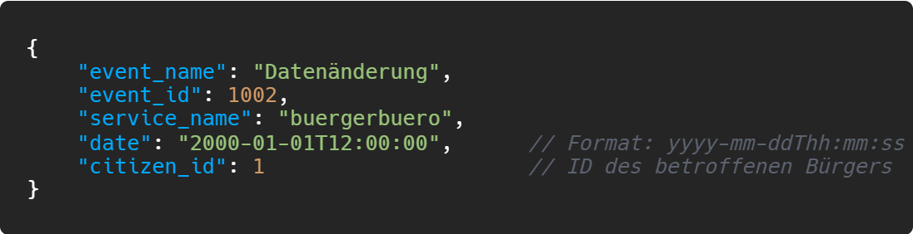</a> |
| Eheschließung | wird ausgelöst, wenn zwei Bürger heiraten | <a href="https://smartcityprojectgroup.github.io/SmartCity/buergerbuero/media/event_marriage.png" title="Klick mich!" target="_blank" rel="noopener">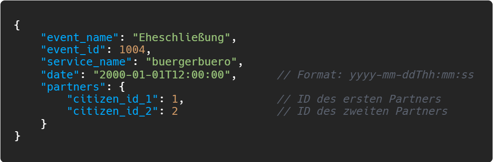</a> |
| Scheidung | wird ausgelöst, wenn zwei Bürger sich scheiden lassen | <a href="https://smartcityprojectgroup.github.io/SmartCity/buergerbuero/media/event_divorce.png" title="Klick mich!" target="_blank" rel="noopener">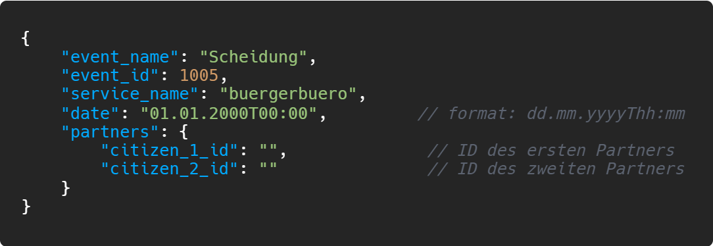</a> |
| Todesmeldung | wird ausgelöst, wenn ein Bürger stirbt | <a href="https://smartcityprojectgroup.github.io/SmartCity/buergerbuero/media/event_citizen_death.png" title="Klick mich!" target="_blank" rel="noopener">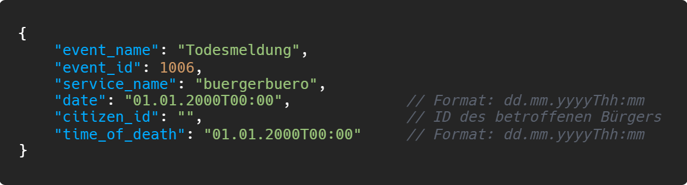</a> |

### Event-Subscriptions
Events, von anderen Microservices, die das Bürgerbüro auswertet/verarbeitet

| **Service** | **Event** | **Funktion** |
| :------ | :----- | :----- | 
| Amt für Integration | Register New Refugee | Bürger in der Datenbank speichern |
| Amt für Integration | Register New Refugee Family | Bürger in der Datenbank speichern |
| Tierheim | New Proof Of Competence | Genehmigung abspeichern |

## Technische Umsetzung

### Softwarearchitektur
<!---
Darstellung von Softwarebausteinen (Module, Schichten, Komponenten)

Hier stellen Sie die Verteilung der Softwarebausteine auf die Rechnerknoten dar. Das ist die Softwarearchitektur. Zum Beispiel Javascript-Software auf dem Client und Java-Software auf dem Server. In der Regel wird die Software dabei sowohl auf dem Client als auch auf dem Server in Schichten dargestellt.
--->

* **Server**
  * Web-Schicht: **JavaScript Node.js**
  * Logik-Schicht: **JavaScript Express.js**
  * Persistenz-Schicht: **MySQL Datenbank**

* **Client**
  * View-Schicht: **React**
  * Logik-Schicht: **React**
  * Kommunikation-Schicht: **JavaScript Fetch-API**

<!---
Die Abhängigkeit ist bei diesen Schichten immer unidirektional von "oben" nach "unten". Die Softwarearchitektur aus Kapitel "Softwarearchitektur" ist demnach detaillierter als die Systemübersicht aus dem Kapitel "Systemübersicht". Die Schichten können entweder als Ganzes als ein Softwarebaustein angesehen werden. In der Regel werden die Schichten aber noch weiter detailliert und in Softwarebausteine aufgeteilt. 
--->

### Fehlerbehandlung 
<!--
* Mögliche Fehler / Exceptions auflisten
* Fehlercodes / IDs sind hilfreich
* Nicht nur Fehler technischer Art ("Datenbankserver nicht erreichbar") definieren, sondern auch fachliche Fehler wie "Kunde nicht gefunden", "Nachricht wurde bereits gelöscht" o.ä. sind relevant. 
-->
#### API-Aufrufe
Es gelten für alle API-Aufrufe die üblichen HTTP-Statuscodes.  
Zusätzlich wird bei Fehlern immer ein JSON im Antwort-Body liegen, welches die Fehler näher erläutert.  
Hier die im Backend meistbenutzen Statuscodes:
 - **200**: Die Anfrage wurde erfolgreich bearbeitet
 - **400**: Die Anfrage-Nachricht war fehlerhaft aufgebaut
 - **401**: Die Anfrage kann nicht ohne gültige Authentifizierung durchgeführt werden
 - **404**: Die angeforderte Ressource wurde nicht gefunden
 - **500**: Sammelfehler für unerwartete Serverfehler

### Validierung

* Relevante (Integrations)-Testfälle, die aus den Use Cases abgeleitet werden können
* Testfälle für 
  - Datenmodell
  - API
  - User Interface
* Fokussieren Sie mehr auf Integrationstestfälle als auf Unittests
* Es bietet sich an, die IDs der Use Cases / User Stories mit den Testfällen zu verbinden,
  so dass erkennbar ist, ob Sie alle Use Cases getestet haben.

### Verwendete Technologien

* Frontend: React
* Backend: JavaScript (Node.js/Express.js)
* Datenbank: MySQL
