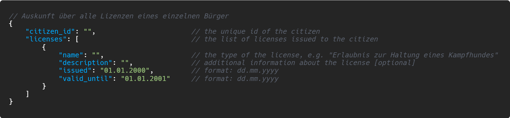
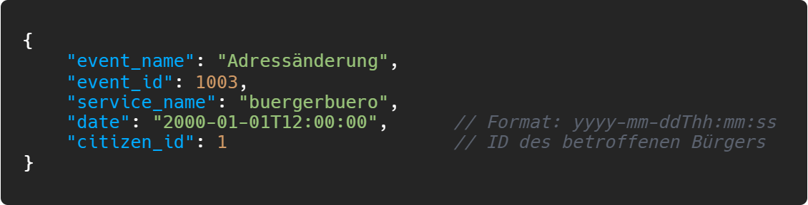
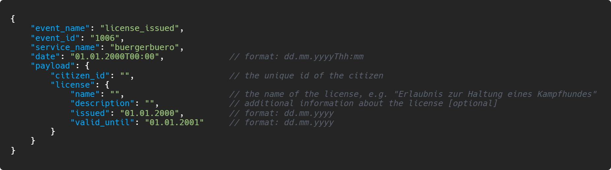
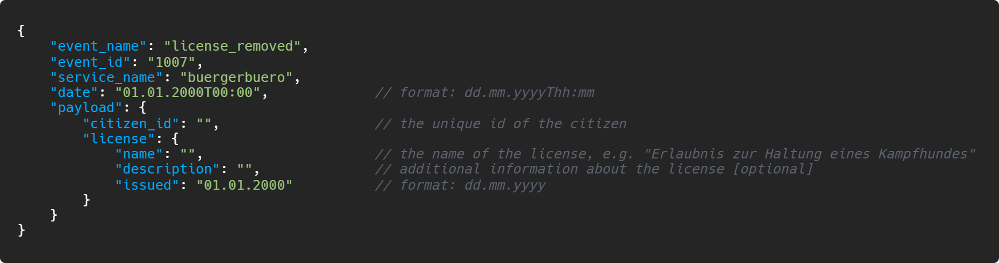

# Bürgerbüro

**Autor:** Tristan Kechlo

## Überblick

<!--- Textuelle Beschreibung der Anwendungsdomäne --->
Das Bürgerbüro dient als erste Anlaufstelle wenn ein Bürger sich in der Stadt melden will.  
Dies kann der Bürger in der SmartCity auch online durchführen.
Nach Abschluss des Meldevorgangs erhält der Bürger ein Email mit einem Registrierungscode.
Mit diesem Code kann der Bürger sich dann einen Account in der SmartCity anlegen. 
Der Account wird für die Nutzung anderer Microservices der SmartCity bebötigt.  
  
Desweiteren kann bei dem Bürgerbüro eine Namens-/Adressänderung beantragt werden.
Diese Änderungen werden den anderen Microservices über Events mitgeteilt. Auch andere Statusänderungen, 
wie Beendigung eines Arbeitsverhältnisses, Eheschließung oder Todesmeldungen, werden an die anderen Microservices veteilt.  
  
`Konzeptionelles Analyseklassendiagramm (logische Darstellung der Konzepte der Anwendungsdomäne)`

## Funktionale Anforderungen
<!--
  * Definition der Akteure
  * Use-Case Diagramme
  * Strukturierung der Diagramme in funktionale Gruppen
  * Akteure sowie andere Begriffe der implementierten Fachdomäne definieren 
  * Begriffe konsistent in der Spezifikation verwenden  
  * Begriffe im Glossar darstellen
-->
### Akteure
**Bürger:** eine Person die sich in dieser Stadt melden will  
**User:** ein Bürger der sich in der SmartCity registriert hat  
**Angestellter:** ein Mitarbeiter der Stadt  

### Use-Case Diagramme

## Anforderungen im Detail
<!--
- User Stories mit Akzeptanzkritierien 
- Optional: Name (oder ID) und Priorität ("Must", "Should", "Could", "Won't")
- Strukturierung der User Stories in funktionale Gruppen
- Sicherheit: Misuse-Stories formulieren
-->
**User-Stories: Personendetails verwalten**

| **ID** | **Als** | **möchte ich** | **so dass** | **Akzeptanz** | **Prioität** |
| :------ | :----- | :------ | :-------- | :------ | :------ |
| 1 | Bürger | möchte ich mich im Bürgeramt melden können | ich in dieser Stadt gemeldet bin | Bürger wird gemeldet | Muss |
| 2 | User | eine Namensänderung beantragen | mein Name im Melderegister korrekt ist | Antrag wird eingereicht | Muss |
| 3 | User | einen Umzug melden | meine Adresse im Melderegister korrekt ist | Daten werden geändert | Muss |
| 4 | User | eine Eheschließung beantragen | mit meinem Partner verheiratet bin | Heirat wird beantragt | Muss |
| 5 | User | eine Scheidung beantragen | nicht mehr mit meinem Partner verheiratet bin | Scheidung wird beantragt | Muss |
| 6 | Angestellter | ausstehende Anträge sehen | ich diese annehmen/ablehnen kann | Anträge werden angezeigt | Muss |
| 7 | Angestellter | einen ausstehenden Antrag annehmen/ablehnen | dieser bearbeitet wurde | Antrag wird angenommen/abgelehnt | Muss |

**User-Stories: Genehmigungen einreichen**

| **ID** | **Als** | **möchte ich** | **so dass** | **Akzeptanz** | **Prioität** |
| :------ | :----- | :------ | :-------- | :------ | :------ |
| 8 | User | Genehmigungen beantragen | diese eingereicht wird | Genehmigung wird eingereicht | Muss |
| 9 | User | meine Genehmigungen sehen | ich weiß welche Genehmigungen angenommen wurden | Genehmigungen werden angezeigt | Muss |
| 10 | Angestellter | ausstehende Genehmigungen sehen | ich diese annehmen/ablehnen kann | Genehmigungen werden angezeigt | Muss |
| 11 | Angestellter | eine ausstehende Genehmigung annehmen/ablehnen | diese bearbeitet wurde | Genehmigung wird angenommen/abgelehnt | Muss |

## Graphische Benutzerschnittstelle
<!--
- GUI-Mockups passend zu User Stories
- Screens mit Überschrift kennzeichnen, die im Inhaltsverzeichnis zu sehen ist
- Unter den Screens darstellen (bzw. verlinken), welche User Stories mit dem Screen abgehandelt werden
- Modellierung der Navigation zwischen den Screens der GUI-Mockups als Zustandsdiagramm
- Mockups für unterschiedliche Akteure
-->
?> Klicke auf die Bilder um sie in voller Größe zu sehen

  

    Hauptseite des Bürgerbüros 
    
  

  

    Neuen Bürger im Melderegister eintragen 
    
  

  

    Übersicht über eigene Anträge 
    
  

  

    Übersicht über eigene Genehmigungen 
    
  

  

    Antrag auf Namensänderung 
    
  

  

    Umzug melden 
    
  

  

    Eheschließung beantragen 
    
  

  

    Scheidung beantragen 
    
  

## Datenmodell
<!--
- Begriffe im Glossar darstellen
- Modellierung des physikalischen Datenmodells 
  - RDBMS: ER-Diagramm bzw. Dokumentenorientiert: JSON-Schema
-->
### ER-Modell

### Physisches Datenmodell

## Abläufe

- Aktivitätsdiagramm für den Ablauf sämtlicher Use Cases
- Aktivitätsdiagramme für relevante Use Cases
- Aktivitätsdiagramm mit Swimlanes sind in der Regel hilfreich 
  für die Darstellung der Interaktion von Akteuren der Use Cases / User Stories
- Abläufe der Kommunikation von Rechnerknoten (z.B. Client/Server)
  in einem Sequenz- oder Aktivitätsdiagramm darstellen
- Modellieren Sie des weiteren die Diagramme, die für das (eigene) Verständnis des
  Softwaresystems hilfreich sind. 

## Schnittstellen
<!--
- Schnittstellenbeschreibung (API), z.B. mit OpenAPI 
- Auflistung der nach außen sichtbaren Schnittstelle des Microservices. Über welche Schnittstelle kann z.B. der Client den Server erreichen?
- In Event-gesteuerten Systemen ebenfalls die Definition der Ereignisse und deren Attribute
- Aufteilen in Commands, Events, Queries
* Abhängigkeiten: Liste mit Kommunikationsabhängigkeiten zu anderen Microservices
-->
### API
?> Klicke auf die Bilder um sie in voller Größe zu sehen

!> Noch in Arbeit, Syntax der Resultate können sich noch ändern

**Basis - URL:** http://smart.city/microservices/buergerbuero/api

| **Pfad** | **Methode** | **Parameter** | **Resultat** |
| :------ | :----- | :------ | :------ |
| /info/{ID} | GET | ID: eindeutige Bürger-ID | Informationen zu einem einzelnen Bürger |
| /licenses/{ID} | GET | ID: eindeutige Bürger-ID | Auskunft über alle Lizenzen eines einzelnen Bürger |
| /children/{ID} | GET | ID: eindeutige Bürger-ID | Informationen zu den Kindern des angegebenen Bürgers<a href="https://merlinchiodo.github.io/SmartCity/buergerbuero/media/api_children.png" title="Klick mich!" target="_blank" rel="noopener"> |

### Events
?> Klicke auf die Bilder um sie in voller Größe zu sehen

!> Noch in Arbeit, Event-IDs und Event-Payloads können sich noch ändern

| **Name** | **Beschreibung** | **Payload** |
| :------ | :----- | :----- |  
| About us | wird ausgelöst wenn sich die About-Us-Seite des Bürgerbüros ändern soll |  |
| Neuer Bürger gemeldet | wird ausgelöst sobald sich ein Bürger bei der Stadt meldet |  |
| Eheschließung | wird ausgelöst, wenn zwei Bürger heiraten |  |
| Namensänderung | wird ausgelöst, wenn ein Bürger seinen Namen änder lässt |  |
| Adressänderung | wird ausgelöst, wenn ein Bürger innerhalb der Stadt umzieht |  |
| Todesmeldung | wird ausgelöst, wenn ein Bürger stirbt |  |
| Genehmigung ausgestellt | wird ausgelöst, wenn einem Bürger eine Genehmigung ausgestellt wird |  |
| Genehmigung widerrufen | wird ausgelöst, wenn einem Bürger eine Genehmigung widerrufen wird |  |

### Event-Subscriptions
Events, von anderen Microservices, die das Bürgerbüro auswertet/verarbeitet

| **Service** | **Event** | **Funktion** |
| :------ | :----- | :----- | 
| Amt für Integration |  |  |
| Amt für Integration |  |  |

## Technische Umsetzung

### Softwarearchitektur

- Darstellung von Softwarebausteinen (Module, Schichten, Komponenten)

Hier stellen Sie die Verteilung der Softwarebausteine auf die Rechnerknoten dar. Das ist die Softwarearchitektur. Zum Beispiel Javascript-Software auf dem Client und Java-Software auf dem Server. In der Regel wird die Software dabei sowohl auf dem Client als auch auf dem Server in Schichten dargestellt.

* Server
  * Web-Schicht
  * Logik-Schicht
  * Persistenz-Schicht

* Client
  * View-Schicht
  * Logik-Schicht
  * Kommunikation-Schicht

Die Abhängigkeit ist bei diesen Schichten immer unidirektional von "oben" nach "unten". Die Softwarearchitektur aus Kapitel "Softwarearchitektur" ist demnach detaillierter als die Systemübersicht aus dem Kapitel "Systemübersicht". Die Schichten können entweder als Ganzes als ein Softwarebaustein angesehen werden. In der Regel werden die Schichten aber noch weiter detailliert und in Softwarebausteine aufgeteilt. 

### Entwurf

- Detaillierte UML-Diagramme für relevante Softwarebausteine

### Fehlerbehandlung 

* Mögliche Fehler / Exceptions auflisten
* Fehlercodes / IDs sind hilfreich
* Nicht nur Fehler technischer Art ("Datenbankserver nicht erreichbar") definieren, sondern auch fachliche Fehler wie "Kunde nicht gefunden", "Nachricht wurde bereits gelöscht" o.ä. sind relevant. 

### Validierung

* Relevante (Integrations)-Testfälle, die aus den Use Cases abgeleitet werden können
* Testfälle für 
  - Datenmodell
  - API
  - User Interface
* Fokussieren Sie mehr auf Integrationstestfälle als auf Unittests
* Es bietet sich an, die IDs der Use Cases / User Stories mit den Testfällen zu verbinden,
  so dass erkennbar ist, ob Sie alle Use Cases getestet haben.

### Verwendete Technologien

* Frontend: React
* Backend: JavaScript (Node.js/Express.js)
* Datenbank: MySQL
