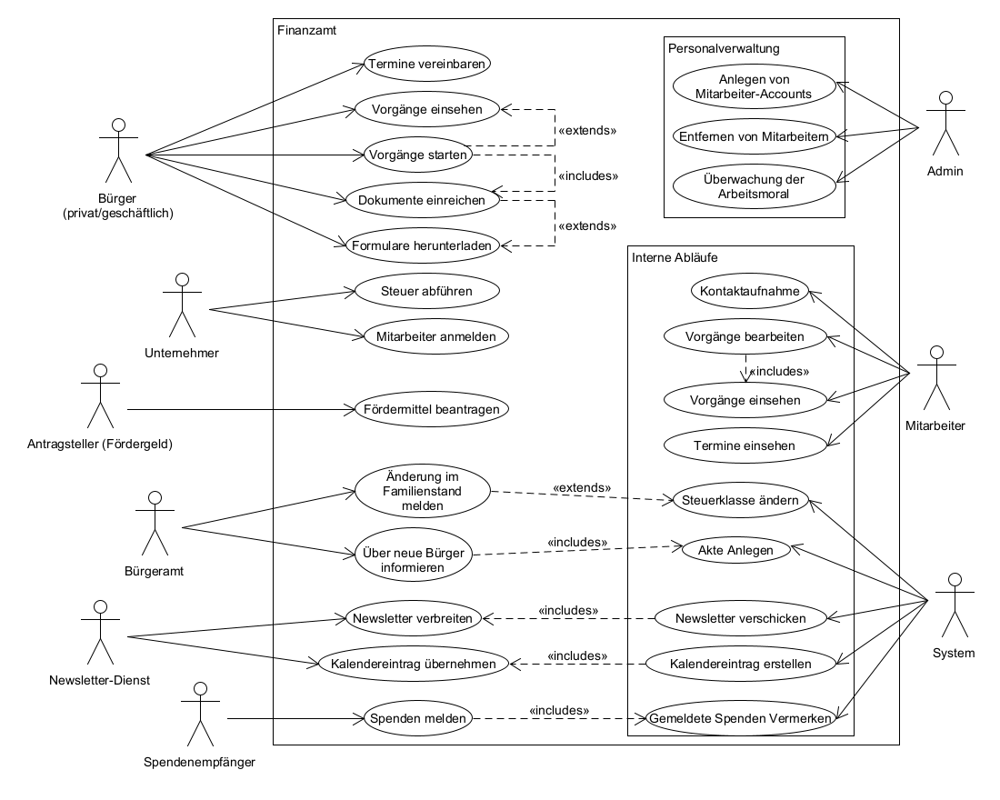
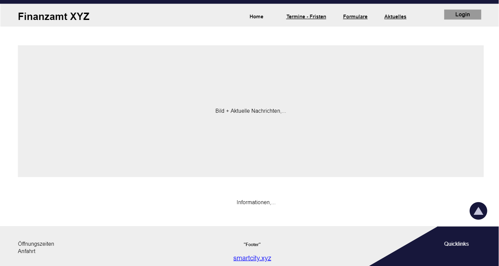
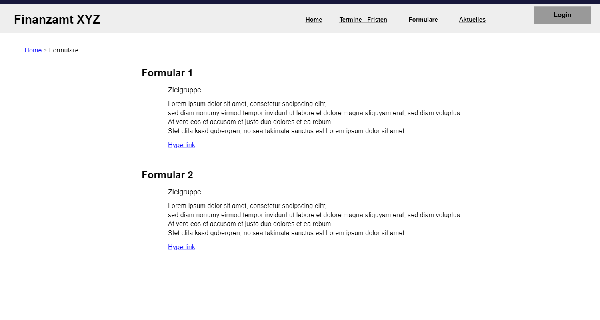
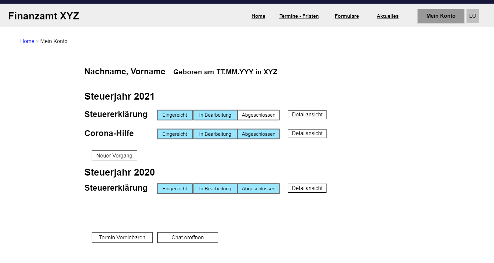
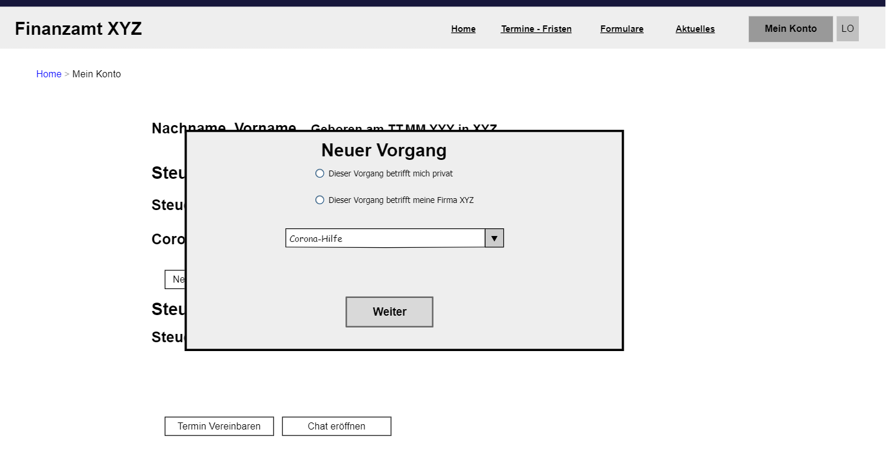
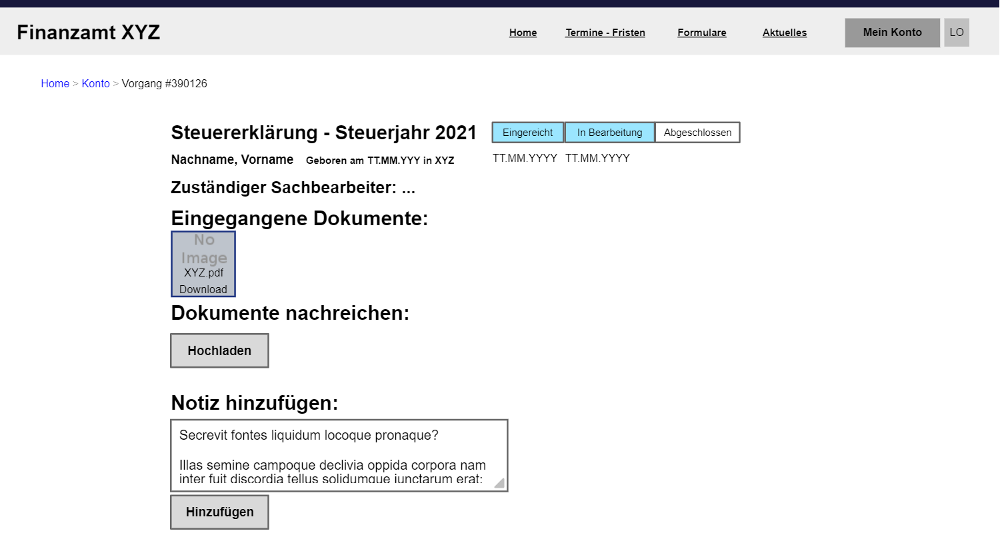
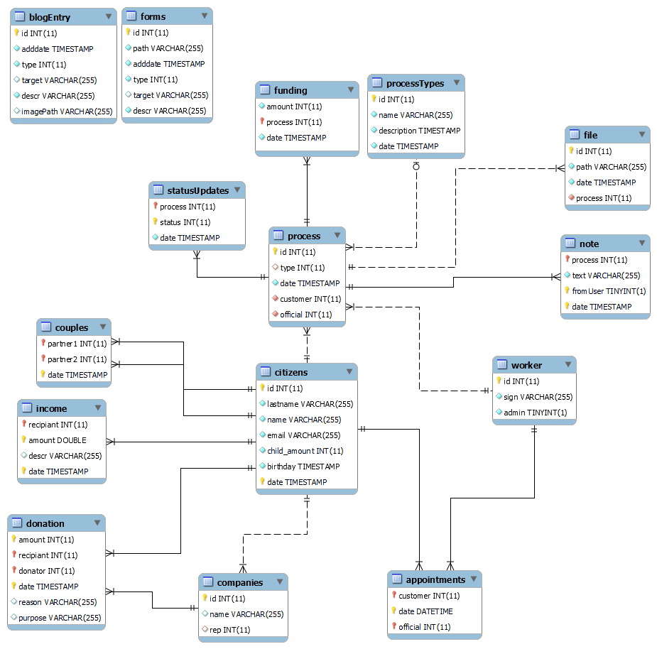

# Finanzamt

**Autor:** Mario Blomenkamp

## Überblick

In der heutigen Zeit wird es immer wichtiger, Bürokratie abzubauen und Vorgänge zu optimieren.
Nur so kann auf lange Zeit nachhaltig Geld eingespart und alle Bereiche der Gesellschaft ökologischer gestaltet werden.
Gerade in der Finanzwelt gehört das Internet schon lange zu den wichtigsten Begegnungsräumen.

Das soll auch mit dem smarten Finanzamt der Zukunft möglich sein.
Anträge sollten komplett online vom Abschicken bis zum Abschließen begleitet werden können und sollten dem Bürger umfassend erklärt werden.
Es sollte sich mit anderen Institutionen vernetzt werden, um z. B. automatisch die Steuerklasse ändern zu können, ohne eine erneute Meldung nötig zu machen.

Zudem sollte nach wie vor die Möglichkeit bestehen Termine für ein Gespräch zu vereinbaren und es sollte kein Account-Zwang bestehen, um niemanden den Zugang zu verwehren.

## Funktionale Anforderungen

  - Bürger
    - können alle gewohnten Vorgänge online durchführen
    - kriegen schnellen Überblick über Aktuelles
  - Arbeitgeber
    - können Mitarbeiter anmelden
    - können Steuern automatisiert abführen
  - Mitarbeiter
    - bearbeiten Anträge und sorgen für Richtigkeit
  - Bürgeramt 
    - meldet neue Bürger und Änderungen im Familienstand
  - Newsletter-Dienst
    - verteilt Meldungen über Events/ Neuigkeiten
  - Empfänger von Spenden
    - informieren über Spendeneingang

## Anforderungen im Detail ##

**Unternehmer - User Stories**

| **ID** | **Als** | **möchte ich** | **so dass** | **Akzeptanz**   | **Priotität (0-10)** |
|:--------|:--------|:---------------|:---------------|:----------------|:----------------|
| 1 | Arbeitgeber | Lohnsteuer abführen | Meine Abläufe Vereinfacht werden | Steuer wird online erfasst | 3 |
| 2 | Arbeitgeber | Meine Mitarbeiter anmelden | Meine Abläufe Vereinfacht werden | Mitarbeiter werden für weitere Nutzung gespeichert | 5 |

**Arbeitnehmer - User Stories**

| **ID** | **Als** | **möchte ich** | **so dass** | **Akzeptanz**   | **Priotität (0-10)** |
|:--------|:--------|:---------------|:---------------|:----------------|:----------------|
| 3 | Arbeitnehmer | Familienstand, Beschäftigungsstatus o.ä. nicht ändern müssen | Ich weniger Aufwand habe | Automatische Änderung der Steuerklasse durch Infos vom Bürgeramt | 8 |

**Gemeinnützige Organisation/Verein - User Stories**

| **ID** | **Als** | **möchte ich** | **so dass** | **Akzeptanz**   | **Priotität (0-10)** |
|:--------|:--------|:---------------|:---------------|:----------------|:----------------|
| 4 | Stiftung/Verein | Spenden melden | Wohltätern Arbeit abgenommen wird und Sonderausgaben geltend gemacht werden | Es wird auf eingehende Spendenmeldungen reagiert | 7 |

**Bürger (egal ob privat oder geschäftlich) - User Stories**

| **ID** | **Als** | **möchte ich** | **so dass** | **Akzeptanz**   | **Priotität (0-10)** |
|:--------|:--------|:---------------|:---------------|:----------------|:----------------|
| 5 | Bürger | Antrag auf Fördergelder stellen | Ich Unterstützung erhalte | Plattform zum Beantragen von Fördergeldern | 8 |
| 6 | Bürger | Steuererklärung (+Jahresabschluss,...) machen | Ich meine Pflichten erfülle oder sich womöglich ein Finanzieller Vorteil ergibt | Schnittstelle zum Einreichen einer Steuererklärung| 6 |
| 7 | Bürger | In Kontakt treten | Mein Anliegen bearbeitet wird | Chat oder Plattform zur Terminvereinbarung | 4 |
| 8 | Bürger | Dokumente hochladen können | Mögliche Rückfragen ausgeschlossen werden | Dateien können mit Vorgängen verknüpft werden | 8 |
| 9 | Bürger | Auch ohne Account Formulare online Abschicken können | Ich keinen Brief verschicken muss | Formulare ohne konkreten Vorgang werden angenommen und bearbeitet | 8 |
| 10 | Bürger | Auf Fristen hingewiesen werden | Ich diese nicht verpasse | Hinweise werden auf der Website angezeigt und ein optionaler Newsletter wird bereitgestellt| 3 |
| 11 | Bürger | Meine Vorgänge einsehen können | Ich den Überblick nicht verliere | Übersicht über alle Vorgänge | 9 |
| 14 | Bürger | Mich anmelden können | Ich Zugang zu meinen Vorgängen erhalte | Möglichkeit der Anmeldung | 9 |
| 15 | Bürger | PDF-Berichte erzeugen lassen | Ich diese ausdrucken kann | Möglichkeit des PDF-Exports | 7 |

**Mitarbeiter - User Stories**

| **ID** | **Als** | **möchte ich** | **so dass** | **Akzeptanz**   | **Priotität (0-10)** |
|:--------|:--------|:---------------|:---------------|:----------------|:----------------|
| 12 | Finanzbeamter | Vorgänge bearbeiten | Diese abgeschlossen werden können | Vorgänge können eingesehen werden | 9 |
| 13 | Finanzbeamter | Stichproben durchführen | Potenziell Betrug erkannt wird | Alle Bürger werden in Übersicht geführt | 7 |

## Use-Case-Diagramm

## Graphische Benutzerschnittstelle

User Story 7,12

User Story 5,6,7

User Story 7,8,9

## Datenmodell 

- Begriffe im Glossar darstellen
- Modellierung des physikalischen Datenmodells 
  - RDBMS: ER-Diagramm bzw. Dokumentenorientiert: JSON-Schema

## Abläufe

- Aktivitätsdiagramm für den Ablauf sämtlicher Use Cases
- Aktivitätsdiagramme für relevante Use Cases
- Aktivitätsdiagramm mit Swimlanes sind in der Regel hilfreich 
  für die Darstellung der Interaktion von Akteuren der Use Cases / User Stories
- Abläufe der Kommunikation von Rechnerknoten (z.B. Client/Server)
  in einem Sequenz- oder Aktivitätsdiagramm darstellen
- Modellieren Sie des weiteren die Diagramme, die für das (eigene) Verständnis des
  Softwaresystems hilfreich sind. 

## Schnittstellen

- Schnittstellenbeschreibung (API), z.B. mit OpenAPI 
- Auflistung der nach außen sichtbaren Schnittstelle des Microservices. Über welche Schnittstelle kann z.B. der Client den Server erreichen?
- In Event-gesteuerten Systemen ebenfalls die Definition der Ereignisse und deren Attribute
- Aufteilen in Commands, Events, Queries
* Abhängigkeiten: Liste mit Kommunikationsabhängigkeiten zu anderen Microservices

### Dependencies

| **Service** | **Expected Content** | **Description** | **Action** |
| :------ | :----- | :----- | :----- |
| Bürgeramt | 	Bürger-ID Anzahl der Kinder ID des Ehepartners(optional) | Neuer Bürger | Anlegen einer Akte |
| Bürgeramt | 	Bürger-ID Anzahl der Kinder(optional) ID des Ehepartners(optional, false wenn getrennt) | Änderung Bürger | Änderung der Akte |
| Alle | Bürger-ID Summe Datum Grund(optional) Verwendungszweck(optional) | Spendeneingang | Vermerken der Spende, Ausstellen eines Spendenbescheids|

### Events

| **Service** | **Payload** | **Description** | 
| :------ | :----- | :----- |
| Newsletter | 	{ event_id: 8000, event_name:"New Newsletter Entry", service_name: finanzamt, title: title, text: text } | Neuer Newsletter-Eintrag |
| Newsletter | 	{ event_id: 8001, event_name:"New Calendar Entry", service_name: finanzamt, title: title, text: text, date: date } | Neuer Kalendereintrag |

### Private Schnittstellen

#### Blog Entries
| **Name** | **Method** | **URL** | **Request**| **Response** |
| :--- | :----- | :------ | :------ | :------ |
| Get blog entry |GET| /api/blogEntries/:id |Parameter:id | Body:path,date,type,title,target,description  or message   |
| Get all blog entries |GET| /api/blogEntries/all | - | Body:list(path,date,type,title,target,description) or message   |
| Add blog entry |POST| /api/blogEntries | Body:path,date,type,title,target,description Header:token  |  message   |
| Edit blog entry |PUT| /api/blogEntries | Body:id,path,date,type,title,target,description   Header:token  |  message   |
| Delete blog entry |DELETE| /api/blogEntries/:id | Parameter:id Header:token  |  message   |

#### Forms
| **Name** | **Method** | **URL** | **Request**| **Response** |
| :--- | :----- | :------ | :------ | :------ |
| Get form |GET| /api/forms/:id |Parameter:id | Body:path,date,type,target,description or message   |
| Get all forms |GET| /api/forms/all | - | Body:list(path,date,type,title,target,description) or message   |
| Add form |POST| /api/forms | Body:path,date,type,target,description Header:token  |  message   |
| Edit form |PUT| /api/forms | Body:id,path,date,type,target,description Header:token  |  message   |
| Delete form |DELETE| /api/forms/:id | Parameter:id Header:token  |  message   |

#### Deadlines
| **Name** | **Method** | **URL** | **Request**| **Response** |
| :--- | :----- | :------ | :------ | :------ |
| Get deadline |GET| /api/deadline/:id |Parameter:id | Body:date,title,description or message   |
| Get all deadlines |GET| /api/deadline/all | - | Body:list(date,title,description) or message   |
| Add deadline |POST| /api/deadline | Body:date,title,description Header:token  |  message   |
| Delete deadline |DELETE| /api/deadline/:id | Parameter:id Header:token  |  message   |

#### Worker
| **Name** | **Method** | **URL** | **Request**| **Response** |
| :--- | :----- | :------ | :------ | :------ |
| Get all workers |GET| /api/worker/ | Header:token | Body:list(id,sign,admin) or message   |
| Add worker |POST| /api/worker | Body:id,sign,admin Header:token  |  message   |
| Delete worker |DELETE| /api/worker/:id | Parameter:id Header:token  |  message   |

#### Processes
| **Name** | **Method** | **URL** | **Request**| **Response** |
| :--- | :----- | :------ | :------ | :------ |
| Get process |GET| /api/process/:id |Parameter:id Header:token | Body:type,customer,official,date or message   |
| Get all processes |GET| /api/process/all | Header:token | Body:list(type,customer,official,date) or message   |
| Add process |POST| /api/process | Body:type,customer,official,date Header:token  |  message   |
| Edit process |PUT| /api/process | Body:id,type,customer,official,date Header:token  |  message   |
| Delete process |DELETE| /api/process/:id | Parameter:id Header:token  |  message   |

#### Notes
| **Name** | **Method** | **URL** | **Request**| **Response** |
| :--- | :----- | :------ | :------ | :------ |
| Get all notes |GET| /api/notes/:processID | Parameter:processID Header:token | Body:list(date,text,sender) or message   |
| Add note |POST| /api/notes | Body:date,text,process Header:token  |  message   |
| Delete note |DELETE| /api/notes | Header: fromUser,process,date,token  |  message   |

#### Status updates
| **Name** | **Method** | **URL** | **Request**| **Response** |
| :--- | :----- | :------ | :------ | :------ |
| Get all status updates |GET| /api/statusUpdates/:processID | Parameter:processID Header:token | Body:list(date,status) or message   |
| Add status update |POST| /api/statusUpdates | Body:date,status,process Header:token  |  message   |

#### Appointments
| **Name** | **Method** | **URL** | **Request**| **Response** |
| :--- | :----- | :------ | :------ | :------ |
| Get all appointments |GET| /api/appointments | Header:token, customer(optional) | Body:list(date,official,customer) or message   |
| Add appointment |POST| /api/appointments | Body:date,official,customer Header:token  |  message   |
| Delete appointment |DELETE| /api/appointments | Header: date,official,token  |  message   |

#### Citizens
| **Name** | **Method** | **URL** | **Request**| **Response** |
| :--- | :----- | :------ | :------ | :------ |
| Get citizen |GET| /api/citizen/:id | Parameter:id Header:token | Body:id,name,lastname,email,date or message   |
| Get all citizens |GET| /api/citizen/all | Header:token, customer(optional) | Body:list(id,name,lastname,email,date) or message   |
| Add citizen |POST| /api/citizen | Body:id,name,lastname,email,date Header:token  |  message   |
| Edit citizen |PUT| /api/citizen | Body:id,name(optional),lastname(optional),email(optional) Header:token  |  message   |
| Delete citizen |DELETE| /api/citizen/:id | Parameter:id Header: token  |  message   |

#### Companies
| **Name** | **Method** | **URL** | **Request**| **Response** |
| :--- | :----- | :------ | :------ | :------ |
| Get companies |GET| /api/companies| Header:token, id(optional),rep(optional) | Body:list(id,name,rep) or message   |
| Add company|POST| /api/companies | Body:name,rep Header:token  |  message   |
| Delete company |DELETE| /api/companies/:id | Parameter:id Header: token  |  message   |

#### Contact requests
| **Name** | **Method** | **URL** | **Request**| **Response** |
| :--- | :----- | :------ | :------ | :------ |
| Get contact request |GET| /api/contactRequest/:id | Parameter:id Header:token | Body:id,name,email,message,date or message   |
| Get all contact requests |GET| /api/contactRequest/all | Header:token | Body:list(id,name,email,message,date) or message   |
| Add contact request |POST| /api/contactRequest | Body:name,email,message,date Header:token  |  message   |
| Delete contact request |DELETE| /api/contactRequest/:id | Parameter:id Header: token  |  message   |

#### Donations
| **Name** | **Method** | **URL** | **Request**| **Response** |
| :--- | :----- | :------ | :------ | :------ |
| Get donations by recipiant |GET| /api/donations/:recipiant | Parameter:recipiant Header:token | Body:list(date,amount,recipiant,donator) or message   |
| Get all donations |GET| /api/donations/ | Header:token | Body:list(date,amount,recipiant,donator) or message   |
| Add donation |POST| /api/donations/ | Body:date,amount,recipiant,donator Header:token  |  message   |
| Delete donation |DELETE| /api/donations/ | Header: date,amount,recipiant,donator,token  |  message   |

#### Files
| **Name** | **Method** | **URL** | **Request**| **Response** |
| :--- | :----- | :------ | :------ | :------ |
| Get file by id   |GET| /api/files/:uuid | Parameter:uuid Header:token | Body:file or message   |
| Get all files |GET| /api/files/all | Header:token,processID | Body:list(path) or message   |
| Add file |POST| /api/files/ | Body:file,processID Header:token  |  message   |
| Delete file |DELETE| /api/files/:uuid | Parameter:uuid Header:token  |  message   |

#### Income
| **Name** | **Method** | **URL** | **Request**| **Response** |
| :--- | :----- | :------ | :------ | :------ |
| Get income   |GET| /api/income?recipiant | Query:recipiant Header:token | Body:list(date,amount,recipiant) or message   |
| Add income |POST| /api/income/ | Body:date,amount,recipiant Header:token  |  message   |
| Delete income |DELETE| /api/income/ | Header:date,amount,recipiant,token  |  message   |

(Sofern nötig werden weitere Informationen ergänzt)
## Technische Umsetzung

### Softwarearchitektur

- Darstellung von Softwarebausteinen (Module, Schichten, Komponenten)

Hier stellen Sie die Verteilung der Softwarebausteine auf die Rechnerknoten dar. Das ist die Softwarearchitektur. Zum Beispiel Javascript-Software auf dem Client und Java-Software auf dem Server. In der Regel wird die Software dabei sowohl auf dem Client als auch auf dem Server in Schichten dargestellt.

* Server
  * Web-Schicht JavaScript Node.js
  * Logik-Schicht JavaScript Express.js
  * Persistenz-Schicht MySQL Datenbank

* Client
  * View-Schicht HTML, CSS
  * Logik-Schicht JavaScript + Vue.js
  * Kommunikation-Schicht Axios

Die Abhängigkeit ist bei diesen Schichten immer unidirektional von "oben" nach "unten". Die Softwarearchitektur aus Kapitel "Softwarearchitektur" ist demnach detaillierter als die Systemübersicht aus dem Kapitel "Systemübersicht". Die Schichten können entweder als Ganzes als ein Softwarebaustein angesehen werden. In der Regel werden die Schichten aber noch weiter detailliert und in Softwarebausteine aufgeteilt. 

### Entwurf

- Detaillierte UML-Diagramme für relevante Softwarebausteine

### Fehlerbehandlung 

* Mögliche Fehler / Exceptions auflisten
* Fehlercodes / IDs sind hilfreich
* Nicht nur Fehler technischer Art ("Datenbankserver nicht erreichbar") definieren, sondern auch fachliche Fehler wie "Kunde nicht gefunden", "Nachricht wurde bereits gelöscht" o.ä. sind relevant. 

### Validierung

* Relevante (Integrations)-Testfälle, die aus den Use Cases abgeleitet werden können
* Testfälle für 
  - Datenmodell
  - API
  - User Interface
* Fokussieren Sie mehr auf Integrationstestfälle als auf Unittests
* Es bietet sich an, die IDs der Use Cases / User Stories mit den Testfällen zu verbinden,
  so dass erkennbar ist, ob Sie alle Use Cases getestet haben.

### Verwendete Technologien

- Verwendete Technologien (Programmiersprachen, Frameworks, etc.)

* Frontend - vue.js 
* Backend - express
* Datenbank - MySQL
