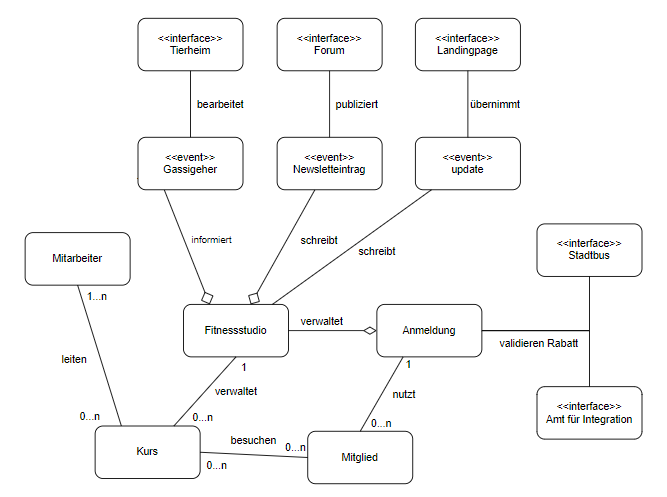
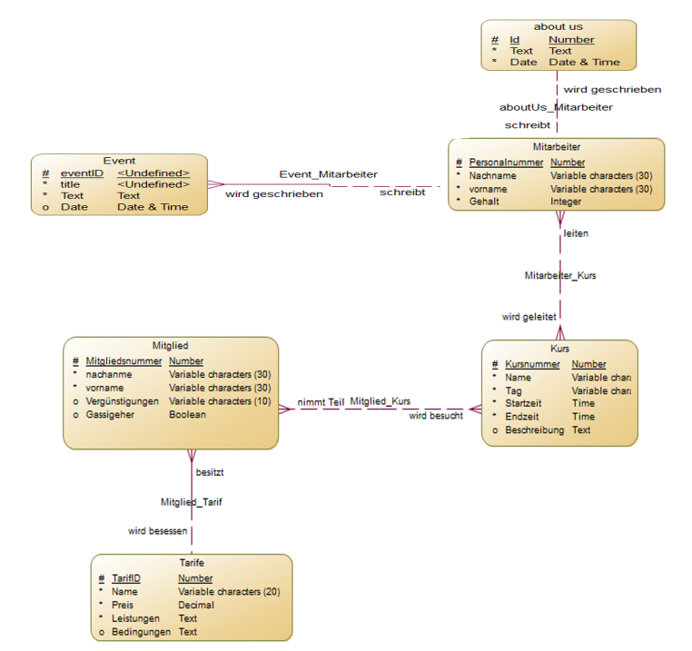
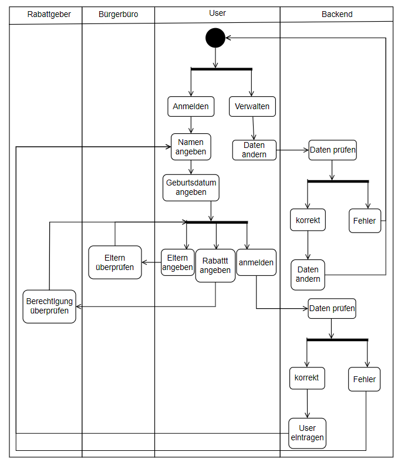
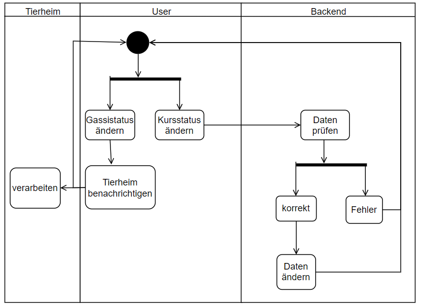
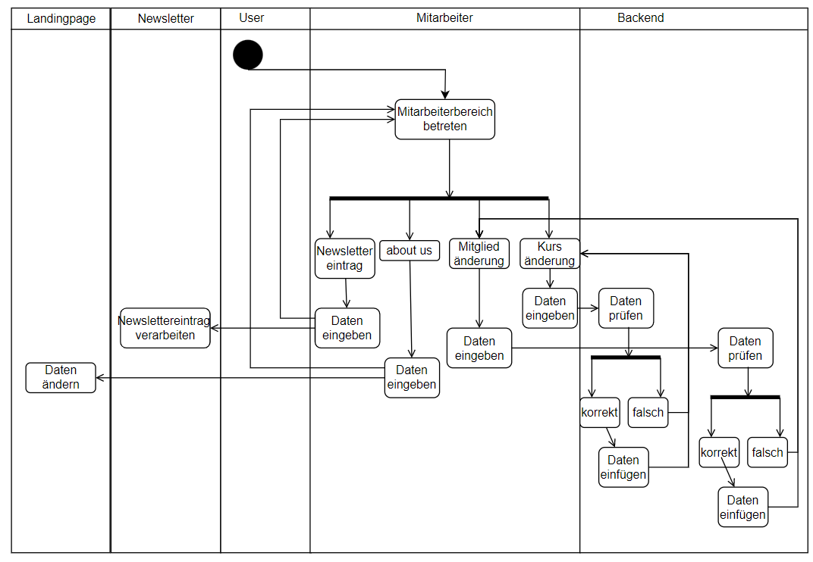

# Fitnessstudio

**Autor:** Tom Luca Horstmann

## Überblick
Die Seite des Fitnessstudios dient dazu, die Mitgliedschaft in dem Fitnessstudio zu vereinfachen. 
So können die Mitgliedschaft komplett online verwaltet und die Aktivitäten online gebucht werden. 
Für maximalen Komfort sorgt die Vernetzung mit den anderen Microservices. So reicht der Name zur 
Anmeldung aus, da die restlichen Daten vom Bürgerbüro und Finanzamt geholt werden. Außerdem ist es 
möglich verschiedene Sondertarife zu buchen, und sich für Kooperationen anzumelden.

 <!-- Analyseklassendiagramm -->

## Funktionale Anforderungen
### Akteure

| **Akteur** | **Definition**  |
| :-------: | :------- |
| User | Nutzer der den Service nutzt und Zugriff auf seine Mitgliedschaft hat |
| Mitarbeiter | Mitarbeiter des Fitnessstudios, hat administrative Rechte auf einer gesonderten Mitarbeiterseite |
| Tierheim | Das Tierheim besitzt eine Kooperation durch die ihr bereitwillige Gassigeher mitgeteilt werden |
| Rabattgeber | Institutionen, die ihren "Mitgliedern" Rabatt gewähren, aktuell Flüchtlinge und Mitarbeiter des Stadtbusses |
| Newsletter | Der Newsletter Microservice welcher Interessierte regelmäßig über Neuigkeiten informiert |
| Landingpage | Die Startseite der Anwendung |

### Use-Case Diagramme

#### Mitgliedschaftsverwaltung
 <!-- use case-Digramm -->

#### Sportaktivitäten
 <!-- use case-Digramm -->

#### Mitarbeiteraktionen
 <!-- use case-Digramm -->

## Anforderungen im Detail

### Mitgliedschaft verwalten
| **ID**| **Als**|   **möchte ich**   |  **so dass** | **Akzeptanz** | **Priorität**   |
|:-----|:----------:|:-------------------|:-------------|:---------|:----------------|
| 1  |User| nur mit meinem Namen Mitglied werden|ich die Dienste des Studios nutzen kann| Mitglied wird angelegt | Muss |
| 2  |User| mich ohne Fremddatennutzung anmelden können|ich die Dienste des Studios nutzen kann| Mitglied wird angelegt | Muss |
| 3  |User| meine Mitgliedschaft verwalten können|ich meine Mitgliedschaft ändern kann| Mitgliedschaft wird passend geändert | Muss |
| 4  |User| "Mitgliedschaften" angeben können|ich Sondertarife entscheide| Sondertarif wird hinterlegt | Sollte |
| 5  |User| möchte ich von meinen Erzeihungsberechtigten angemeldet werden können|ich auch als Nichtgeschäftsfähiger Mitglied werden kann| Mitglied wird angelegt | Sollte |

### Sportaktivitäten verwalten
| **ID**| **Als**|   **möchte ich**   |  **so dass** | **Akzeptanz** | **Priorität**   |
|:-----|:----------:|:-------------------|:-------------|:---------|:----------------|
| 6  |User| Kurse angezeigt bekommen|ich einen auswählen kann| Kurse werden angezeigt | Sollte |
| 7  |User| Kurse buchen können|ich an diesen teilnehmen kann| Mitglied wird im Kurs gespeichert | Sollte |
| 8  |User| mich für das Tierheimprogramm anmelden|ich bei Verfügbarkeit benachrichtigt werde | Mitglied wird Tierheim gemeldet| Sollte |
| 9  |User| mich für das Tierheimprogramm abmelden|ich nicht mehr verfügbar bin | Mitglied wird Tierheim gemeldet| Sollte |

### Servicekommunikation
| **ID**| **Als**|   **möchte ich**   |  **so dass** | **Akzeptanz** | **Priorität**   |
|:-----|:----------:|:-------------------|:-------------|:---------|:----------------|
| 10  |Tierheim| über bereitwillige Gassigeher informiert werden|ich diesen ein Tier zuweisen kann| Tierheim wird über Person informiert | Sollte |
| 19  |Gemeinschaft| meinen Mitgliedern Rabatte ermöglichen|diese günstigere Tarife haben| Rabatt wird gewährt | Sollte |

### Mitarbeiterseite
| **ID**| **Als**|   **möchte ich**   |  **so dass** | **Akzeptanz** | **Priorität**   |
|:-----|:----------:|:-------------------|:-------------|:---------|:----------------|
| 11  |Mitarbeiter| mich anmelden können| ich in einen gesichterten Mitarbeiterbereich geleitet werde| Weiterleitung auf separate Mitarbeiterseite| Sollte |
| 12  |Mitarbeiter| Mitglieder verwalten können| ich deren Daten ändern kann| Daten werden geändert| Sollte |
| 13  |Mitarbeiter| Kurse verwalten können| ich deren Daten ändern kann| Daten werden geändert| Sollte |
| 14  |Mitarbeiter| besondere Termine bekanntmachen| diese allgemein eingesehen werden können| Event wird verschickt| Sollte |
| 15  |Mitarbeiter| das about us ändern können| die Landingpage es richtig anzeigt| about us wird aktualisiert| Sollte |

### Missue-Stories
| **ID**| **Als**|   **könnte ich**   |  **so dass** | **Fehler** | **Bewertung**   |
|:-----|:----------:|:-------------------|:-------------|:---------|:----------------|
| 16  |User| mich mehrfach anmelden|ich mehrere Tarife zahlen muss|	mehrere Tarife von gleicher Person | Schlecht |
| 17  |User| mich mehrfach für einen Kurs anmelden| Plätze freibleiben| gleiche Person mehrmals in einem Kurs | Schlecht |
| 18  |Mitarbeiter| Benutzerdaten falsch abändern| Fehler im System entstehen| Daten stimmen nicht mit der Realität überein | Schlecht |

## Graphische Benutzerschnittstelle

#### Home
 <!-- home -->

#### Mitgliedschaft
[User Story 1, 4, 5](#mitgliedschaft-verwalten-1)
 <!-- anmeldung -->

[User Story 2, 4](#mitgliedschaft-verwalten-2)
 <!-- anmeldung -->

[User Story 3, 8, 9](#mitgliedschaft-verwalten-3)
 <!-- Mitgliedschaft -->

#### Sportaktivitäten
[User Story 6, 7](#sportaktivitäten-verwalten-1)
 <!-- kurse -->

#### Mitarbeiterbereich
[User Story 11](#mitarbeiterseite-1)
 <!-- Mitarbeiteranmeldung -->

[User Story 12](#mitarbeiterseite-1)
 <!-- Mitgliederverwaltung -->

[User Story 13](#mitarbeiterseite-1)
 <!-- Kursverwaltung -->

[User Story 12](#mitarbeiterseite-1)
 <!-- Eventseite -->

[User Story 13](#mitarbeiterseite-1)
 <!-- About us -->

## Datenmodell 
  
 <!-- ER-Digramm -->

## Abläufe

### Mitgliedschaft

 <!-- Anmeldungsablauf -->

### Sportaktionen

 <!-- Sportaktionenablauf -->
  
### Mitarbeiterbereich

 <!-- Mitarbeiterablauf -->

## Schnittstellen

### URL

http://smart.city/microservices/customer

### Private Schnittstellen
#### Commands 

**Asynchronous**

| **Name** | **Parameter** | **Resultat** |
| :------ | :----- | :------ |
| createMember() | MemberData d | member m |
| createMember() | int citizen_id | member m |
| createCourse() | CourseData d | course c |
| createEmployee() | int citizen_id | employee e |
| changeMember() | MemberData d | member m |
| changeMember() | int citizen_id | member m |
| changeCourse() | CourseData d | course c |
| changeEmployee() | int citizen_id | employee e |
| deleteMember() | MemberData d | member m |
| deleteMember() | int citizen_id | member m |
| deleteCourse() | CourseData d | course c |
| deleteEmployee() | int citizen_id | employee e |

#### Queries

| **Name** | **Parameter** | **Resultat** |
| :------ | :----- | :------ |
| getMember() | MemberData d | member m |
| getMember() | MemberData d | member m |
| getCourse() | CourseData d | course c |
| getEmployee() | EmployeeData d | employee e |
| getMembers() |  | member[] members |
| getCourses() |  | course[] courses |
| getEmployees() |  | employee[] e |

### Öffentliche Schnittstellen

#### Events

**Newsletter event channel** 

| **Service** | **Payload** | **Description** | 
| :------ | :----- | :----- |
| Newsletter | 	{ event_id: 7000, event_name:"New Newsletter Entry", service_name: fitnessstudio, title: title, text: text } | Neuer Newsletter-Eintrag/Werbung |
| Newsletter | 	{ event_id: 7001, event_name:"New Calendar Entry", service_name: fitnessstudio, title: title, text: text, date: date } | Neuer Kalendereintrag |

**Tierheim event channel** 

| **Service** | **Payload** | **Description** | 
| :------ | :----- | :----- |
| Tierheim | 	{ event_id: 7002, event_name:"New Volunteer for walk", service_name: fitnessstudio, personal_number: number} | Neuer Kalendereintrag |

**Landingpage event channel** 
| :------ | :----- | :----- |
| **Service** | **Payload** | **Description** | 
| Landingpage | 	{ event_id: 7003, event_name:"New About us", service_name: fitnessstudio, text: text} | Neues about us |

### Dependencies

#### RPC (REST)

| **Service** | **Funktion** |
| :------ | :----- | 
| SmartAuth | authenticateUser() |
| SmartAuth | authenticateEmployee() |

## Technische Umsetzung

### Softwarearchitektur

* Server
  * Web-Schicht Node.js
  * Logik-Schicht Node.js
  * Persistenz-Schicht MySQL-Datenbank

* Client
  * View-Schicht Vue.js
  * Logik-Schicht Vue.js
  * Kommunikation-Schicht

### Fehlerbehandlung 

* Mögliche Fehler / Exceptions auflisten
* Fehlercodes / IDs sind hilfreich
* Nicht nur Fehler technischer Art ("Datenbankserver nicht erreichbar") definieren, sondern auch fachliche Fehler wie "Kunde nicht gefunden", "Nachricht wurde bereits gelöscht" o.ä. sind relevant. 

### Validierung

* Mindestens Tests für alle User Stories
* Möglichst Testfälle für:
	- alle Funktionen
	- Datenbankaktionen
	- Aktionen auf dem Frontend

### Verwendete Technologien

- Verwendete Technologien (Programmiersprachen, Frameworks, etc.)

* Frontend	vue.js
* Backend	node.js, express.js
* Datenbank	MySQL
