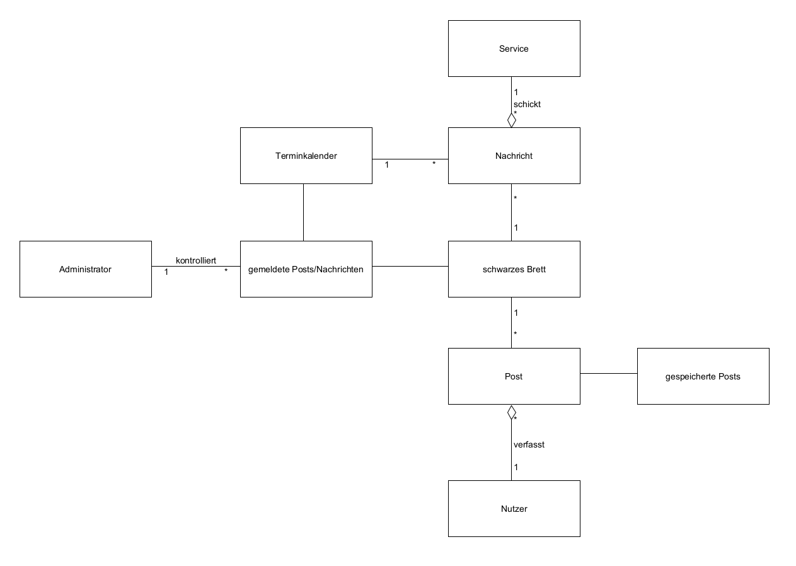
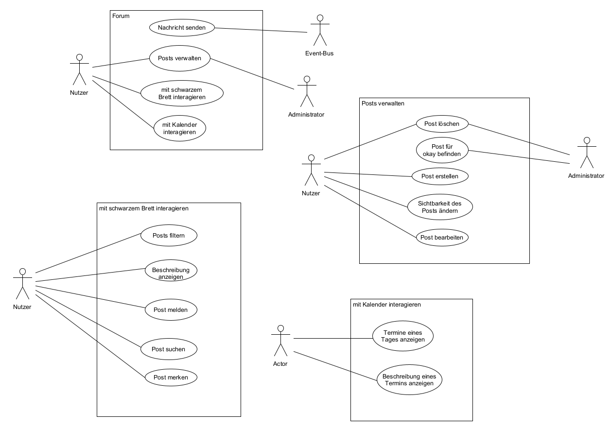
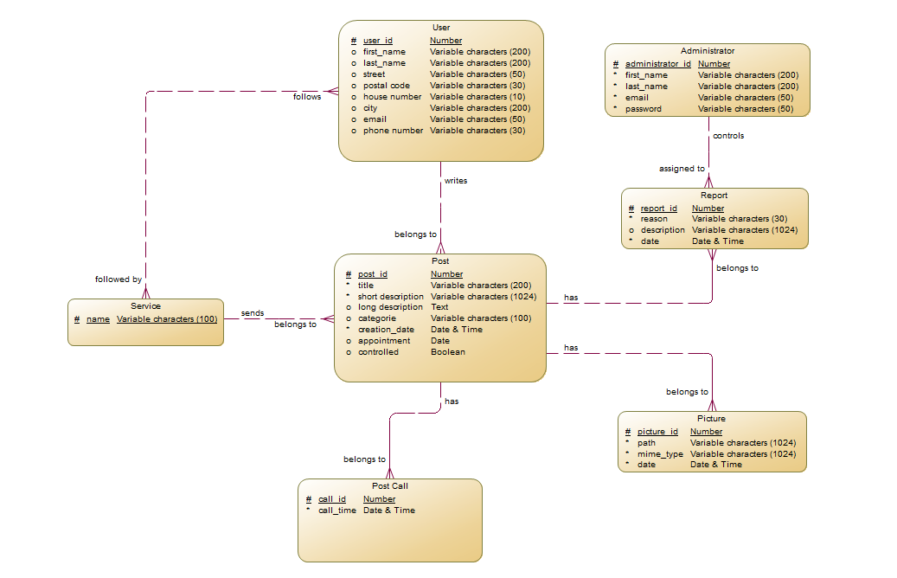
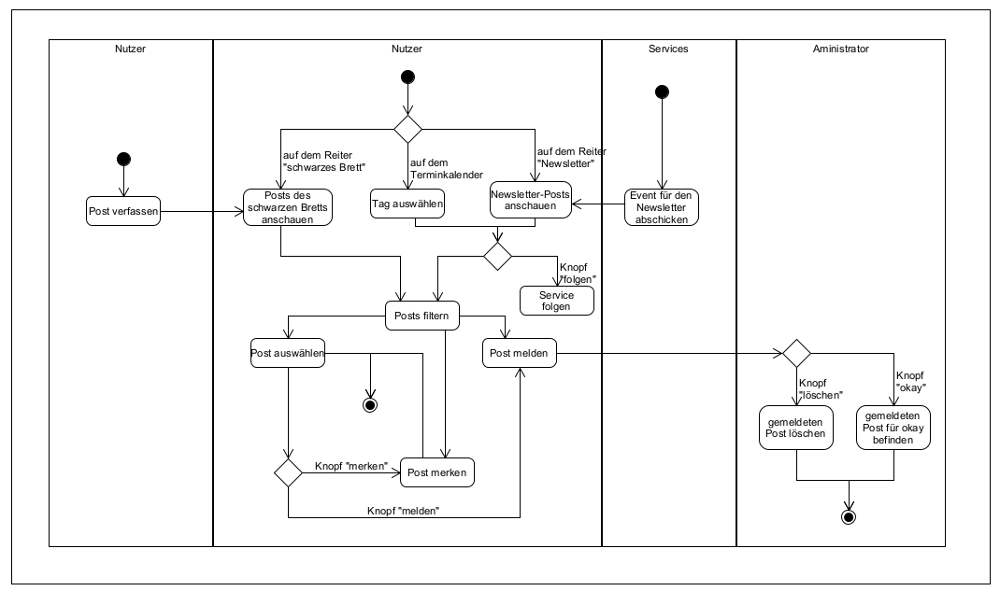

# Forum

**Autor:** Marius Braun

## Überblick

Das Forum dient für unsere SmartCity als schwarzes Brett. 
Hier können die einzelnen Services wichtige Nachrichten oder Werbung mit allen Nutzern unserer SmartCity teilen. 
So könnte zum Beispiel der KiTa-Service über Neueröffnungen von KiTas oder das Finanzamt über Fristen, an die sich die Bevölkerung erinnern soll, berichten.
Termingebundene Nachrichten können zusätzlich auch in einem Kalender dargestellt werden.
Bei besonderem Interesse können Nutzer einzelnen Services auch folgen, um bei neuen Nachrichten eine Email zu bekommen.

Des Weiteren haben auch Nutzer die Möglichkeit, eigene Aushänge in Form von Posts zu verfassen.
So könnte jemand auf der Suche nach Dienstleistungen (Nachhilfe, Babysitter) oder Gegenständen(Kinderwagen, Plattenspieler) sein oder selbst Dienstleistungen oder Gegenstände hier anbieten.
Aber auch Fragen können gestellt oder Veranstaltungen angekündigt werden. 

### Konzeptionelles Analyseklassendiagramm

 

## Funktionale Anforderungen

<!--- 
* Definition der Akteure
* Use-Case Diagramme
* Strukturierung der Diagramme in funktionale Gruppen
* Akteure sowie andere Begriffe der implementierten Fachdomäne definieren 
* Begriffe konsistent in der Spezifikation verwenden  
* Begriffe im Glossar darstellen
--->

### Definition der Akteure

**Nutzer:** Person, die den Service und seine Inhalte nutzt
**Administrator:** Person, die gemeldete posts bearbeitet
** Event-Bus:** leitet die Nachrichten anderer Services an das Forum weiter

### Use-Case Diagramme

## Anforderungen im Detail

<!--- 
- User Stories mit Akzeptanzkritierien 
- Optional: Name (oder ID) und Priorität ("Must", "Should", "Could", "Won't")
- Strukturierung der User Stories in funktionale Gruppen
- Sicherheit: Misuse-Stories formulieren
--->

**Informationen anderer Services einsehen(Auflistung)**

| **Als** | **möchte ich** | **so dass** | **Akzeptanz** |
| :------ | :----- | :------ | :-------- |
| Nutzer | auf der Startseite des Forums aktuelle Nachrichten der anderen Services sehen | ich über aktuelle Vorgänge in unserer Stadt informiert werde| Nachrichten werden chronologisch angezeigt |
| Nutzer | Nachrichten nach bestimmten Diensten filtern können | ich für mich uninteressante Inhalte ausblenden kann | Filter für jeden Service |
| Nutzer | schnell erkennen können, worum es sich bei der Nachricht handelt | ich schnell erkennen kann, ob mich die Nachricht interessiert | jede Nachricht hat eine Überschrift und eine Kurzbeschreibung|
| Nutzer | ich bei Interesse an einer Nachricht schnell zu einer ausführlicheren Information weitergeleitet werden | ich schnell Genaueres über den Sachverhalt erfahren kann | Klicken auf eine Nachricht leitet den Nutzer zu einer längeren Beschreibung des Inhalts |
| Service | möchte ich dem Forum Nachrichten schicken können | Nutzer über Inhalte/Veranstaltungen meines Dienstes auf dem aktuellen Stand gehalten werden | Services können dem Forum über Events Nachrichten zukommen lassen |
 

**Informationen anderer Services einsehen (Kalender)** 

| **Als** | **möchte ich** | **so dass** | **Akzeptanz** |
| :------ | :----- | :------ | :-------- |
| Nutzer | termingebundene Nachrichten von Services nach Tagen sortiert anschauen können | ich auf einen Blick erkennen kann, wann Termine stattfinden werden| Kalenderansicht, in der Tage mit Termin anklickbar sind, um eine Auflistung der Nachrichten zu sehen | 
| Service | wichtige Termine in einem Kalender darstellen können | Nutzer an meine Nachrichten erinnert werden | Events, die mit einem Datum geschickt werden, werden im Kalender angezeigt |

**Newsletter**

| **Als** | **möchte ich** | **so dass** | **Akzeptanz** |
| :------ | :----- | :------ | :-------- |
| Nutzer | den Services folgen können | ich direkt von neuen Nachrichten erfahre | Nachrichten gefolgter Services werden per Email an den Nutzer gschickt |
| Nutzer | den Services nicht mehr folgen können | ich Nachrichten, die mich nicht mehr interessieren, nicht mehr per Email zugeschickt bekomme | Folgen muss rückgängig gemacht werden können

**schwarzes Brett**

| **Als** | **möchte ich** | **so dass** | **Akzeptanz** |
| :------ | :----- | :------ | :-------- |
| Nutzer | eigene Posts mit bestimmten Kategorien verfassen können | ich nach bestimmten Diesntleistungen oder Gegenständen suchen kann oder Fragen und Veranstaltungen mit anderen Nutzern teilen kann | Post mit Kategorie, Überschrift, Kurz-/Langbeschreibung, Kontaktdaten (möglicherweise aus Datenbank) |
| Nutzer | Posts anderer Nutzer nach bestimmten kategorien filtern können | ich gezielt nach etwas suchen kann oder Dinge, die mich nicht interessieren, ausblenden kann | Checkboxen zum Filtern (Frage,Suche/Biete, Veranstaltungen, ...)
| Nutzer | Posts nach Wörtern durchsuchen können | ichs chnell finde, was mich interessiert | Suchzeile, die die Überschriften der Posts filtert |
| Nutzer | Posts mit verwerflichen Inhalten melden können | diese Posts nicht mehr angezeigt werden | gemeldete Posts tauchen auf dem schwarzen Brett nicht mehr auf |

**Post-Management**

| **Als** | **möchte ich** | **so dass** | **Akzeptanz** |
| :------ | :----- | :------ | :-------- |
| Nutzer | mir meine verfassten Posts anzeigen lassen können | ich einen Überblick über meine Posts bekommen kann | Liste eigener Posts, sortierbar/filterbar|
| Nutzer | meine Posts löschen können | ich einen besseren Überblick über meine Posts behalten kann | verfasste Posts können bei Auflistung eigener Posts mit einem Knopf gelöscht werden |
| Nutzer | meine Posts öffentlich oder privat stellen können | Posts , die beispielsweise nicht mehr von belang sind, anderen Nutzern nicht mehr angezeigt werden | bei eigenen Meldungen Knopf zum privat/öffentlich stellen |
| Nutzer | meine Posts bearbeiten können | ich gemachte Fehler korrigieren kann | bereits erstelle Posts werden nach der Bearbeitung abgespeichert|
| Nutzer | selbst entscheiden, welche meiner Kontaktdaten automatisch zu meinem Post hinzugefügt werden | ich meine Daten schützen kann | beim Erstellen von Posts wird der Nutzer gefargt, welche Daaten hinzugefügt werden sollen |
| Nutzer | Posts/Nachrichten ein bild hinzufügen können | der Sachverhalt besser dargestellt wird | bei der Anischt eines Posts wird das Bild angezeigt |

**interessante Posts zwischenspeichern**

| **Als** | **möchte ich** | **so dass** | **Akzeptanz** |
| :------ | :----- | :------ | :-------- |
| Nutzer | eine Liste haben, in der ich für mich interessante Nachrichten/Posts zwischenspeichern kann | ich diese später leicht wiederfinden kann | Knopf, mit dem zu Liste hinzugefügt und entfernt werden kann |

**Statistiken**

| **Als** | **möchte ich** | **so dass** | **Akzeptanz** |
| :------ | :----- | :------ | :-------- |
| Nutzer | Informationen darüber erhalten, wie viele Nutzer auf meinen Post geklick haben | ich möglichst interessante Posts erstellen kann | Anzahl der Aufrufe von Nachrichten/Posts werden angezeigt |
| Service |  Informationen darüber erhalten, wann Nutzer auf meine Nachricht geklickt hat | ich bestimmte Ankündigungen zu günstigen Zeiten machen kann | Graph einsehbar, wann die Nachricht wie oft angeklickt wurde |

**Administration**

| **Als** | **möchte ich** | **so dass** | **Akzeptanz** |
| :------ | :----- | :------ | :-------- |
| Administrator | gemeldete Posts einsehen können | diese entweder gelöscht oder für unbegründet gemeldet befunden werden können | Auflistung gemeldeter Posts, Posts werden entweder gelöscht oder wieder angezeigt |
| Administrator | Posts nicht mehrfach überprüfen müssen | ich weniger Arbeit habe | bereits für unbegründet befundene Posts können nicht wieder gemeldet werden |

## Graphische Benutzerschnittstelle

- GUI-Mockups passend zu User Stories
- Screens mit Überschrift kennzeichnen, die im Inhaltsverzeichnis zu sehen ist
- Unter den Screens darstellen (bzw. verlinken), welche User Stories mit dem Screen abgehandelt werden
- Modellierung der Navigation zwischen den Screens der GUI-Mockups als Zustandsdiagramm
- Mockups für unterschiedliche Akteure

### GUI-Mockups

## Datenmodell 

### ER-Diagramm

<!---
- Begriffe im Glossar darstellen
- Modellierung des physikalischen Datenmodells 
  - RDBMS: ER-Diagramm bzw. Dokumentenorientiert: JSON-Schema
  --->

## Abläufe

<!---
- Aktivitätsdiagramm für den Ablauf sämtlicher Use Cases
- Aktivitätsdiagramme für relevante Use Cases
- Aktivitätsdiagramm mit Swimlanes sind in der Regel hilfreich 
  für die Darstellung der Interaktion von Akteuren der Use Cases / User Stories
- Abläufe der Kommunikation von Rechnerknoten (z.B. Client/Server)
  in einem Sequenz- oder Aktivitätsdiagramm darstellen
- Modellieren Sie des weiteren die Diagramme, die für das (eigene) Verständnis des
  Softwaresystems hilfreich sind. 
--->

## Schnittstellen

- Schnittstellenbeschreibung (API), z.B. mit OpenAPI 
- Auflistung der nach außen sichtbaren Schnittstelle des Microservices. Über welche Schnittstelle kann z.B. der Client den Server erreichen?
- In Event-gesteuerten Systemen ebenfalls die Definition der Ereignisse und deren Attribute
- Aufteilen in Commands, Events, Queries
* Abhängigkeiten: Liste mit Kommunikationsabhängigkeiten zu anderen Microservices
 <!---
**Beispiel:**

### URL

http://smart.city/microservices/customer

### Commands

**Synchronous**

| **Name** | **Parameter** | **Resultat** |
| :------ | :----- | :------ |
| createCustomer() | int id | int id |
| deleteOrder() | int id | int id |

**Asynchronous**

| **Name** | **Parameter** | **Resultat** |
| :------ | :----- | :------ |
| createContract() | int id | int id |
| changeContract() | int id | - |
--->
### eingehende Events

| **Name** | **Beschreibung** | **Payload** |
| :------ | :----- | :----- |  
| newServicePost | legt einen neuen Post mit den verschickten Daten an | {
  "event_id" : "event_id",
  "service" : "service",
  "title" : "title",
  "short_description" : "short_description",
  "long_description" : "long_description", (optional)
  "picture" : "picture", (noch nicht sicher, wie speichern)
  "event_at" : "event_at" (optional, der Tag, bei dem das Event im Kalender angezeigt werden soll)
}|

### ausgehende Events

| **Name** | **Beschreibung** |
| :------ | :----- |  
| About us | wird an die Landingpage gesendet, wenn die About Us-Seite des Forums verändert werden soll | 
<!---
**Customer event channel**

| **Name** | **Payload** | 
| :------ | :----- | 
| Customer Authorized | int id |
| Customer Deleted | int id |

**Contract event channel**

| **Name** | **Payload** | 
| :------ | :----- | 
| Contract Received | int id |
| Contract Deleted | int id |
--->
<!---
**required Data**

{
  "event_id" : "event_id",
  "service" : "service",
  "title" : "title",
  "short_description" : "short_description",
  "long_description" : "long_description", (optional)
  "picture" : "picture", (noch nicht sicher, wie speichern)
  "event_at" : "event_at" (optional, der Tag, bei dem das Event im Kalender angezeigt werden soll)
}

- event_id
- event_name
- title
- text_short
- text_long
- picture 
- date (der Tag, bei dem das Event im Kalender angezeigt werden soll, ansonsten weglassen)
--->

### Queries

| **Name** | **Parameter** | **Resultat** |
| :------ | :----- | :------ |
| getContracts() | - | Contract [] list |
| getContract() | int id | Contract c |

### Dependencies

#### RPC

| **Service** | **Funktion** |
| :------ | :----- | 
| Authorization Service | authenticateUser() |
| Hospital Service | blockDate() |

#### Event-Subscriptions

| **Service** | **Funktion** |
| :------ | :----- | 
| Cinema channel | CancelFilmCreatedEvent |
| Customer reply channel | CreateCustomerEvent |

## Technische Umsetzung

### Softwarearchitektur

- Darstellung von Softwarebausteinen (Module, Schichten, Komponenten)

Hier stellen Sie die Verteilung der Softwarebausteine auf die Rechnerknoten dar. Das ist die Softwarearchitektur. Zum Beispiel Javascript-Software auf dem Client und Java-Software auf dem Server. In der Regel wird die Software dabei sowohl auf dem Client als auch auf dem Server in Schichten dargestellt.

* Server
  * Web-Schicht
  * Logik-Schicht
  * Persistenz-Schicht

* Client
  * View-Schicht
  * Logik-Schicht
  * Kommunikation-Schicht

Die Abhängigkeit ist bei diesen Schichten immer unidirektional von "oben" nach "unten". Die Softwarearchitektur aus Kapitel "Softwarearchitektur" ist demnach detaillierter als die Systemübersicht aus dem Kapitel "Systemübersicht". Die Schichten können entweder als Ganzes als ein Softwarebaustein angesehen werden. In der Regel werden die Schichten aber noch weiter detailliert und in Softwarebausteine aufgeteilt. 

### Entwurf

- Detaillierte UML-Diagramme für relevante Softwarebausteine

### Fehlerbehandlung 

* Mögliche Fehler / Exceptions auflisten
* Fehlercodes / IDs sind hilfreich
* Nicht nur Fehler technischer Art ("Datenbankserver nicht erreichbar") definieren, sondern auch fachliche Fehler wie "Kunde nicht gefunden", "Nachricht wurde bereits gelöscht" o.ä. sind relevant. 

### Validierung

* Relevante (Integrations)-Testfälle, die aus den Use Cases abgeleitet werden können
* Testfälle für 
  - Datenmodell
  - API
  - User Interface
* Fokussieren Sie mehr auf Integrationstestfälle als auf Unittests
* Es bietet sich an, die IDs der Use Cases / User Stories mit den Testfällen zu verbinden,
  so dass erkennbar ist, ob Sie alle Use Cases getestet haben.

### Verwendete Technologien

- Verwendete Technologien (Programmiersprachen, Frameworks, etc.)

* Frontend: Vue.js
* Backend: Node.js, Express.js
* Datenbank: MySQL
