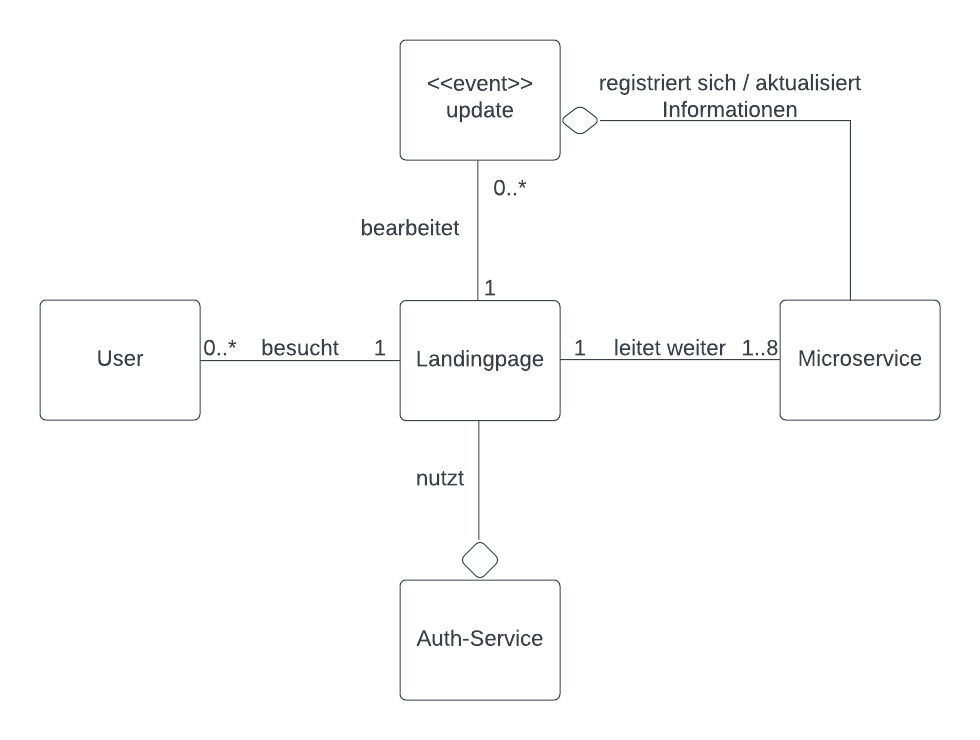
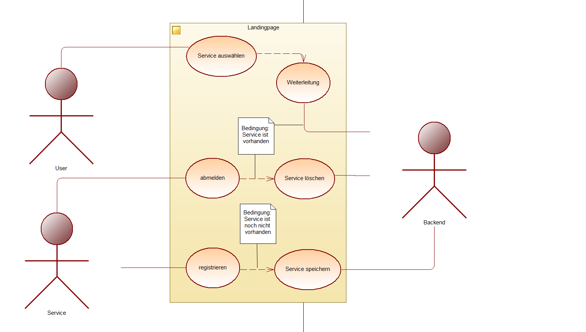
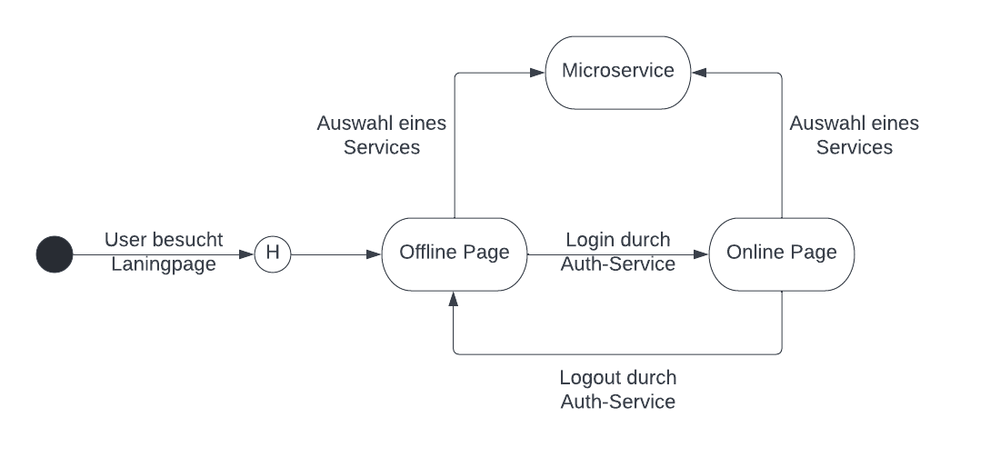
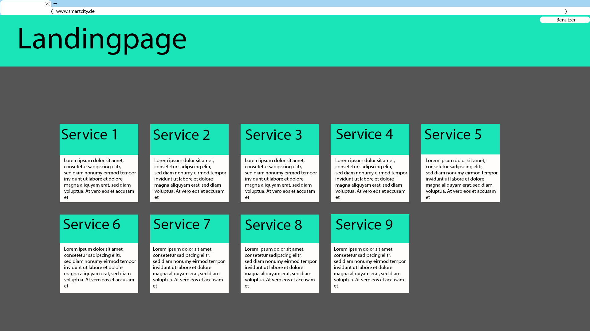
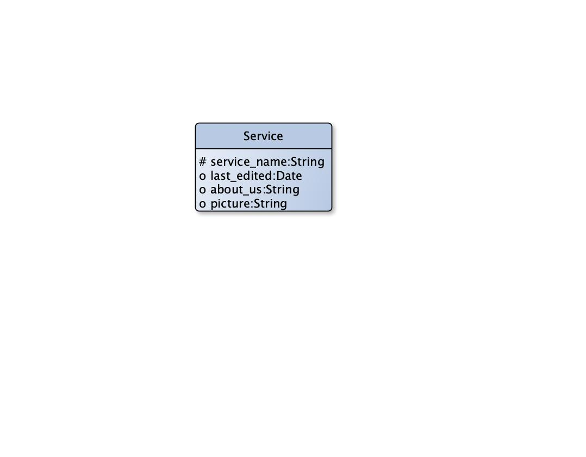
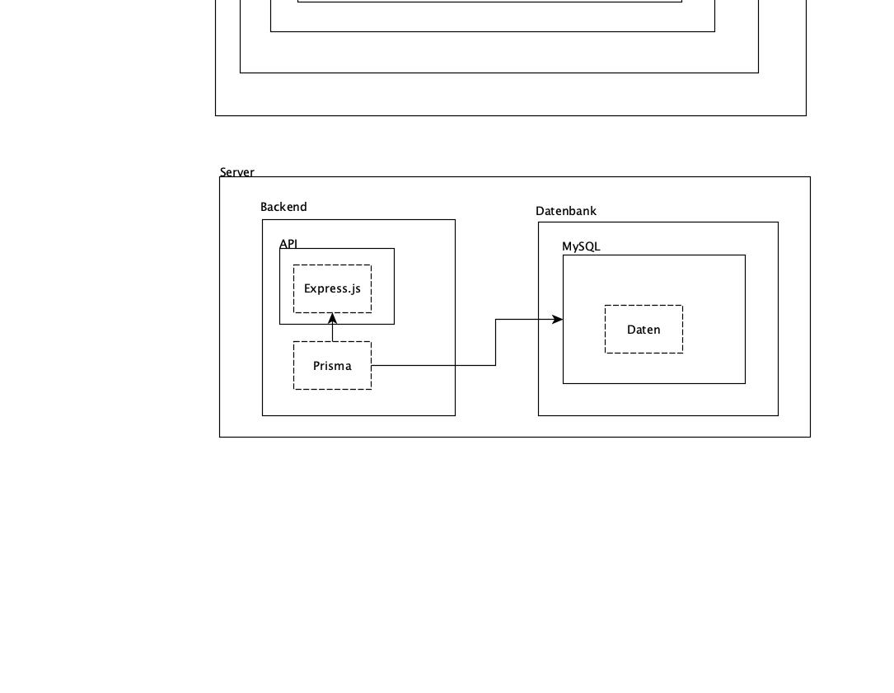

# Landingpage

**Autor:** Janik Geist, Adrian Koß


<!--
Here goes the path to the image if there is one

-->


## Überblick

Die Landingpage dient als Portal zu allen vorhandenen Microservices. Übersichtliche Kacheln mit 
einem kurzen Informationstext sowie einem Bild, ermöglichen dem User effizient den gesuchten </br>
Microservice aufzurufen. Außerdem kann sich der User hier einloggen und so 
auch die Mitgliedsfunktionen der anderen Services nutzen.



## Funktionale Anforderungen

**Glossar**

| **Begriff**     | **Definition/Erklärung**                                                                                         |
|:----------------|:-----------------------------------------------------------------------------------------------------------------|
| User            | Menschlicher Benutzer der Landingpage, nutzt diese als Portal zu anderen Microservices                           |
| (Micro)-Service | Eigenständiges System, welches sich bei der Landingpage registrieren kann, um sich dort dem User zu präsentieren |
| About Us        | Eine kurze Beschreibung des Services, mit wichtigen Informationen für den User                                   |

<br>

**Use Cases**

 <!-- Usecase Digramm -->

## Anforderungen im Detail

**Servicenavigation - User Stories**

| **ID** | **Als** | **möchte ich**                                                | **so dass**                           | **Akzeptanz**                                       | **Priorität** |
|:-------|:--------|:--------------------------------------------------------------|:--------------------------------------|:----------------------------------------------------|:--------------|
| 1      | User    | beim besuchen der Seite alle Microservices angezeigt bekommen | ich weiter navigieren kann            | Alle Microservices werden  angezeigt                | muss          |
| 2      | User    | einen Microservices auswählen können                          | ich dort hin navigieren kann          | Auswahl eines Microservices führt zur Weiterleitung | muss          |

**Anmeldung - User Stories**

| **ID** | **Als** | **möchte ich**                                                | **so dass**                           | **Akzeptanz**                                       | **Priorität** |
|:-------|:--------|:--------------------------------------------------------------|:--------------------------------------|:----------------------------------------------------|:--------------|
| 3      | User    | mich anmelden können                                          | ich erweiterte Funktionen nutzen kann | Userlogin ist erfolgreich                           | muss          |
| 4      | User    | mich ausloggen können                                         | ich nicht mehr eingeloggt bin         | Ausloggen ist erfolgreich                           | muss          |

**Service Registrierung - User Stories**

| **ID** | **Als** | **möchte ich**                                                | **so dass**                           | **Akzeptanz**                                       | **Priorität** |
|:-------|:--------|:--------------------------------------------------------------|:--------------------------------------|:----------------------------------------------------|:--------------|
| 5      | Service | mich registrieren können                                      | ich angezeigt werde                   | Registrierung führt zur Anzeige                     | sollte        |
| 6      | Service | meine Anmeldung revidieren                                    | ich nicht mehr angezeigt werde        | Service wird nicht mehr angezeigt                   | sollte        |
| 7      | Service | mein About Us verändern                                       | Informationen über mich aktuell sind  | Neue Informationen werden korrekt angezeigt         | sollte        |
| 8      | Service | mein Bild verändern                                           | mein Bild aktuell ist                 | Neues Bild wird angezeigt                           | sollte        |

**Missuse-Stories**

| **ID** | **Als** | **könnte ich**            | **so dass**                  | **Fehler**                                          | **Bewertung** |
|:-------|:--------|:--------------------------|:-----------------------------|:----------------------------------------------------|:--------------|
| 9      | Service | mich doppelt registrieren | ich zwei mal angezeigt werde | Service wird mehr als einmal gespeichert            | schlecht      |

## Graphische Benutzerschnittstelle



Entscheidet sich der User dazu, die Langingpage zu besuchen, wird er beim ersten Mal zur "offline"-Page geleitet. Dort kann er sich mithilfe des Auth-Services einloggen oder </br>
einen der Microservices auswählen und zu diesem navigieren. Loggt er sich ein, wird er zur "online"-Page geleitet und kann dort erneut einen Microservice auswählen.
 
### Seitenlayout, wenn der User nicht eingeloggt ist

**User Story 1, 2 und 3**


Ist der User nicht eingeloggt, so kann er dennoch alle Services sehen und auch weiterhin navigieren. 
Möchte sich der User einloggen, so kann er dies durch das Formular in der oberen rechten Ecke tun, er wird dann 
an die weiter unten gezeigte Seite weiter geleitet. 
Die grünen Flächen werden Bilder darstellen, welche sowohl die SmartCity, als auch die einzelnen Services repräsentieren. 
In den weißen Flächen kann dann der "About Us"-Text dargestellt werden. Ist eins von beiden, oder auch beides, nicht vorhanden 
wird auf standard Bilder/Texte zurückgegriffen.

### Seitenlayout, wenn der User eingeloggt ist

**User Story 4**



Ein eingeloggter User findet sich auf dieser Seite wieder. Er kann, wie auch 
schon vor dem Einloggen, weiter zu anderen Services navigieren. Mit einem Klick auf Benutzer 
wird der User zum Auth-Service weiter geleitet und kann so seinen Account verwalten. 
Da es nur einen Akteur, den User, geben soll, welcher mit der Landingpage interagiert, sind 
mehr MockUps nicht sinnvoll.

## Datenmodell



## Abläufe


## Schnittstellen

### URL

http://smart.city/microservices/customer

### API
**Synchronous**

| **Name**      | **Parameter** | **Resultat**                                                                                                           |
|:--------------|:--------------|:-----------------------------------------------------------------------------------------------------------------------|
| getServices() |               | Liste von allen Microservices:<br/>[<br/>{<br/>service_name: String,<br/>about_us: String,<br/>url: String<br/>}<br/>] |

### Dependencies

#### Event

| **Service**   | **Payload**                                                                                                                                                                                                                                           |
|:--------------|:------------------------------------------------------------------------------------------------------------------------------------------------------------------------------------------------------------------------------------------------------| 
| Alle Services | {<br/>event_id: <i>Abhängig von den einzelnen Services</i>,<br/>event_name:"Updated About US<br/>service_name: <i>service</i><br/>date: <i>date</i><br/>about_us:"Neuer About Us Text" (optional)<br/>picture: <i>URL to picture</i> (optional)<br/>} |
| Alle Services | {<br/>event_id: <i>Abhängig von den einzelnen Services</i>,<br/>event_name:"Delete My Service"<br/>service_name:<i>service</i><br/>date: <i>date</i><br/>}                                                                                            |

##### JSON-Schema
**Updated About Us**
```
{
"title": "Change About Us",
"description": "Schema for the event to change the about us",
"type": "object",
"properties": {
"event_id" : {
"type": "integer",
"minimum": 0,
"maximum": 10000
},
"event_name": {
"type": "string",
"const": "Updated About US"
},
"service_name": {
"type": "string"
},
"date": {
"type": "string"
},
"about_us":{
"type": "string"
},
"picture": {
"type": "string"
}
},
"required": [
"event_id",
"event_name",
"service_name",
"date"
]
}
```
**Delete My Service**
```
{
    "title": "Delete My Service",
    "description": "Schema for the event to delete an existing service",
    "type": "object",
    "properties": {
        "event_id" : {
            "type": "integer",
            "minimum": 0,
            "maximum": 10000
        },
        "event_name": {
            "type": "string",
            "const": "Delete My Service"
        },
        "service_name": {
            "type": "string"
        },
        "date": {
            "type": "string"
        }
    },
    "required": [
        "event_id",
        "event_name",
        "service_name",
        "date"
    ]
}
```
## Technische Umsetzung


### Softwarearchitektur

- Darstellung von Softwarebausteinen (Module, Schichten, Komponenten)

Hier stellen Sie die Verteilung der Softwarebausteine auf die Rechnerknoten dar. Das ist die Softwarearchitektur. Zum Beispiel Javascript-Software auf dem Client und Java-Software auf dem Server. In der Regel wird die Software dabei sowohl auf dem Client als auch auf dem Server in Schichten dargestellt.

* Server
  * Web-Schicht: JavaScript Node.js 
  * Logik-Schicht: JavaScript Express.js
  * Persistenz-Schicht: MySQL Datenbank

* Client
  * View-Schicht: HTML, CSS
  * Logik-Schicht: JavaScript + Vue.js
  * Kommunikation-Schicht: Axios

Die Abhängigkeit ist bei diesen Schichten immer unidirektional von "oben" nach "unten". Die Softwarearchitektur aus Kapitel "Softwarearchitektur" ist demnach detaillierter als die Systemübersicht aus dem Kapitel "Systemübersicht". Die Schichten können entweder als Ganzes als ein Softwarebaustein angesehen werden. In der Regel werden die Schichten aber noch weiter detailliert und in Softwarebausteine aufgeteilt. 



### Validierung

Test, dass die einkommenden Events zum Update der About Us Seite korrekt ausgeführt wird

Test, dass alle Daten über die Services korrekt an den Client übertragen werden

Test, dass alle Links zu den richtigen Microservices führen

### Verwendete Technologien

- Verwendete Technologien (Programmiersprachen, Frameworks, etc.)

* HTMl, CSS, JavaScript, Vue.js, Axios
* JavaScript, Node.js, Express.js
* MySQL
