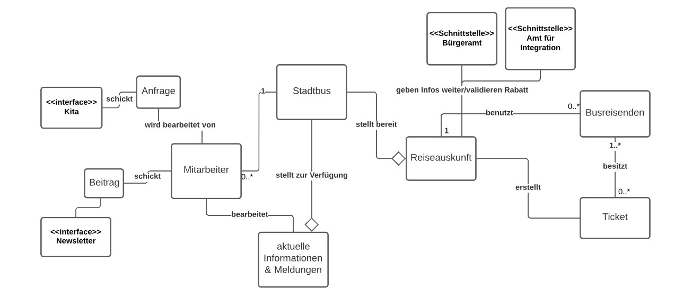
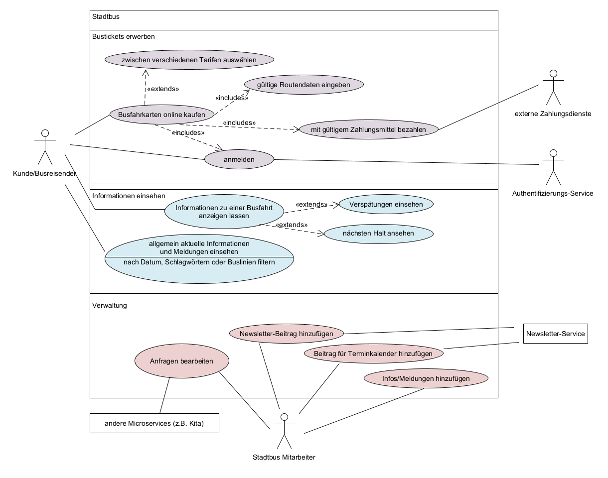
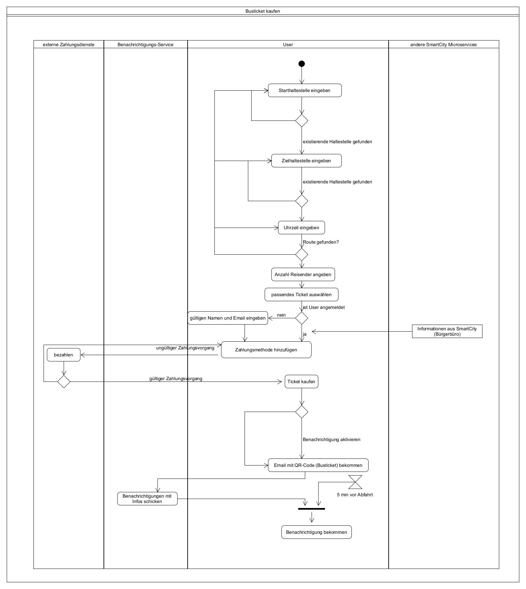
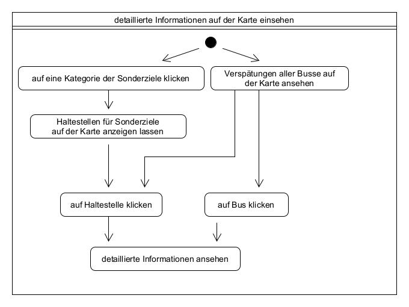

# Stadtbus

**Autor:** Celine Dridiger

## Überblick

### Textuelle Beschreibung der Anwendungsdomäne:

  Die voranschreitende Digitalisierung, die sich mehr und mehr durch unseren Alltag zieht, macht auch vor den öffentlichen Vekehrsmitteln keinen Halt. Deshalb soll dieser Microservice der zentrale digitale Anhaltspunkt für den Busverkehr werden und durch die nutzerfreundliche und transparente Anwendung mehr Menschen dazu anregen die Möglichkeiten des ÖPNV zu nutzen. Ziel ist es dadurch nicht nur ein komfortables, sondern auch ein nachhaltigeres Reisen zu ermöglichen.
  
  Dabei sollen Informationen, wie z.B. die aktuellen Positionen und Verspätungen der einzelnen Busse im Stadtgebiet, offen und für jeden zugänglich sein. Des Weiteren, bietet der Stadtbus beim Erwerb der Bustickets eine kontaktlose und schnelle Bezahlung und verschiedene Vergünstigungen an (FamilienTarif für große Familien und kostenlose Busfahrten für Geflüchtete).
    
### Konzeptionelles Analyseklassendiagramm (logische Darstellung der Konzepte der Anwendungsdomäne)

## Funktionale Anforderungen

- Kunde/Busreisender: Benutzer, der nicht unbedingt in der SmartCity angemeldet sein muss, um die Dienste in Anspruch zu nehmen
- externe Zahlungsdienst: wickelt die Bezahlung der Tickets extern ab
- Authentifizierungs-Service: durch diesen Dienst kann sich der Nutzer eindeutig identifizieren und Informationen über sich (für z.B. die Anmeldung) freigeben
- Stadtbus Mitarbeiter
- andere Microservices: Services können verschiedene Anfragen an den Stadtbus schicken (z.B für Sonderrabatte bei Kita-Ausflügen)

## Anforderungen im Detail

- User Stories mit Akzeptanzkritierien 
- Optional: Name (oder ID) und Priorität ("Must", "Should", "Could", "Won't")
- Strukturierung der User Stories in funktionale Gruppen

|**ID**| **Name**| **In meiner Rolle als**...|   ...**möchte ich**...   | ..., **so dass**... | **Erfüllt, wenn**... | **Priorität**   |
|:-|:-----|:----------:|:-------------------|:-------------|:---------|:----------------|
Reiseauskunft
|1| Route finden | Benutzer | bei Eingabe von zwei gültigen Haltestellen und einer Uhrzeit passende Routen angezeigt bekommen |ich ein passendes Busticket kaufen kann | Haltestellen müssen bei der Eingabe auf Gültigkeit geprüft werden, optimale Route muss ermittelt werden | Must |
|2| Haltestellen für PoI (Point of Interests)  | Benutzer | Haltestellen in der Nähe von Sehenswürdigkeiten, Freizeiteinrichtigungen und anderen Institutionen angezeigt bekommen | Route finden ohne zu die genauen Haltestellen im Voraus zu kennen | Haltestellen entsprechend auf der Karte kennzeichnen wenn der User z.B. auf die Option "Sporteinrichtungen" klickt | Should |
|3| vorher gespeicherte Haltestellen | in der SmartCity angemeldeter Benutzer, der personenbezogene Informationen freigegeben hat | Haltestellen in der Nähe von meinem Zuhause, meinen Einrichtigungen (wie z.B. Fitnessstudio) angezeigt bekommen | Route finden ohne zu die genauen Haltestellen im Voraus zu kennen | Option (zuhause, mein Arbeitsplatz, mein Fitnessstudio) im Dropdown für die Eingabe der Haltestellen zur Verfügung stellen | Should |
Ticketkauf
|4| Ticket auswählen | Benutzer | zwischen passenden Bustickets auswählen können |ich ein passendes Busticket kaufen kann | angezeigte Tickets müssen wichtige Informationen enthalten (Abfahrt, Ankunft, zu dem Zeitpunkt geschätzte Verspätung, Auslastung, Preis)  | Must |
|5| Tarifauswahl| in der SmartCity angemeldeter Benutzer, der personenbezogene Informationen freigegeben hat | beim Kauf von Busticket soll der angemeldete Benutzer sofort den passenden/günstigsten Tarif vorgeschlagen bekommen | der Benutzer automatisch den besten Tarif angezeigt bekommt| den besten passenden Tarif als erste Option darstellen | Should |
|6| Tarifauswahl  | Benutzer | beim Kauf von Busticket kann der Benutzer zwischen verschiedenen Tarifen/Vergünstigungen (z.B. Gruppentickets) auswählen können | günstigstes Ticket kaufen | Option für verschiedene Tarife/Preisklassen zur Verfügung stellen | Must |
|7| Anfragen bearbeiten | Mitarbeiter | eingehende Anfragen (z.B. Kita-Ausflug) bearbeiten und Tickets ausstellen können | die Kita nicht jedes einzelne Ticket kaufen muss, besondere Gruppenrabatte, die nur für ausgewählte Institutionen verfügbar sind | Mitarbeiter muss Überblick über alle Anfragen haben und diese auf der Mitarbeiter-Seite bearbeiten können | Must |
Informationseinsicht 
|8| Verspätungen einsehen | Benutzer | auf der Karte die Positionen der Busse einsehen und bei Mausklick auf einzelnen Bus die Verspätung und weitere Infos ansehen (Linie, nächster Halt) | mich auf Verspätungen/Ausfälle einstellen kann | echtzeit aktualisierte, interaktive Karte mit Legende | Must |
|9| Informationen zu meiner Fahrt | Benutzer | automatische Nachricht bekommen mit Infos zu meiner Fahrt | man sich auf Verspätungen oder ähnliches einstellen kann | 5 min vor Abfahrt eine Push-Benachrichtung bekommen mit Infos über meine Fahrt (Ankunft, geschätzte Verspätung), Option beim Kauf des Tickets | Could |
|10| allgemeine Informationen | Benutzer | jederzeit aktuelle Meldungen und Störungen/Ausfälle einsehen können | sich der Benutzer auf diese einstellen kann (und ggf. das Ticket erstattet bekommen kann) und diese beim Kauf der Karten berücksichtigen kann | unter dem Tab "Infos & Meldungen" diese anzeigen (filtern nach Datum, Linie) | Must |
|11| Infos und Meldungen bearbeiten | Mitarbeiter | Beiträge im Tab "Infos und Meldungen" hinzufügen und löschen | die Informationen auf der Seite aktuell zu halten | extra Seite für Mitarbieter, die nur für diese zu erreichen ist | Must |
Feedback
|12| Feedback | Benutzer | Feedback zu meiner Fahrt geben | ich aktiv zur Verbesserung des Busverkehrs beitragen kann | Email mit dem Ticket enthält zusätzlich Möglichkeit für Feedback zur Fahrt (Link zu Feedback-Formular) | Could/Won't |
Statistiken
|13| Statistiken einsehen | Mitarbeiter | Statistiken und Feedback der Reisenden einsehen | Mitarbeiter diese auswerten können und den Busverkehr optimieren können | extra Seite für Mitarbieter, die nur für diese zu erreichen ist| Could |

## Graphische Benutzerschnittstelle

## Datenmodell 

- Modellierung des physikalischen Datenmodells 
  - RDBMS: ER-Diagramm bzw. Dokumentenorientiert: JSON-Schema

## Abläufe

  
  

## Schnittstellen

### URL

http://smart.city/microservices/stadtbus

### private API

| **Method** | **Name** | **Parameter** | **Resultat** |
|:---| :------ | :----- | :------ |
|POST| createInfoPost | { "titel": " ", "kurzbeschreibung": " ", "text": " ", "priorität": " ", "tag": " ", "date": "00.00.0000" }| Neuer Post wird veröffentlicht |
|DELETE| removeInfoPost | meldung_id | angegebener Post wird gelöscht |
|GET| getInfoPost | meldung_id | angegebener Post wird returned
|POST| addTicket | {  "busreisende_id" : " ", "ticket_art: " ",  "geltungstag": "00.00.0000",  "preis": " ",  } | verkauftes Ticket wird hinzugefügt |
|GET| getSoldTicketsPerRoute | int route_id | Tickets [] list

### Events
**Forum event channel**

| **Name** | **Payload** | 
| :------ | :----- | 
| Newsletter | { "event_id": 2001, "event_name": "New Newsletter Post",  "service_name": "stadtbus", "title": " ", "short_description": " ", "long_description": " ", "event_on": " " , "picture_url": " " } |
| Calendar | { "event_id": 2002, "event_name": "New Calendar Post",  "service_name": "stadtbus", "title": " ", "short_description": " ", "long_description": " ", "event_on": " " , "picture_url": " " } | |

**Landingpage event channel**
| **Name** | **Payload** | 
| :------ | :----- | 
| About Us | { "event_id": 2003, "event_name": "",  "service_name": "stadtbus", "title": " ", "text": " ", "date": " " } |
| Delete Service | { "event_id": 2004, "event_name": "",  "service_name": "stadtbus", "date": " " } |

**Kita event channel**
| **Name** | **Payload** | 
| :------ | :----- | 
| Kita Inquiry |  { event_id: 3001, event_name: "New Kita Inquiry", service_name: "kita", number_of_passengers: 40, person_responsible: "Hans Merkel", date: "22.05.2022" } |

### Softwarearchitektur

- Darstellung von Softwarebausteinen (Module, Schichten, Komponenten)

* Server
  * Web-Schicht: Node.js
  * Logik-Schicht: Express.js
  * Persistenz-Schicht: MySQL Datenbank

* Client
  * View-Schicht: React.js
  * Logik-Schicht: React.js
  * Kommunikation-Schicht

Die Abhängigkeit ist bei diesen Schichten immer unidirektional von "oben" nach "unten". Die Softwarearchitektur aus Kapitel "Softwarearchitektur" ist demnach detaillierter als die Systemübersicht aus dem Kapitel "Systemübersicht". Die Schichten können entweder als Ganzes als ein Softwarebaustein angesehen werden. In der Regel werden die Schichten aber noch weiter detailliert und in Softwarebausteine aufgeteilt. 

### Fehlerbehandlung 

* Mögliche Fehler / Exceptions auflisten
* Fehlercodes / IDs sind hilfreich
* Nicht nur Fehler technischer Art ("Datenbankserver nicht erreichbar") definieren, sondern auch fachliche Fehler wie "Kunde nicht gefunden", "Nachricht wurde bereits gelöscht" o.ä. sind relevant. 

| Fehler | Beschreibung |
| :----- | :----------- |
|WebSocketError| Verbindung zu WebSocket getrennt|

### Validierung

* Relevante (Integrations)-Testfälle, die aus den Use Cases abgeleitet werden können
* Testfälle für 
  - Datenmodell
  - API
  - User Interface
* Fokussieren Sie mehr auf Integrationstestfälle als auf Unittests
* Es bietet sich an, die IDs der Use Cases / User Stories mit den Testfällen zu verbinden,
  so dass erkennbar ist, ob Sie alle Use Cases getestet haben.

### Verwendete Technologien

- Verwendete Technologien (Programmiersprachen, Frameworks, etc.)

* Frontend: React.js
* Backend: Node.js, Express.js
* Datenbank: MySQL 
