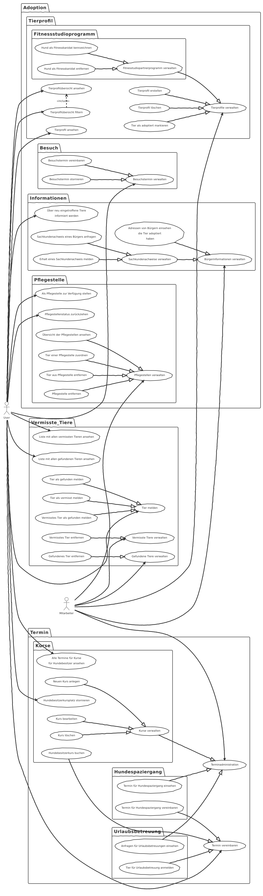

# Tierheim

**Autor:** Vivien Traue

## Überblick

Das Tierheim bietet den Bürgern die Möglichkeit, auf einer Webseite eine Vielzahl an Informationen einzusehen. So wird dem Nutzer eine Übersicht aller aktuell im Tierheim befindlichen Tiere angezeigt. Es können Termine zum Kennenlernen der Tiere oder auch für Hundespaziergänge vereinbart werden. Die Bürger können sich sowohl als Interessent für eine Adoption eintragen, als auch als Pflegestelle registrieren um Tieren dauerhaft oder vorübergehend ein Zuhause geben zu können. Außerdem informiert das Tierheim über entlaufende und gefundene Tiere. Nutzer können hierfür sowohl melden, wenn sie ein Tier vermissen, als auch, wenn sie ein Tier gefunden oder gesichtet haben. Zusätzlich bietet das Tierheim unterschiedliche Kurse für Hundebesitzer an, so beispielsweise auch einen Kurs zum Erhalt eines Sachkundenachweises, um große Hunde halten zu dürfen. Die Termine für die Kurse können ebenfalls über die Webseite eingesehen und gebucht werden. Des Weiteren können Bürger ihre Tiere in einer Urlaubsbetreuung im Tierheim unterbringen. Auch hierfür ist eine Terminbuchung möglich.

## Funktionale Anforderungen

### Akteure
| **Akteur** | **Definition** |
| --- | --- |
| User | Kann Informationen einsehen, Termine buchen und vermisste/gefundene Tiere melden |
| Mitarbeiter | Kann Inhalte der Tierheimseite erstellen, bearbeiten und löschen |
| Bürgerbüro | Austausch über den Erhalt/Besitz eines Sachkundenachweises für Hundehalter |
| Finanzamt | Dem Finanzamt wird mitgeteilt, wenn ein Hund adoptiert wird (Hundesteuer) |
| Forum | Über das Forum werden die Bürger über verschiedene Ereignisse informiert |
| Fitnessstudio | Mit dem Fitnessstudio existiert eine Kooperation, um bewegungsintensive Hunde mit engagierten Läufern zusammenzubringen |

### Use-Case-Diagramm

## Anforderungen im Detail

### User Stories

#### Tiere im Tierheim

| **ID**| **Als**|   **möchte ich**   |  **so dass** | **Akzeptanz** | **Priorität**   |
|:-----|:----------:|:-------------------|:-------------|:---------|:----------------|
| 1 | User | eine Übersicht über alle Tiere im Tierheim sehen | ich alle Tiere auf einen Blick sehen kann | Liste mit allen Tieren wird angezeigt| Muss |
| 2 | User | ein detaillierteres Profil eines einzelnen Tieres einsehen | ich mehr Informationen über dieses Tier erfahre | Profil eines Tieres wird angezeigt | Muss |
| 3 | User | die Liste aller Tiere filtern können | ich ein zu mir passendes Tier leichter finden kann | Liste der Tiere wird gefiltert angezeigt | Sollte |
| 4 | User | einen Besuchstermin vereinbaren können | ich ein Tier besser kennenlernen kann | Termin wird gebucht | Muss |
| 5 | User | einen gebuchten Besuchstermin stornieren können | der Termin gelöscht wird und wieder frei ist | Termin wird gelöscht | Muss |
| 6 | User | über neu eingetroffene Tiere informiert werden | immer auf dem Laufenden bin | Neue Tiere werden dem Forum-Service gemeldet | Sollte |
| 7 | Mitarbeiter | ein Profil für ein Tier im Tierheim anlegen können | das Tier auf der Seite des Tierheims angezeigt wird | Tierprofil wird erstellt und angezeigt | Muss |
| 8 | Mitarbeiter | das Profil eines Tieres bearbeiten | die Daten das Tieres geändert werden | Das Profil des Tieres wird geändert | Muss |
| 9 | Mitarbeiter | das Profil eines Tieres löschen | das Profil des Tieres entfernt wird | Das Profil des Tieres wird gelöscht | Muss |
| 10 | Mitarbeiter | ein adoptiertes Tier als adoptiert markieren | es als bereits adoptiert angezeigt wird | Tier wird als adoptiert markiert und angezeigt |  Muss |
| 11 | Mitarbeiter | die Adressen von Bürgern sehen können, die ein Tier adoptiert haben | ich das adoptierte Tier besuchen und sein Wohlergehen überprüfen kann | Adresse der Bürger mit einem adoptierten Tier wird angezeigt | Sollte |
| 12 | Mitarbeiter | beim Bürgeramt anfragen, ob ein Bürger einen Sachkundenachweis für Hundehalter besitzt | ich weiß, ob ein Bürger einen Hund halten darf | Status des Sachkundenachweises eines Bürgers wird angezeigt | Muss |
| 13 | Mitarbeiter | beim Bürgeramt melden, dass ein Bürger einen Sachkundenachweis für Hundehalter erhalten hat | der Sachkundenachweis für den Bürger vermerkt wird | Erhalt des Sachkundenachweises wird gemeldet | Muss |
| 14 | Mitarbeiter | einen Hund als Kandidat für das Partnerprogramm mit dem Fitnessstudio kennzeichnen | dieser Hund dem Fitnessstudio als Teilnehmer am Partnerprogramm gemeldet wird | Hund wird Fitnessstudio gemeldet und dem Partnerprogramm hinzugefügt | Muss |
| 15 | Mitarbeiter | einen Hund aus dem Partnerprogramm mit dem Fitnessstudio entfernen | dieser Hund dem Partnerprogramm nicht mehr zur Verfügung steht | Hund wird aus dem Partnerprogramm entfernt, dies wird auch dem Fitnessstudio gemeldet | Muss |
| 16 | User | mich als Pflegestelle für Tiere zur Verfügung stellen | ich als verfügbare Pflegestelle vermerkt werde | User wird als Pflegestelle angelegt | Muss | 
| 17 | User | mich von der Liste der verfügbaren Pflegestellen für Tiere entfernen | ich nicht weiter als Pflegestelle verfügbar bin | User wird von der Liste der verfügbaren Pflegestellen entfernt | Muss |
| 18 | Mitarbeiter | eine Übersicht über alle Pflegestellen sehen | ich alle Pflegestellen auf einen Blick sehen kann und weiß, welche frei sind und wo bereits Tiere untergebracht sind | Liste mit allen Pflegestellen wird angezeigt | Muss |
| 19 | Mitarbeiter | ein Tier einer Pflegestelle zuordnen können | deutlich wird, dass dieses Tier in dieser Pflegestelle untergebracht ist | Tier wird der Pflegestelle zugeordnet | Kann |
| 20 | Mitarbeiter | ein Tier aus einer Pflegestelle entfernen können | dieses Tier nicht weiter der Pflegestelle zugeordnet ist | Das Tier wird nicht weiter der Pflegestelle zugeordnet | Muss |
| 21 | Mitarbeiter | einen Bürger als Pflegestelle entfernen | der Bürger aus der Liste der verfügbaren Pflegestellen gelöscht wird | Bürger wird aus der Liste der verfügbaren Pflegestellen entfernt | Muss |

#### Termine

| **ID**| **Als**|   **möchte ich**   |  **so dass** | **Akzeptanz** | **Priorität**   |
|:-----|:----------:|:-------------------|:-------------|:---------|:----------------|
| 22 | User | Termin für einen Hundespaziergang vereinbaren | ich einen Spaziergang zum gewünschten Zeitpunkt unternehmen kann | Termin wird gebucht | Muss |
| 23 | User | mein Tier für die Urlaubsbetreuung anmelden | mein Tier während ich im Urlaub bin versorgt wird | Zeitraum wird als Anfrage vorgemerkt | Muss |
| 24 | Mitarbeiter | alle Termine für Hundespaziergänge einsehen | die Hunde für den Spaziergang vorbereiten kann | Alle Termine für Hundespaziergänge werden angezeigt | Muss |
| 25 | Mitarbeiter | alle Anfragen für Urlaubsbetreuungen einsehen können | diese bestätigen oder ablehnen kann | Alle Anfragen werden angezeigt und können bestätigt oder abgelehnt werden (E-Mail an Bürger) | Muss |
| 26 | User | alle Termine für Kurse für Hundebesitzer ansehen können | ich mir einen passenden Kurs aussuchen kann | Liste mit allen Kursen für Hundebesitzer wird angezeigt | Muss |
| 27 | User | einen Platz für einen Kurs für Hundebesitzer buchen | an diesem Kurs teilnehmen zu können | Termin für Kurs wird gebucht | Muss |
| 28 | User | einen gebuchten Platz für einen Kurs für Hundebesitzer wieder stornieren können | ich meine Teilnahme zurückziehen kann und der Platz wieder frei ist | Terminbuchung für Kurs wird gelöscht | Muss | 
| 29 | Mitarbeiter | neue Kurse für Hundebesitzer anlegen können | diese auf der Seite angezeigt werden | Kurs wird auf der Seite angezeigt | Muss |
| 30 | Mitarbeiter | einen bestehenden Kurs für Hundebesitzer löschen können | der Kurs nicht mehr auf der Seite angezeigt wird | Kurs wird gelöscht | Muss |
| 31 | Mitarbeiter | einen bestehenden Kurs für Hundebesitzer ändern können | ich die Daten des Kurses anpassen kann | Kurs wird geändert | Muss |

#### Vermisste Tiere

| **ID**| **Als**|   **möchte ich**   |  **so dass** | **Akzeptanz** | **Priorität**   |
|:-----|:----------:|:-------------------|:-------------|:---------|:----------------|
| 32 | User | eine Liste mit allen vermissten Tieren sehen | ich alle momentan vermissten Tiere sehen kann | Liste mit allen vermissten Tieren wird angezeigt | Muss |
| 33 | User | eine Liste mit allen gefundenen Tieren sehen  | ich alle gefundenen Tiere sehen kann | Liste mit allen gefundenen Tieren wird angezeigt | Muss |
| 34 | User | ein vermisstes Tier melden | andere Bürger sehen können, dass das Tier vermisst wird | Vermisstes Tier wird auf der Seite angezeigt | Muss |
| 35 | User | ein gefundenes Tier melden | die Besitzer des Tiers sehen können, dass es gefunden wurde | Gefundenes Tier wird auf der Seite angezeigt | Muss |
| 36 | User | ein vermisstes Tier als gefunden melden | das vermisste Tier als gefunden angezeigt wird | Vermisstes Tier wird gefunden markiert, angezeigt und der Besitzer wird informiert | Muss |
| 37 | Mitarbeiter | ein vermisstes Tier aus der Liste löschen | das vermisste Tier nicht mehr in der Liste angezeigt wird | Das Tier wird nicht mehr angezeigt | Muss |
| 38 | Mitarbeiter | ein gefundenes Tier aus der Liste löschen | das gefundene Tier nicht mehr in der Liste angezeigt wird | Das gefundene Tier wird nicht mehr angezeigt | Muss |

### Missuse-Stories

| **ID**| **Als**|   **könnte ich**   |  **so dass** | **Fehler** | **Bewertung**   |
|:-----|:----------:|:-------------------|:-------------|:---------|:----------------|
| 39 | User | einen Kurs für Hundebesitzer mehr als einmal buchen | von einer Person mehrere Plätze belegt werden | ein Kurs wird als voll angezeigt, wenn er noch freie Plätze hat | sollte vermieden werden |
| 40 | User | ein vermisstes Tier als gefunden melden, obwohl es noch nicht gefunden wurde | ein Tier nicht mehr als vermisst angezeigt wird, obwohl es weiterhin vermisst wird | Realität wird falsch abgebildet | schwierig zu vermeiden, sollte aber von Tierbesitzer bestätigt oder abgestritten werden können |

## Grafische Benutzerschnittstelle

## Datenmodell

## Abläufe

## Schnittstellen

### Events

| **Service** | **Payload** | **Beschreibung** |
|:---------|:------------------|:----------------|
| Forum | { event_id: 5001, event_name: "New Pet In Shelter", service_name: tierheim, title: title, text: text } | Neues Tier im Tierheim |
| Forum | { event_id: 5002, event_name: "New Missing Pet", service_name: tierheim, title: title, text: text } | Vermisstes Tier |
| Forum | { event_id: 5003, event_name: "New Found Pet", service_name: tierheim, title: title, text: text } | Gefundenes Tier |
| Fitnessstudio | { event_id: 5004, event_name: "New Pet For Walk", service_name: tierheim, pet_name: "name", text: text } | Neuer Hund für das Partnerprogramm Fitnessstudio/Tierheim |

Bürgerbüro
    Sachkundenachweis erhalten
Finanzamt
    neuer Hund Hundesteuer
Fitnessstudio
    neuer Hund für Partnerprogramm
    Hund aus Partnerprogramm entfernt
Forum 
    Neues vermisstes Tier
    Neues gefundenes Tier
    Neues Tier im Tierheim

## Technische Umsetzung

### Verwendete Technologien

- Programmiersprache: Rust
- Frontend: Yew
- Backend: actix-web
- Datenbank: MySQL
